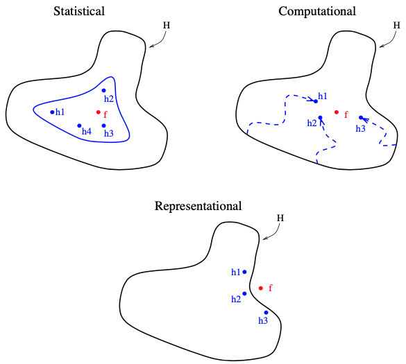

# Ensemble Learning

Reduce variance of models

Why do they work

- Statistical: Average predictions
- Computational: Average local optima
- Representational: Extend hypothesis space

## Steps

1. Divide dataset into subsets
2. For each subset, apply a model
     - This model is usually decision tree
3. Aggegrate the results

## Stability of Classifier

For unstable models, we have to change model when adding new point

For stable models, not required

## Learning Techniques

|                   | Single            | Bagging (Boostrap aggregation) | Boosting                                                     |
| ----------------- | ----------------- | ------------------------------------------------------------ | ------------------------------------------------------------ |
| Training sequence | N/A               | Parallel                                                     | Sequential                                                   |
|                   |                   |                                                              | Forward stage-wise also to fit an adaptive additive model (adaptive basis functions) |
| No of learners    | 1                 | $n$                                                          | $n$                                                          |
| Training          | Complete training | Random sampling with replacement                             | Random sampling with replacement **over weighted data**      |
|                   |                   | Aggregage the results at the end |                                                              |
|                   |                   |                                                              | Only pass over the mis-classified points We boost the probability of mis-classified points to be picked again |
| Preferred for     |                   | Linear Data                                                  | Non-Linear Data                                              |
| Example           |                   | Random forest                                                | XGBoost                                                      |
| Comment           |                   | - Only effective for low-bias, high-variance models - Only effective if misclassification rate of individual classifiers <0.5 |                                                              |
| Advantages        |                   | - Reduce model variance - Noisy useless signals will average out and have no effect |                                                              |
| Disadvantages     |                   | - Reduced interpretability                                   |                                                              |

### Bagging

“Wisdom of the crowds”

Bagged classifier’s misclassification rate behaves like a binomial distribution

Bagging a good classifier can improve predictive accuracy, but bagging a bad one hurts
$$
\text{MSE}' = \dfrac{1}{k} \text{MSE} + \dfrac{k-1}{k} C
$$
where $C=$ covariance between each bagging classifier

### Classification

|                    | $\hat y_i$ |
| ------------------ | ---------- |
| Majority/Hard Vote |            |
| Soft Voting        |            |

### Training Speed

It **cannot** be said that boosting is slower than bagging, just because it is sequential and bagging is parallel.

This is because, boosting may end in just 10 iterations, but you may need 1000 classifiers for bagging.

## Random Forest

Bagging with reduced correlation b/w sampled trees, through random selection of input variables $m<<k$ for each split

Usually $m = \sqrt{p}$

## Boosting

$\lambda$ is the learning rate

### Regression

1. Set $\hat f(x) = 0 \implies u_i = y_i \quad \forall i$

2. For $b=1, \dots, B:$

   1. Fit a regression model $\hat f_b(x)$ to the training data to obtain $\hat y_b$

   2. Update $\hat y$ with a shrunken version of $\hat f_b$: $\hat y = \hat y + \lambda \hat y_b$,

   3. Update the residuals: $u_i = u_i - \lambda \hat y_b$
   
3. Output: $\hat y = \sum_{b=1}^B \lambda \hat y_b$

In each iteration, we fit the model to residuals: this enables re-weighting training data so that obs that did not fit well ($r_i$ large)  become more imp in next iteration.

### Classification

**Ada**ptive **Boost**ing

The boosted classifier is a weighted sum of individual classifiers, with weights proportional to each classifier’s accuracy on the training set (good classifiers get more weight)

In AdaBoost, if an individual classifier has accuracy < 50%, we flip the sign of its predictions and turn it into a classifier with accuracy > 50%. This is achieved by making $\alpha_b$ < 0 so that the classifier enters negatively into the final hypothesis.

In each iteration, we re-weight the obs in the training data such that misclassified points in the previous round see their weights increase compared to correctly classified points. Hence, successive classifiers focus more on misclassified points.

#### Steps

1. Let $y \in \{ -1, 1 \}$

2. Let $w_i = 1/n \quad \forall i$

3. For $b= 1, \dots, B$

   1. Fit a classifier $\hat f_b$ to the training data by minimizing the weighted error

      $\dfrac{\sum_{i=1}^n w_i (\hat y_b \ne y_i)}{\sum_{i=1}^n w_i}$

   2. Let $\alpha_b = \log \vert (1-\epsilon_b)/\epsilon_b \vert$ where $\epsilon_b$ is the weighted error of $\hat f_b (x)$

   3. $L_i = \exp \Big( \alpha_b (\hat y_b \ne y_i) \Big)$

   4. Update $w_i$

      $w_i = w_i \cdot L_i$

4. Output: $\hat y = \text{sign} (\sum_{b=1}^B \alpha_b \cdot \hat y_b)$

### Optimization

Instead of doing a global minimization, the boosting strategy follows a forward **stage**-wise procedure by adding basis functions one by one

##### Stage-wise vs step-wise

|                                   | Stage-wise | Step-wise |
| --------------------------------- | ---------- | --------- |
| Coefficients updated at each step | One        | All       |
| Optimality                        | Worse      | Better    |
| Computation Cost                  | Low        | High      |
