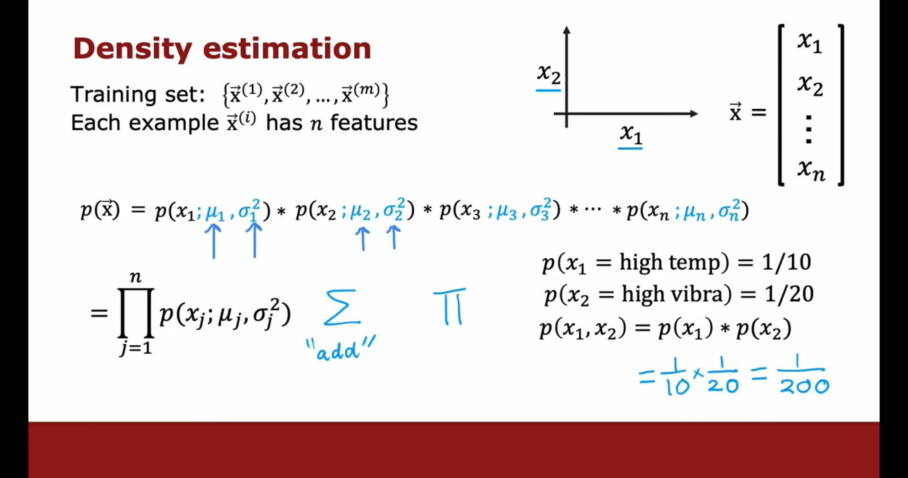
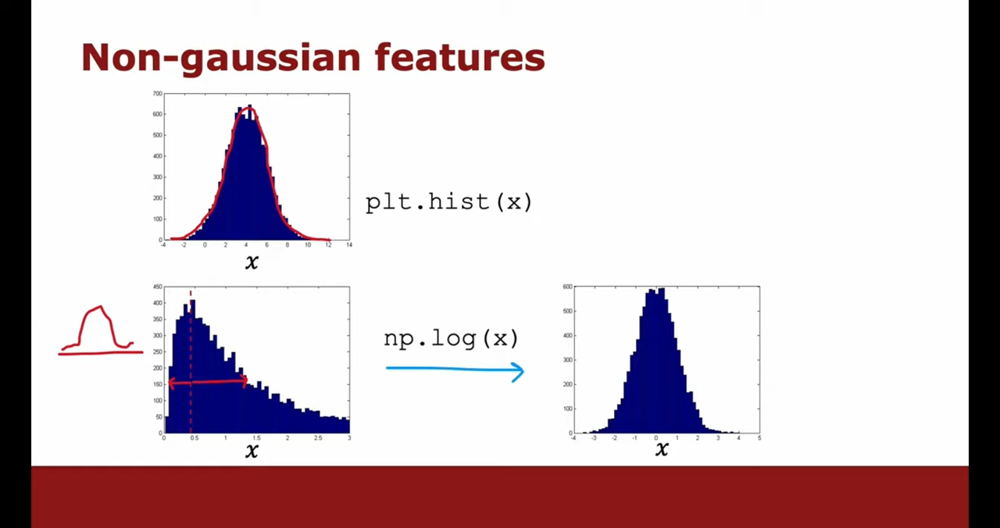

# Anomaly Detection

Detecting unusual events occurring outside of the train distribution

## Limitations
- False positives are a problem
- No temporal coherence: several anomalous events in sequence do not get priority over the same events randomly sampled in time

## Note

- When using AD as a secondary model to filter data for the primary model, you need not use the same input features for both
- Anomaly detection could be used on variables that are not directly to the output
	- Even if variable w does not affect $y$, a novel value in $w$ could indicate a structural break

Let

- $\mathcal{X}, \mathcal{y} \in \mathcal{D}$ be all the data you have
- $\mathcal{X}_a$ be used for primary model
- $X_b$ be used for anomaly detection

Then, all these perfectly reasonable
- $\vert \mathcal{X}_a \vert  = \vert \mathcal{X}_b \vert$
- $\vert \mathcal{X}_a \vert > \vert \mathcal{X}_b \vert$
- $\vert \mathcal{X}_a \vert < \vert \mathcal{X}_b \vert$

## Density Estimation

## Procedure Methodology

|            |                                                                |
| ---------- | -------------------------------------------------------------- |
| Training   | Only non-anomalous samples                                     |
| Validation | Verify with known values, then validate, and then update model |
| Testing    | Verify with known values and then test                         |

## Anomaly Detection vs Classification

|                                            | Anomaly Detection                    | Classification                           |
| ------------------------------------------ | ------------------------------------ | ---------------------------------------- |
| Anomalous training samples requirement     | None (only required for tuning) | Large                                    |
| Non-anomalous training samples requirement | Large                                | Large                                    |
| Can handle novelties                       | ✅                                    | ❌                                        |
| Example                                    | Unseen defects Fraud            | Known defects (scratches) Spam mail |

## Feature Engineering

Include features that have very small/large values for anomalies

If anomalies don’t have such values, then try to find a combination of features such as $x_1 \cdot x_2$ to achieve it

## Dealing with Non-Gaussian Features

Transformation of training, validation, and test set.

If you have x values as 0, then $\log(x)$ as $\log(0)$ is undefined. So you use $\log(x+c)$, where $c>0$

## Categorical Events

Challenge: No metric space allowing comparison

Solution: Self-supervised learning