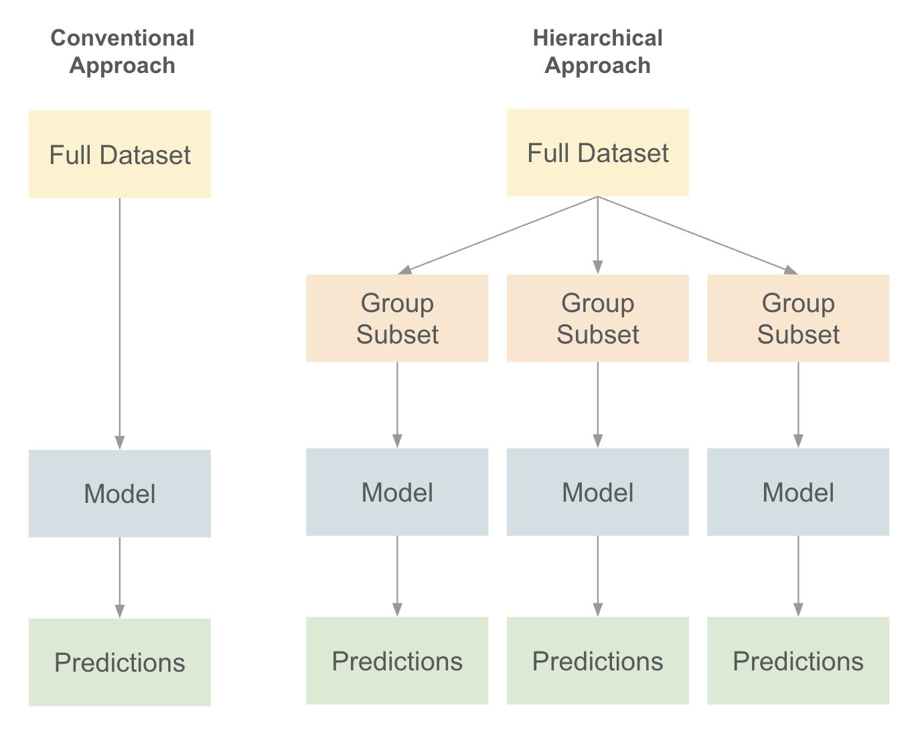

# Hierarchical

- Bottom-up
- Top-Down
- Middle-out

## Types

- Hierarchical non-additive: Price of Make, model, trim
- Hierarchical additive: Revenue of Make, model, trim

## Hierarchical non-additive

If there are multiple independent levels of features, then run a model for each levels
- simple model for each level is better than one complex model for all group
- especially useful for imbalanced hierarchies

Advantages:
1. Better loss definition: Predict accurately on average --> Predict each subset accurately on average
2. Simpler and easier to debug
3. Faster (than requiring a single model to produce splits)

Complexity of atomic model for each hierarchy should be based on the amount of data available for that hierarchy
- create a meta-estimator to conditionally apply a model

{ loading=lazy }

## Hierarchical Additive

Required for coherent forecasts

|            |                       | $\hat y_\text{top}$                    | $\hat y_\text{bot}$                              | $\hat p_l$                                          |
| ---------- | --------------------- | -------------------------------------- | ------------------------------------------------ | --------------------------------------------------- |
| Bottom-up  |                       | $\sum\limits_l \hat y_{\text{bot}, l}$ | $\hat f$                                         |                                                     |
| Top-down   |                       | $\hat f$                               | $\sum\limits_l \hat p_l \cdot \hat y_\text{top}$ |                                                     |
|            | Historical proportion |                                        |                                                  | $\dfrac{y_{\text{bot}, l}}{y_\text{top}}$           |
|            | Predicted proportion  |                                        |                                                  | $\dfrac{\hat y_{\text{bot}, l}}{\hat y_\text{top}}$ |
| Middle-out |                       |                                        |                                                  |                                                     |

