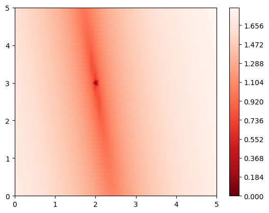
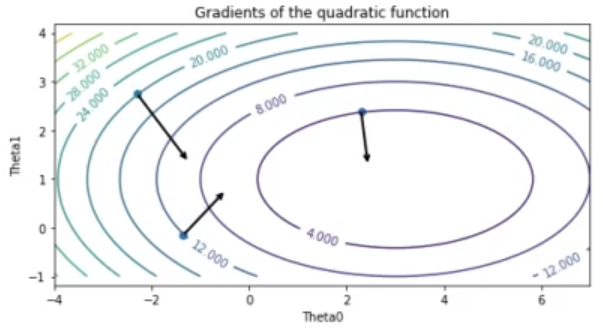

# Optimization Algorithms

Need not be just gradient-based

- The algorithms from AI course can also be used
- Even brute force is fine for small datasets; since this evaluates all possibilities and does not take any approximations/gradients, this would be robust to noisy data

Gradient-based algorithms are preferred for large datasets

| Optimizer                                                      | Meaning                                                                                                                                                                     | Comment                      | Gradient-Free | Weight Update Rule<br />$w_{t+1}$                                                                                                                                                                                                                                                                                                                         | Advantages                                                                                    | Disadvantages                                                                                                                                                                                                                                       |
| -------------------------------------------------------------- | --------------------------------------------------------------------------------------------------------------------------------------------------------------------------- | ---------------------------- | ------------- | --------------------------------------------------------------------------------------------------------------------------------------------------------------------------------------------------------------------------------------------------------------------------------------------------------------------------------------------------------- | --------------------------------------------------------------------------------------------- | --------------------------------------------------------------------------------------------------------------------------------------------------------------------------------------------------------------------------------------------------- |
| L-BGFS                                                         | Newton’s method                                                                                                                                                             | Not commonly used            | ❌             | $w_{t+1} = w_t - \eta H^{-1} g(w_t)$                                                                                                                                                                                                                                                                                                                      | Full-step will optimize quadratic functions in one step<br>No hyperparameters (learning rate) | Computationally-expensive: Can’t efficiently solve for Newton step, even using automatic differentiation<br />For non-convex optimization, it is very unclear if we even want to use Newton direction<br>Does not work well for mini-batch training |
| Nelder-Mead                                                    | Simplex method                                                                                                                                                              |                              | ✅             |                                                                                                                                                                                                                                                                                                                                                           |                                                                                               |                                                                                                                                                                                                                                                     |
| Gradient Descent                                               |                                                                                                                                                                             | Generalizes better than Adam | ❌             | $w_t - \eta g(w_t)$                                                                                                                                                                                                                                                                                                                                       |                                                                                               |                                                                                                                                                                                                                                                     |
| GD + Momentum                                                  | “Averaging” of step directions<br />“global” structure similar to BGFS                                                                                                      |                              | ❌             | $w_t - \eta u_{t}$<br />$u_{t+1} = \beta u_t + (1-\beta) g(w_t); u_0 = 0$<br />$\beta \in [0, 1):$ momentum averaging parameter                                                                                                                                                                                                                           | Smoothens out steps                                                                           | Can introduce oscillation/non-descent behavior                                                                                                                                                                                                      |
| GD + Unbiased Momentum                                         |                                                                                                                                                                             |                              | ❌             | $w_t - \dfrac{\eta u_{t}}{1 - \beta^{t+1}}$<br />Dividing by $1-\beta^{t+1}$ unbiases the update                                                                                                                                                                                                                                                          | Ensures updates have equal expected magnitude across all iterations                           | Sometimes you want the initial steps to be smaller than the later states                                                                                                                                                                            |
| Nag<br>Nesterov Accelerated Gradient<br>GD + Nesterov Momentum | Lookahead gradient from momentum step                                                                                                                                       |                              | ❌             | $w_t - \eta u_{t\textcolor{hotpink}{-1}}$<br />$u_{t+1} = \beta u_t + (1-\beta) g(w_t \textcolor{hotpink}{- \eta u_t}); u_0 = 0$                                                                                                                                                                                                                          |                                                                                               |                                                                                                                                                                                                                                                     |
| AdaDelta                                                       |                                                                                                                                                                             |                              | ❌             | $w_t + v_{t+1}$<br />$v_{t+1} = \rho v_t - \eta g(w_t)$<br />or<br />$v_{t+1} = \rho v_t - \eta g(w_t + \rho v_t)$                                                                                                                                                                                                                                        |                                                                                               |                                                                                                                                                                                                                                                     |
| AdaGrad                                                        | Decreases the momentum for each parameter, based on how much that parameter has made progress<br />Can only decrease the moment                                             |                              | ❌             | $w_{i, t+1} = w_{i, t} - \dfrac{\eta}{\epsilon + \sqrt{v_{i, t+1}}} g(w_{i, t})^2$  $v_{i, t+1} = v_{i, t} + g(w_{i, t})^2$<br />$\epsilon > 0$                                                                                                                                                                                                           |                                                                                               | Learning rate tends to zero after a long time                                                                                                                                                                                                       |
| RMSProp                                                        | Keeps a memory of previous gradients<br />Can increase/decrease the moment                                                                                                  |                              | ❌             | $w_{t+1} = w_{i, t} - \dfrac{\eta}{\epsilon + \sqrt{v_{t+1}}} g(w_{t})^2$ <br /> $v_{t+1} = \beta v_{t} + (1-\beta) g(w_t)^2$<br />$\epsilon > 0, \beta \in [0, 1]$                                                                                                                                                                                       |                                                                                               |                                                                                                                                                                                                                                                     |
| Adam<br />(Adaptive Moment Estimation)                         | Basically AdaGrad with Momentum<br><br>Scales the updates for each parameter differently                                                                                    |                              | ❌             | $w_{t+1} = w_{t} - \dfrac{\eta}{\epsilon + \sqrt{\hat v_{t+1}}} \hat m_{t+1}$<br />$\hat m_{t+1} = \dfrac{m_{t+1}}{1-{\beta_1}^{t+1}}$<br />$m_{t+1} = \beta_1 m_t + (1-\beta_1) g(w_t)$<br/>$\hat v_{t+1} = \dfrac{v_{t+1}}{1-{\beta_2}^{t+1}}$<br />$v_{t+1} = \beta_2 v_t + (1-\beta_2) g(w_t)^2$<br/><br/>$\epsilon > 0; \beta_1, \beta_2 \in [0, 1]$ |                                                                                               |                                                                                                                                                                                                                                                     |
| AdamW                                                          | AdamW is Adam with weight decay rather than L2-regularization<br><br>AdamW seems to consistently outperform Adam in terms of both the error achieved and the training time. |                              |               |                                                                                                                                                                                                                                                                                                                                                           |                                                                                               |                                                                                                                                                                                                                                                     |

Rule of thumb: recommended learning rate $\eta = 3e^{-4}$

## Newton’s Method

Integrates more “global” structure into optimization methods, which scales gradients according to the inverse of the Hessian
Equivalent to approximating the function as quadratic using second-order Taylor expansion, then solving for optimal solution

- $\eta=1:$ Full step
- o.w: Damped Newton method

## Brute-Force Regression

```python
m_hat = (0, 5, 0.1) # min, max, precision
c_hat = (0, 5, 0.1) # min, max, precision
```

### Imports

```python
import numpy as np
import pandas as pd
import matplotlib.pyplot as plt
```

### Generate Synthetic Data

$y = mx + c$

```python
def equation(x, m, c):
  return m*x + c
```

```python
x = np.arange(1, 10+1, 1)

m_true = 2
c_true = 3
y = equation(x, m_true, c_true)
```

```python
m_hat_range = np.arange(m_hat[0], m_hat[1]+m_hat[2], m_hat[2])
c_hat_range = np.arange(c_hat[0], c_hat[1]+c_hat[2], c_hat[2])

data = (
  np.column_stack(
    (
        x,
        y
    ),
  )
)

m, c = (
  np.meshgrid(
    m_hat_range,
    c_hat_range
  )
)
params = (
  np.column_stack(
    (
        m.flatten(),
        c.flatten()
    ),
  )
)

df = pd.DataFrame(
    data = np.column_stack(
        (
            np.tile(data, (params.shape[0], 1)),
            np.tile(params, (data.shape[0], 1))
        )
    ),
    columns = ["x", "y", "m", "c"]
)
```

### Forward Pass

```python
df["pred"] = equation(df["x"], df["m"], df["c"])
```

### Backward Pass

```python
df["error"] = df["pred"] - df["y"]
df["loss"] = df["error"]**2
```

### Results

```python
results = (
    df
    .groupby(["m", "c"])
    ["loss"]
    .mean()
    .reset_index()
    .rename(columns = {
        "loss": "cost"
    })
)
```

#### Loss Landscape

```python
fig, ax = plt.subplots()

ax = plt.tricontourf(
    results["m"],
    results["c"],
    results["cost"].pow(0.1),
    levels = 1_000,
    cmap="Reds_r"
)
fig.colorbar(ax)
plt.show()
```



#### Most Optimal Parameters

```python
(
    results
    .sort_values("cost", ascending=True)
    .reset_index(drop=True)
    .head(5)
)
```

|    m |    c | cost |
| ---: | ---: | ---: |
|  2.0 |  3.0 | 0.00 |
|  2.0 |  2.9 | 0.01 |
|  2.0 |  3.1 | 0.01 |
|  2.0 |  2.8 | 0.04 |
|  2.0 |  3.2 | 0.04 |

## Gradient Descent

Similar to trial and error

1. Start with some $\theta$ vector
2. Keep changing $\theta_0, \theta_1, \dots, \theta_n$ using derivative of cost function, until minimum for $J(\theta)$ is obtained - **Simultaneously**

$$
\theta_{\text{new}} =
\theta_{\text{prev}} -
\eta \ 
{\nabla J}
$$

|                       | Meaning                                                      |
| --------------------- | ------------------------------------------------------------ |
| $\theta_{\text{new}}$ | Coefficients obtained from current iteration<br />(Output of current iteration) |
| $\theta_{\text{old}}$ | Coefficients obtained from previous iteration<br />(Output of previous iteration) |
| $\eta$                | Learning Rate                                                |
| $\nabla J$            | Gradient vector of $J (\theta)$                              |

### Gradients of the Loss Function




### Learning Rate $\eta$

$0 < \eta < 1$

- Large value may lead to underfitting/overfitting
- Small value will lead to more time taken

Rule of thumb: recommended learning rate $\eta = 3 e {-4}$

Can be

- constant
- decay
	- Step: $\alpha_t = \alpha_{t-a}/2$
		- Decay by half every few epochs
	- Exponential: $\alpha_t = \alpha_0 e^{-kt}$
	- 1/t: $\alpha_t = \alpha_0/(1+kt)$


## Iterative vs Normal Equation

|                              |            Iterative            |              Normal Equation               |
| :--------------------------: | :-----------------------------: | :----------------------------------------: |
|  $\alpha$ **not** required   |                ❌                |                     ✅                      |
| Feature scaling not required |                ❌                |                     ✅                      |
|       Time Complexity        |            $O(kn^2)$            |                  $O(n^3)$                  |
|         Performance          |     Fast even for large $n$     |             Slow if $n > 10^4$             |
|        Compatibility         |    Works for all algorithms     |      Doesn’t work for classification       |
|        No of features        |    Works for all algorithms     | Doesn't work when $X^TX$ is non-invertible |
|        Stop criteria         |                                 |                    None                    |
|         Convergence          |              Slow               |                                            |
|  Global Optimal guaranteed   |                ❌                |                     ✅                      |
|        Loss Function         | Should be double-differentiable |                                            |

Gradient-based methods find min of a function by moving in the direction in which the function decreases most steeply
