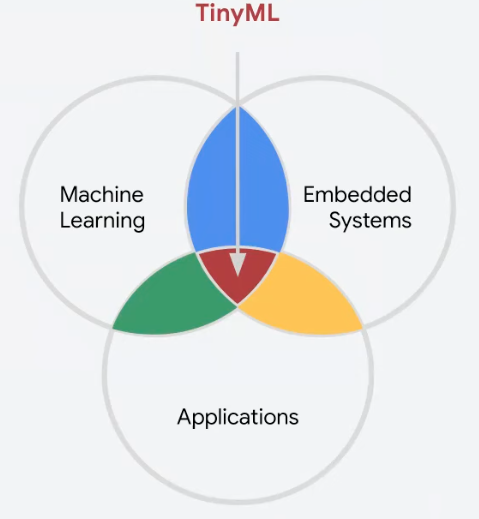
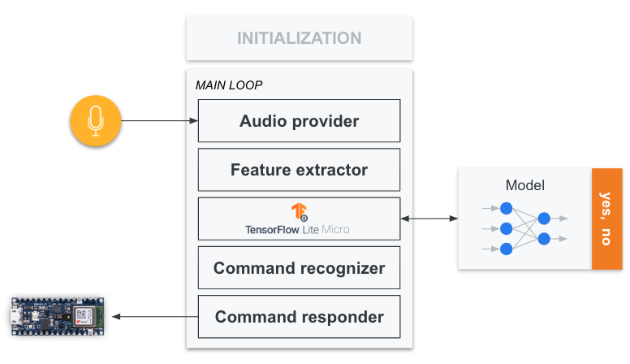
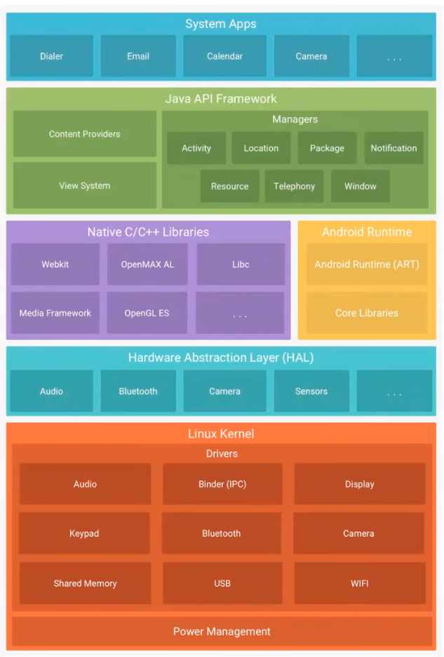
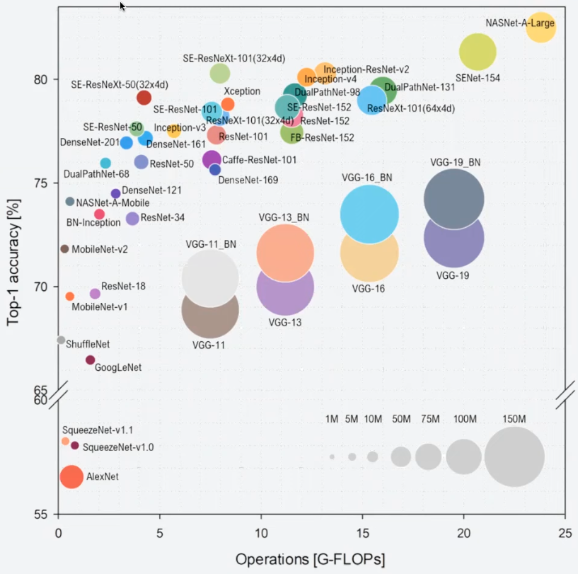

# Introduction

Hardware and systems are essential for the progress of deep learning.

## TinyML

- Machine Learning on embedded systems
- Often overlooked
- Useful to integrate ML with IoT Systems

### Example

### Procedure

## Applications

- Industry
	- Predictive maintenance
		- Reducing downtime
		- Increasing efficiency
		- Cost-efficiency
	- Monitoring
- Environment
	- Detailed insights on animals
	- Less wasted data
	- Cost-effective
	- Overcome limitations of human labor
- Humans
	- Improving accessibility
		- Hands-free
		- Voice control
	- UI + UX intuitiveness

## Embedded Systems

Device with
- extremely low power consumption (usually < 1 mW)
- Sensor, Processor, Output all-in-one

### Existing Systems

Nano 33 BLE Sense: AI-enabled ARM-based developmental microcontroller board

OV 7675 Camera module

TinyML Shield: Alternative to Breadboard

#### ARM Cortex Processor Profiles

- ARM designs the processor core & ISA, but they don’t fabricate the chips
- The company (Qualcomm, Apple) bundles it with other design for system-on-chip
- The company (Google, Samsung, etc) places order to fabrication company (TSMC)

#### Cortex-M ISA

### Embedded Systems OS

- RTOS
- Arm MBED OS

You can remove unnecessary OS modules

## Constraints and Optimization

Contraints
- Small size
- Low power
- Low bandwidth
- Low cost

Requirement
- Low latency
- High throughput

### Hardware

No more “free lunch” from material science improvements

|                 | Comment                                                                                                                                       |                                                                  |
| --------------- | --------------------------------------------------------------------------------------------------------------------------------------------- | ---------------------------------------------------------------- |
| Moore’s law     | Slowing down In 1970-2010, we were able to put more transistors on a chip and get exponentially more performance; but now this is ending |                            |
| Dennard scaling | essential stopped                                                                                                                             |  |

Costly for companies to use cloud-based systems; would prefer edge-computing to reduce their energy consumption

Can’t rely on material technology for performance: After a point in shrinking size of transistors to fit more on a single chip, side-effects (such as electrons shoot in unwanted directions) cause higher power usage. Hence, domain-specific H/W architectures (GPUs, TPUs) are important

#### Compute

#### Memory Allocation

Since products are expected to run for a long duration (months, years)
- memory allocation is very important
- need to guarantee that memory allocation will not end up fragmented
- Contiguous memory cannot be allocated even if there is enough memory overall

#### Memory Usage

- Need to be resource-aware
- Less compute
- Less memory
- Use quantization

### Storage

### Software

- Missing library features
	- Dynamic memory allocation is not always possible, to avoid running out of memory
- Limited OS system support; for eg: no `printf`

#### Operating System
Usually no Operating System, to save resources and enable specialization in the actual task

Sometimes there are OS
- Free RTOS
- arm MBED OS

Example of Android Platform Architecture in general purpose computer

#### Libraries

- Portability is a problem

#### Applications

### Model

There is a tradeoff between Accuracy and
1. Operations (usually, FLOPS)
2. Model size (usually, no of parameters)

Solutions
- Quantization
- Pruning
- Knowledge distillation
- AutoML

### Training Systems

- Pre/Post Processing
- Distributed training
- Federated learning

### Runtime/Inference Systems

Focused only on inference
- Less memory
- Less compute power

