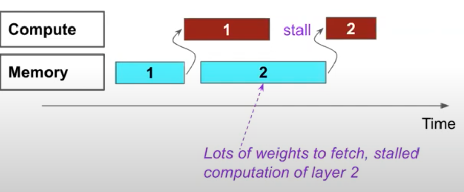
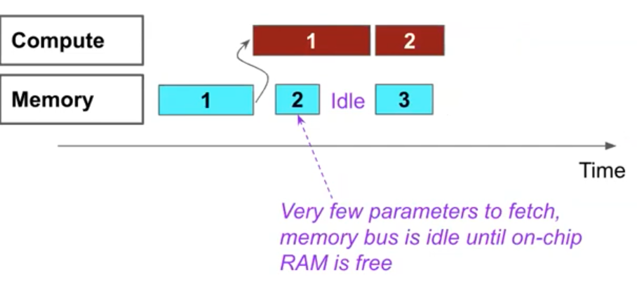
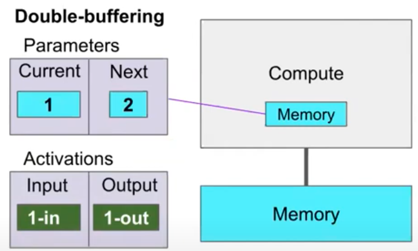

# DNN Computations

## Computational View

| Aspect  |                                  | Questions                                                    |
| ------- | -------------------------------- | ------------------------------------------------------------ |
| Memory  | Parameters                       | Size Does it fit on-chip How long does it take to load from off-chip Can I overlap loading with computation Is there re-use of loaded parameters |
|         | Activation                       | Size Does it fit on-chip How long does it need to be on-chip |
| Compute | MACs (Multiply-ACcumulates) | What is the available parallelism in each layer? Does it fit the HW? Can I overlap compute with memory access |
|         | Data dependencies                | Which (parts of) tensors need to be ready before starting to process a layer |

Operation in an epoch

|                 | Bottleneck operation | Compute utilization ratio | Memory utilization ratio |
| --------------- | -------------------- | ------------------------- | ------------------------ |
| Forward pass    | Multiplication       |                           |                          |
| Backward pass   | Multiplication       | 2x of forward pass        | 1x of forward pass       |
| Gradient update | Subtraction          |                           |                          |

## I/O-Bound vs CPU-Bound

Memory-Bound vs Compute-Bound

- Does it take more time to do computation or fetch data from memory
- Depends on factors
  - Memory bandwidth
  - Compute speed/parallelism
  - Size of operands
  - Size of (intermediate) result
  - On-Chip buffering resources

|                                                              | Memory-Bound                                                 | Compute-Bound                                                |
| ------------------------------------------------------------ | ------------------------------------------------------------ | ------------------------------------------------------------ |
|                                                              |  |  |
| Parameters to fetch                                          | Many                                                         | Few                                                          |
| Stalls other                                                 | Compute                                                      | Memory                                                       |
| Implication  Even if you have the best __, it won’t make a difference | GPU                                                          | RAM, hard drive                                              |
| Not concerning                                               | ❌                                                            | ✅                                                            |
| IDK                                                          |                                                              | Unnecessarily over-optimized memory controller               |

## Double-Buffering

DNN “fit” on a processor: DNN’s parameters and activations fit on the processor’s external memory

Why do GPUs have smaller external memories, ie why is VRAM smaller than RAM? Because VRAM is much faster, and hence more expensive

## Model Checkpointing

- General: Store all activations from forward pass, to use during backward pass
- Checkpointing: skips some of those activations and recalculate on the fly during backward pass

Implication: less memory usage, but more computation

## Common DNN Layers

|                        | Type of bound | Compute complexity (Operations)       | Memory complexity (No of parameters) | Comment                                                      |
| ---------------------- | ------------- | ------------------------------------------ | ----------------------------------------- | ------------------------------------------------------------ |
| Convolution            | Compute       | $k \times 2 \times rs \times w h \times c$ | $k \times rs \times c$                    |                                                              |
| Depth-wise convolution | Compute       | $k \times 2 \times rs \times w h$          | $k \times rs$                             |                                                              |
| Linear/Fully-Connected | Memory        |                                            | $k$                                       |                                                              |
| Batched Linear         | Equal         |                                            | $k$                                       |                                                              |
| Pooling                | Equal         | $O(1)$                                     | $O(1)$                                    | Can reuse hardware for convolutions with max/avg filter      |
| Normalization          | Equal         | $O(1)$                                     | $O(1)$                                    | Batch-norm becomes a simple scale+shift operation during inference |
| Activation Functions   | Equal         | $O(1)$                                     | $O(1)$                                    | AF that cannot be compute in-place would need gradients to be computed before & after the AF Some AF have parameters |

|      | Convolution                                            |
| ---- | ------------------------------------------------------ |
| $w$  | Input width                                            |
| $h$  | Input height                                           |
| $c$  | No of input channels                                   |
| $s$  | Filter width                                           |
| $r$  | Filter height                                          |
| $k$  | No of filters in convolution No of weight tensors |

