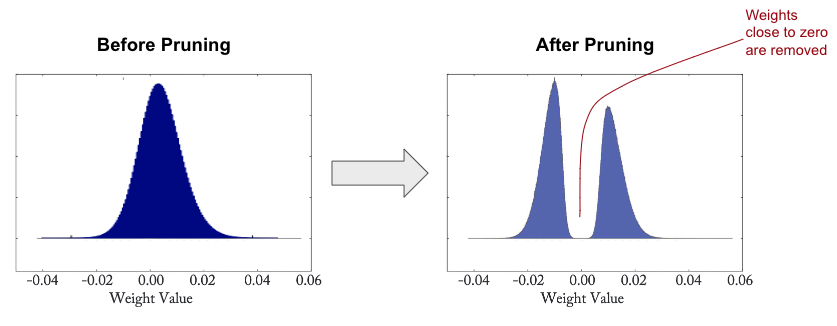
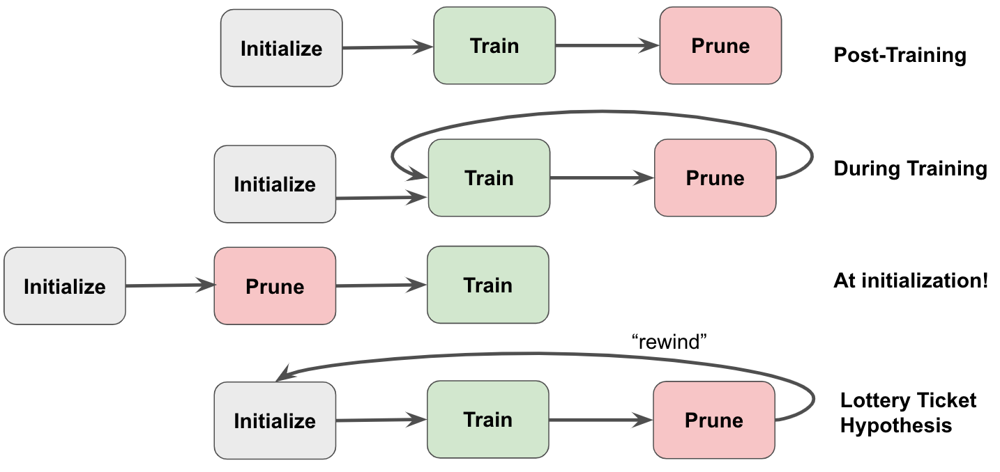
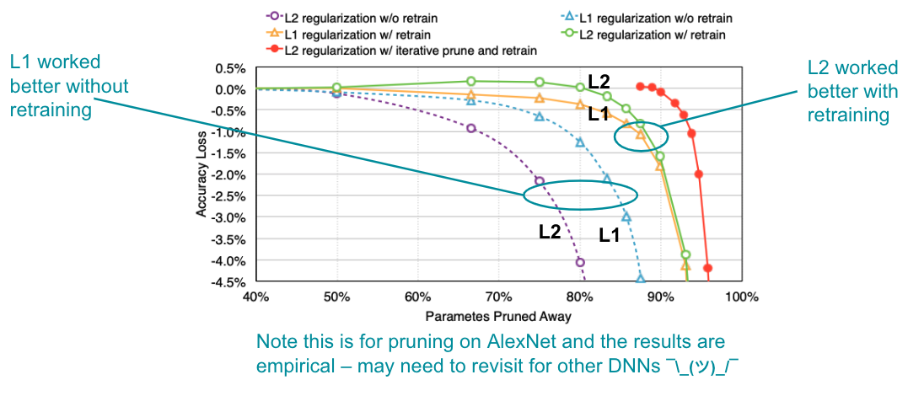

# Pruning

1. Train ANN
2. Remove $p \%$ of parameters with smallest magnitude

Terms

|               |       |
| ------------- | ----- |
| Pruning Rate  | $p$   |
| Sparsity Rate | $1-p$ |
| Compression   | $1/s$ |

## Pruning Mask

The filter that causes the pruning
$$
Y = X \cdot (W \odot M)
$$

## Weight Distribution

## When

- Before training: at initiationization
- During training
- After training

Pruning at initialization

## What

|         | Local                                                  | Global                                                     |
|---      | ---                                                    | ---                                                        |
|         | Remove least important $p \%$ of weights in each layer | Remove least important $p \%$ of weights in entire DNN     |
|         |                                                        | Better                                                     |
|Disadvantage |                                                        | May cause layer collapse: Removal of all parameters of certain layer |

Solution for Layer collapse

- Hard constraints: if lyre collapse then stop pruning
- Iterative pruning: fine-tuning helps to equalize the weight magnitudes

|             | Unstructured       | Structured                                                   |
| ----------- | ------------------ | ------------------------------------------------------------ |
|             |                    | Remove blocks of size of dot product in hardware             |
| Remove      | Individual weights | Channels Filters (N:M)                                  |
| Advantage   |                    | Can be accelerated on any hardware                           |
|             | Higher rates       |                                                              |
| Compression |                    | Better                                                       |
| Limitation  |                    | May cause shape mismatch: no of channels not equal for inputs into future layer, thereby not allowing it |

## Encourage Sparsity

Add regularization penalty to weights

- L1-norm
- L2-norm
- L$\infty$-norm

## Pruning Criteria

How to prune

Remove least important

- Magnitude
- Gradient
- Learned
- Information
- Salience: The change in the loss function with and without a parameter
  - Gradient-based
  - Information-based

### Salience

$$
\Delta L_j (w; D)
=
L( 1 \cdot w; D)
- L \Big( (1-e_j) \cdot w; D \Big)
$$

where

- $\Delta L_j =$ change in loss function
- $w=$ weights
- $D =$ dataset
- $1 =$ unit vector
- $(1-e_j) =$ pruning mask

However, this is intractable

### Optimal brain damage

The hessian of a neural network is intractable to compute

Salience
$$
s_j = \begin{cases}
\vert w_j \vert & \text{magnitude-based} \\
\dfrac{w^2_j}{2 \times H^{-1}_{jj}} & \text{gradient-based} 
\end{cases}
$$
Delete the lowest saliency parameters

### Mutual Information

Measure of how information is present in one var about another var
$$
\begin{aligned}
\vert \Delta L(h_i) \vert
&= \vert
L(D, h_i=0) - L(D, h_i=1)
\vert & \text{(1)} \\
& = \left \vert
\dfrac{\partial L}{\partial h_i} h_i
\right \vert & \text{(2)}
\end{aligned}
$$

1. Impact on loss function $L$ when activation channel $h_i$ is set to 0 and when it is not
2. Gradient of loss function wrt activation map -> intuitively prunes channels that don’t impact loss function

### Fisher information

## How often

- One-shot
- Iterative

## Iterative Magnitude  Pruning (IMP)

1. Train ANN
2. Remove $p \%$ of params with smallest magnitude
3. Retrain ANN: ‘Fine-tune’
4. Repeat steps 2-3

### Weight distributions

## IDK

- Dynamic iterative pruning: Allow parameters to ‘come back to life’: Correction of a pruning decision
- Runtime pruning: Learn which parameters/channels to drop at runtime based on input data
- Learnt pruning mask: Use back propagation to learn aspects of pruning algo during training
  - What to prune
  - Pruning Threshold per layer
