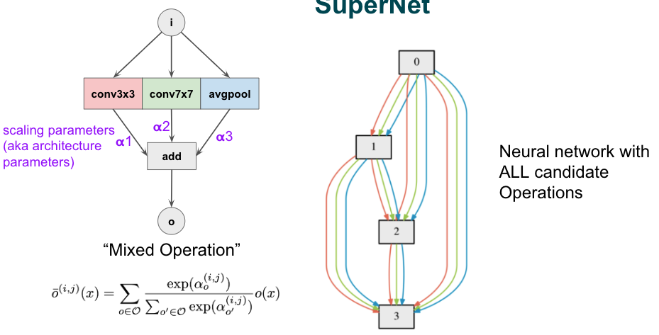
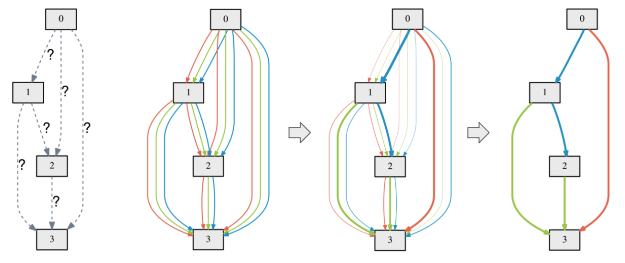
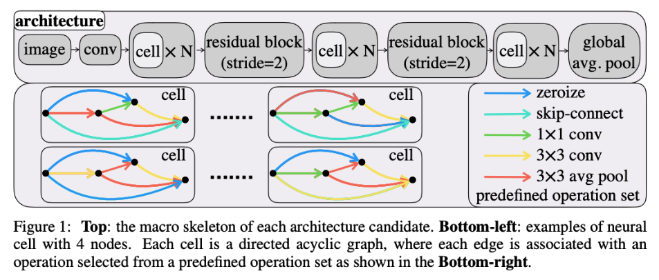

# Neural Architecture Search

- Number of layers
- Operation at each layer
- Hyper-parameters of each operation
- Topology & connectivity

## Objective

- Minimize: Loss/Accuracy
- Minimize: Time taken to train
- Minimize: Latency

## Search Space

- Operation types $o$
- Number of layers $n$

Total number of possible DNNs $= o^d$

## Training Techniques

- Full training
- Proxy instead of training
- Parameter sharing

## Algorithms

- Random search
- Reinforcement learning
- Genetic algorithms
- Prediction-based search
- Differential architecture search

### Reinforcement Learning

```mermaid
flowchart LR
c["Controller<br>DNN"] --->
|Sample arhicterue A<br>with prob p| t["Train child network<br>with architecture A<br>to obtain accuracy R"] --->
|Compute gradient of p<br>and scale it by R<br>to update controller| c
```

Policy gradient algorithm

- Function parameterized with parameters $\theta$: DNN
- Action: DNN architecture parameters
- State space: All set of possible DNNs in search space
- Reward to update $\theta$: Objective (accuracy)

### Predictor-based search

We don’t need exact accuracy of architecture; just need the relative rankings of different architectures

1. Train predictor on $T$ DNNs
2. Use predictor to sort $N$ models, where $N >> T$

### Differentiable Architecture Search

Optimize architecture parameters $\alpha$ during training, then keep operations with largest $\alpha$

- Bi-level optimization
- DARTS

## NAS Efficiency

- More efficient search algorithm
- Smaller search space
- Inexpensive accuracy proxy rather than training

## Cell-based NAS

$c$ cells, $o$ ops per cell, each op has $k$ choices

|       |                                                         | Search Space |
| ----- | ------------------------------------------------------- | ------------ |
| Micro | Search for a “cell” Place the same cell everywhere | $k^o$        |
| Macro | Search for each cell independently                      | $k^{o^c}$    |

## Parameter Sharing

Use trained parameters from previous sample

1000x faster than conventional NAS

Inspired by Transfer Learning

## Training Proxies

Instead of training to convergence to evaluate each model, estimate accuracy by reducing

- Number of epochs
- Subsample training set
- Lower data resolution
- Downscale model being evaluated

## Hardware-aware NAS

Customize DNN architecture for specific device

- Hard constraint: Reject models slower than target
- Soft constraint: Weighted sum of accuracy & latency

Latency evaluation

- Run inference on target device
- Estimation
  - Graph neural networks
  - No of parameters
  - Use FLOPs

## Codesign NAS

Add hardware search space

