# Mapping & Compilation

## Parts of Compiler

- Frontend: Prog lang to IR (Intermediate Representation)
- Middle-end (Optimizer)
- Backend: IR to Assembly/Machine code (Code generator)

## ML Compilation System

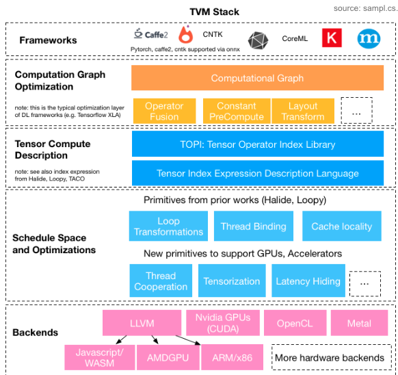{ loading=lazy }

## Mapping onto Hardware

- Dataflow choice
- Tiling
- Vectorization
- Bind ops to PEs
- On-chip memory management

### Dataflow selection

Compiler can re-order loops without changing functionality

Compiler heuristics can model approximate effect on runtime and memory access

Eg: 1D Convolution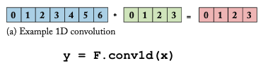{ loading=lazy }

|                   |                                                              |                                                              |
| ----------------- | ------------------------------------------------------------ | ------------------------------------------------------------ |
| Weight stationary | 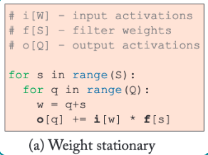{ loading=lazy } | 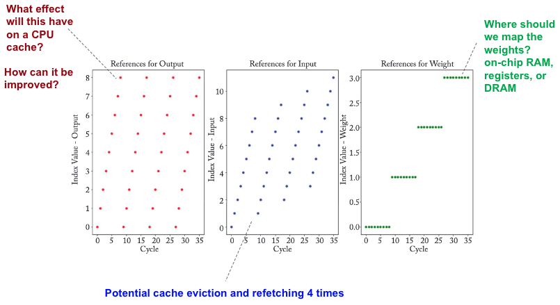{ loading=lazy } |
| Output stationary | { loading=lazy } | 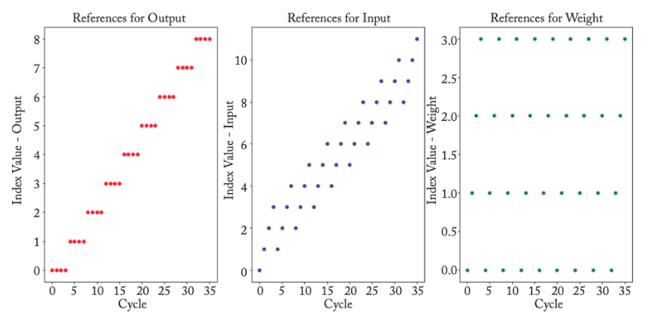{ loading=lazy } |
| Input stationary  | 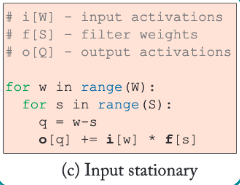{ loading=lazy } |                                                              |

### Tiling

Choose tile size on which to operate, to fit data in various parts of memory system

Break a loop into nested loops, each of which can be mapped hierarchically onto memory system (DRAM, SRAM, Registers)

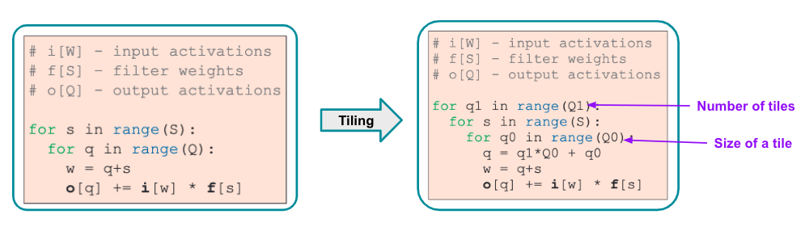{ loading=lazy }

Other names

- CUDA: Thread Block
- OpenCL: Work Group

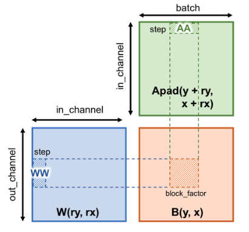{ loading=lazy }

### Vectorization

Parallelize operations within smallest tile, to leverage hardware parallelism

{ loading=lazy }

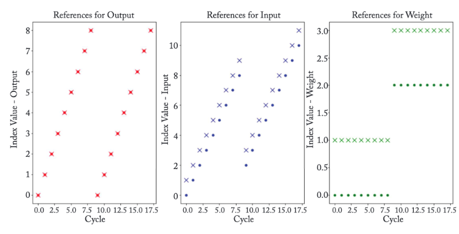{ loading=lazy }

### Binding

Specify PE index $i$ that will execute loop iteration $j$

Applicable when no of PEs $\ne$ no of loop iterations

## On-chip memory management

### Graph Compiler

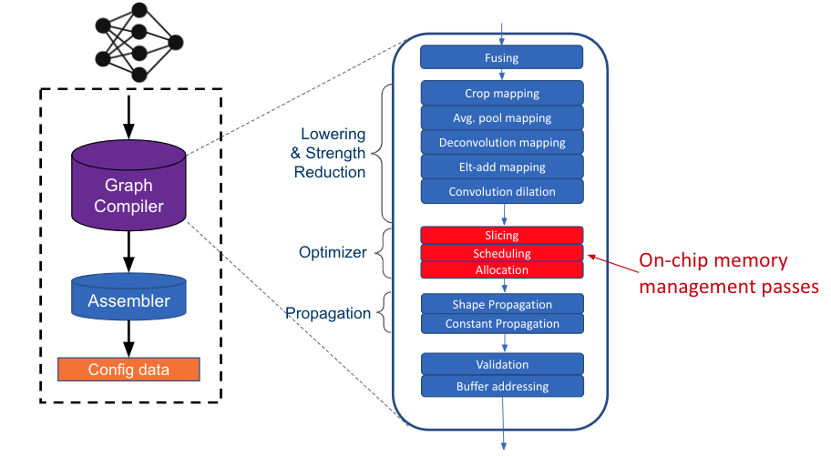{ loading=lazy }

### On-Chip buffer

“Spatio-temporal tetris”

Mem management passes:

- Scheduling: order of subgraph execution
- Allocation: where to put data in buffer
- Slicing/fusing: how to break/merge operations

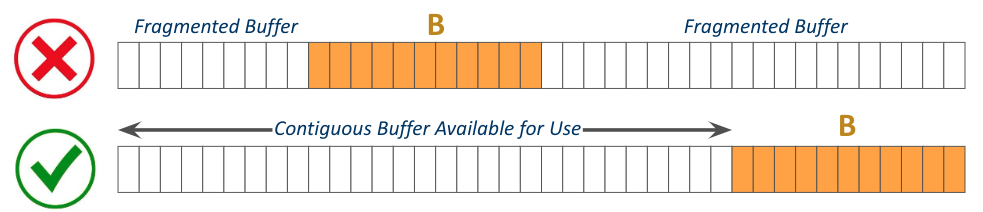{ loading=lazy }

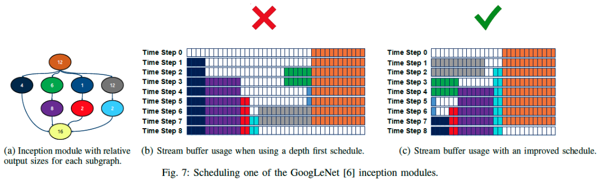{ loading=lazy }

## Mapping Space

Usually very large

- Many mappings are functionally-identical; eg: binding operations differently
- Many mappings are invalid; eg: tile size doesn’t fit in memory

Navigate space using heuristics

Informed by device performance/energy models

## DLA ISA

- Domain-specific, simple ISAs
- VLIW: Very Long Instruction Word is common

As time progresses, for DLAs, compiler need not worry about loop nests/mapping data flows, as this is all handled in hardware

Operation fusion: Coarse-grained optimizations

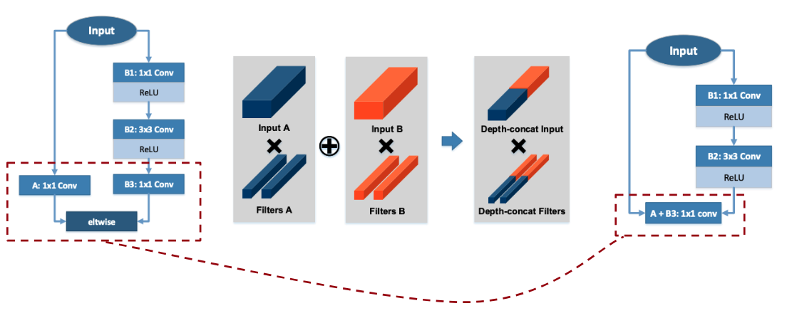{ loading=lazy }