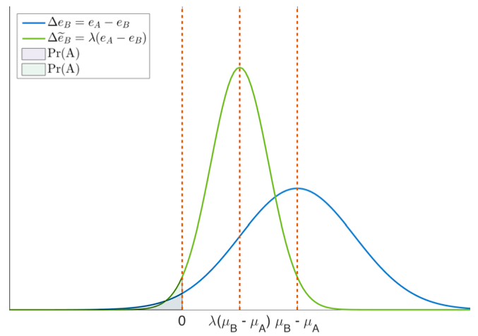
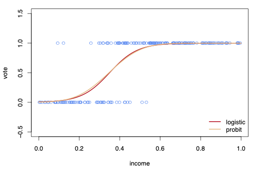
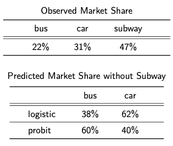
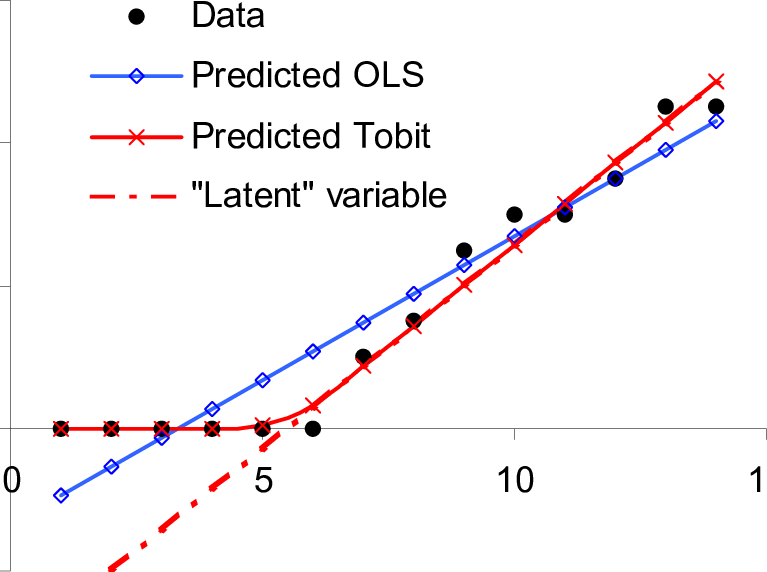

# Discrete Choice Models

Discrete choice models are a class of econometric models of how individuals make choices, where “individuals” is any unit of decision making, such as people, firms, governments

These models are similar to a classification problem, but they are structural models of decision making based on utility maximization. Hence, they do not make the assumption of IIA and can handle it effectively.

The ultimate goal of the researcher is to represent utility so well that the assumption of error independence is appropriate and then use Logistic regression incorporating all important features.
In the absence of that, a discrete choice model that allows for correlated errors, such as the multinomial probit, can be used

## RUM Framework

Random Utility Maximization

### Problem Formalization

Consider

- Individual $i$ chooses $y$ among $J$ alternatives
- $x_{ij}$ is the **observed** characteristics associated with individual $i$ and alternative $k$
  - $s_i:$ Individual-specific factors (eg: income)
    - $r_j s_i$
  - $z_{ij}:$ Alternative-specific factors with generic coefficients (eg: price)
    - $\beta z_{ij}$
  - $w_{ij}:$ Alternative-specific factors with alternative-specific coefficients (eg: price)
    - $\alpha_j w_{ij}$
- $u_{ij}$ is the **unobserved** utility associated with alternative $j$ for individual $i$, that even the individual is not aware about

$$
\begin{aligned}
u_{ij} &= f_j(x_{ij}) + \epsilon_{ij} \\
f_j &= \beta_j x_{ij} && \text{(Simple Model)}
\end{aligned}
$$

where $\epsilon_{ij}$ is the effect of unobserved factors, such that $\epsilon \sim^\text{iid} F_e$; different specifications of $f_j$ and $F_e$ lead to different discrete choice models

Example: Temperature and Rainfall $x_{ij}$ affects which crop $u_{ij}$ is grown in each place $j$

### Assumption

- Individual knows their $u_{ij}$
- Individual’s decision is deterministic

### Choice

A rational individual chooses the alternative that maximizes the utility
$$
\begin{aligned}
u_i &= \max( \{ u_{ij} \} ) \\
\implies y_i &= \arg \max_{j} \{ u_{ij} \}
\end{aligned}
$$

$$
\begin{aligned}
P(y_i = k \vert x)
&= P(
u_{ik} > u_{ij}
) && \forall j \ne k \in J \\
&= P \Big(
	f_j - f_k > \epsilon_{ij} - \epsilon_{ik}
\Big) \\
&= F \Big( f_j - f_k \Big) && (\epsilon_{ij} - \epsilon_{ik} \sim F)
\end{aligned}
$$

where $P=$ CCP (Conditional Choice Probability)

### Features

- Only differences in utility matter; the absolute level of utility is irrelevant
  - Hence, if a constant is added to the utility of all alternatives, then the alternative with the highest utility does not change
- The overall scale of utility is irrelevant
  - Hence, if a **positive** scale is multiplied to the utility of all alternatives, then the alternative with the highest utility does not change

### Advantages

- Better interpretability
- Structural model

### Limitations

- Since $u_{ij}$ is unobserved, we can only calculate the probability of individual choosing each alternative conditional on the variables we observe
- Due to the [features](#features), we cannot learn the level of utility associated with different alternatives, only the scaled differences among them
- We cannot estimate the intercept and scale associated with $s_i$ for each utility
  - We can only estimate the difference of the above between 2 utilities 

### Estimation

1. We need to normalize and scale such that $u_{ia} = 0$

   1. Subtract all terms by $u_{ia}$
   2. Divide all terms to make $\epsilon_{i} \sim N(0, 1)$

   Reason: The parameters $\mu_a, \mu_b, \sigma_a, \sigma_b$ are not separately identifiable, because an infinite number of models (corresponding to different values of $\alpha$ and $\gamma$) are consistent with the same choice behavior

2. As long as there is an intercept term $\alpha_j$, alternative-specific variables $z_{ij}$ must vary with i in order to be identified

   Reason: Else, both will be constants and hence cannot be separately identified

3. The scale coefficients $\alpha$ of individual-specific variables must be alternative-specific in order to be identified.

   Reason: Since only difference in utility matters, $\alpha$ cannot be identified

4. Alternative-specific variables can have either alternative-specific coefficients or generic coefficients that do not change with alternatives

Consider a binary choice problem $y \in \{ a, b \}$
$$
\begin{aligned}
u_{ia} &= \mu_a + \epsilon_{ia} \\
u_{ib} &= \mu_a + \epsilon_{ib} \\
\end{aligned}
$$
Estimate $\Delta \tilde \mu_b = \alpha(\mu_b - \mu_a)$, which is the scaled difference between $\mu_a$ and $\mu_b$, by normalize the level and scale of utility.

## Probit Regression

Assumes that $\epsilon$ is a joint-normal distribution
$$
\epsilon_i \sim N(0, \Sigma)
$$
where the covariance matrix $\Sigma$ uses the “base class” as reference

A model with $J$ alternatives has $\le \dfrac{1}{2} J(J-1) - 1$ covariance parameters after normalization, which can be evaluated using the below methods

### Binary

$$
\begin{aligned}
\epsilon_i
&= \begin{bmatrix}
\epsilon_{ia} \\
\epsilon_{ib}
\end{bmatrix}
\\
& \sim N \left(
0,
\begin{bmatrix}
\sigma_a^2 & \sigma_{ab} \\
\cdot & \sigma_b^2
\end{bmatrix}
\right)
\end{aligned}
$$

$$
\epsilon_{ia} - \epsilon_{ib} \sim N(0, \sigma_a^2 + \sigma_b^2 - 2 \sigma_{ab}) \\
\alpha = u_{ia} \\
\lambda = \dfrac{1}{
\sqrt{\sigma_a^2 + \sigma_b^2 - 2 \sigma_{ab}}
}
$$

### Multinomial

$$
\begin{aligned}
\epsilon_i
&= \begin{bmatrix}
\epsilon_{i1} \\
\epsilon_{i2} \\
\dots \\
\epsilon_{ij}
\end{bmatrix}
\\
& \sim N \left(
0,
\begin{bmatrix}
\sigma^2_1 & \sigma_{12} & \dots &  \sigma_{1j} \\
& \ddots & \\
& & \dots  & \sigma^2_j
\end{bmatrix}
\right)
\end{aligned}
$$

Multinomial probit models do not have the IIA property as they allow correlated errors

## Logistic Regression

Assumes that $\epsilon$ is iid
$$
\epsilon_{ij} \sim^\text{iid} \text{Gumbel}(0, \sigma)
$$
The difference between two extreme values is distributed as a logistic distribution
$$
F(\Delta) = \dfrac{\exp(\Delta e)}{1 + \exp(\Delta e)}
$$
The CDF of the logistic distribution is the sigmoid function

We need to normalize the scale of $\epsilon_i$ such that $\sigma=1$
$$
\begin{aligned}
\implies \epsilon_{ij}'
& \sim \text{Gumbel}(0, 1) \\
& \sim N(0, 1)
\end{aligned}
$$
As Gumbel and normal very similar
$$
\begin{aligned}
P(y_i = k \vert x_i)
&= P(u_{ik} > u_{ij}) && \forall j \ne k \in J \\
&= P(\Delta e_i < \Delta f_i) \\
&= \dfrac{\exp(f_{ik})}{\sum_j^J \exp(f_{ij})} && (\Delta e_i \sim \text{Logistic})
\end{aligned}
$$
Expected utility of individual $i$ conditional on $x_i$
$$
\begin{aligned}
E[u_i \vert x_i]
&= E \Big[
\max_j \{ u_{ij} \} \ \vert \ x_i
\Big] \\
&= \log \Big[
\sum_j^J \exp(f_{ij})
\Big] + c && (c = \text{const})
\end{aligned}
$$
This is because we can add any $c$ to the utilities and the model would be the same

Proportional substitution is a manifestation of the IIA property of the logistic model

## Logistic vs Probit

Binary Logistic regression $\approx$ Binary probit regression

|                                       | Logistic Regression                    | Probit                                                                        |
| ------------------------------------- | -------------------------------------- | ----------------------------------------------------------------------------- |
| Speed                                 | Faster (has closed form solution) | Slower (no closed form solution)                                         |
| Can handle similarity between choices | ❌                                      | ✅                                                                             |
| Advantage                             |                                        | Probit seems more realistic as it incorporates similarity of alternatives     |
| Disadvantage                          |                                        | Might struggle for large number of alternatives due to difficult optimization |

Example

## Marginal Effects

$$
\begin{aligned}
\dfrac{\partial P(y_i = j \vert x_i)}{\partial s_i}
&= P(y_i = j \vert x_i) \left( \gamma_j - \sum_j \gamma_l P(y_i = l \vert x_i) \right) \\
\dfrac{\partial P(y_i = j \vert x_i)}{\partial z_{ij}} &= \delta_j \cdot P(y_i = j \vert x_i) \Big[ 1 - P(y_i = j \vert x_i) \Big]
\end{aligned}
$$

| Variable             | Sign of marginal effect |
| -------------------- | ----------------------- |
| Alternative-Specific | Sign of coefficient     |
| Individual-Specific  | N/A                     |

### Choice Probability Elasticity

|       | Denotation   | Formula                                     | Meaning                                                      |
| ----- | ------------ | ------------------------------------------- | ------------------------------------------------------------ |
| Own   | $e_{i}^{jj}$ | $\delta z_{ij}[1- P(y_i = j \vert x_i)]$    | $\dfrac{\partial P(y_i=j \vert x_i)}{\partial z_{ij}} \times \dfrac{z_{ij}}{P(y_i = j \vert x_i)}$ |
| Cross | $e_{i}^{jk}$ | $-\delta z_{ij} \cdot P(y_i = k \vert x_i)$ | $\dfrac{\partial P(y_i=j \vert x_i)}{\partial z_{ik}} \times \dfrac{z_{ik}}{P(y_i = j \vert x_i)}$ |

## Tobit Regression

Applicable for
- Censored
- Truncated: Household expenditure
- Zero-inflated

$$
\hat y = \begin{cases}
\hat f(x), & \hat f(x) > c \\
c, &\hat f(x) \le c
\end{cases}
$$

OLS will be biased and inconsistent with/without removal of the truncated data

### MLE

$$
\begin{aligned}
L
&= \prod_{i=1}^n P(y_i \vert x_i) \\
&= \cancel{\prod_{i=1 | y_i \le c}^n P(y_i \vert x_i)} \times \prod_{i=1 | y_i = c}^n P(y_i \vert x_i) \times \prod_{i=1 | y_i \ge c}^n P(y_i \vert x_i) \\

\implies \ln L
&= \cancel{\sum_{i=1 | y_i \le c}^n P(y_i \vert x_i)} + \sum_{i=1 | y_i = c}^n P(y_i \vert x_i) + \sum_{i=1 | y_i \ge c}^n P(y_i \vert x_i) \\
&= 0 + \ln L_2 + \ln L_3 \\
\\
P(y_i \vert x_i)_2 &= \Phi(\text{Distribution}, \hat y, c) = \text{Tobit extra term} \\
P(y_i \vert x_i)_3 &= \phi(\text{Distribution}, \hat y, y) = \text{Usual minimization}
\end{aligned}
$$
For normal distribution,

$$
P(y_i \vert x_i)_2 = \dfrac{y_i - C}{\sigma_i}
$$

## Ordinal Regression

For classifying ordered categories