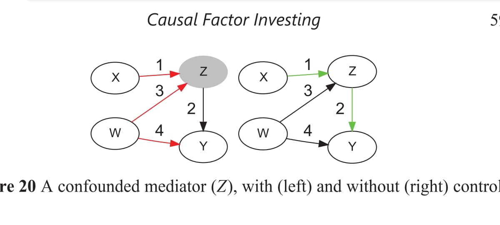
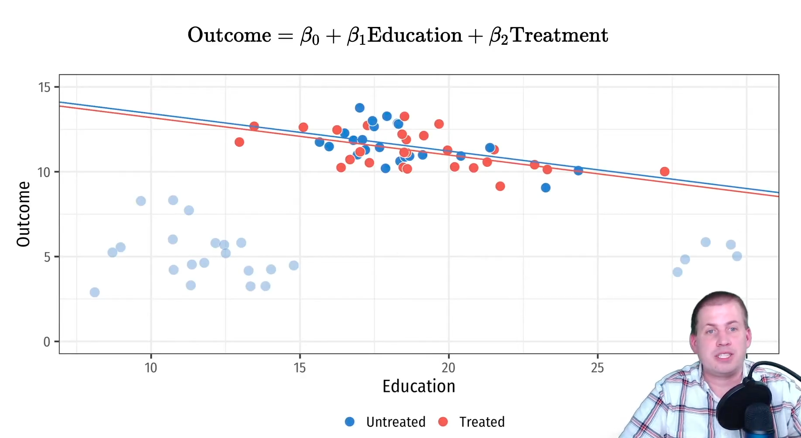
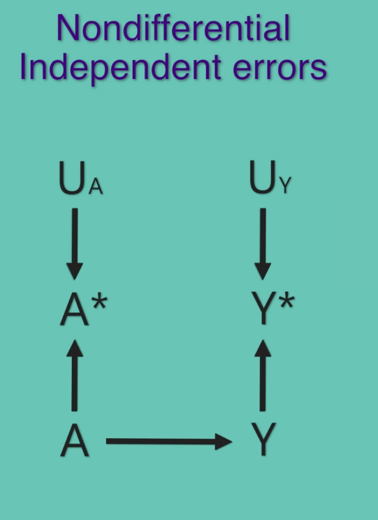
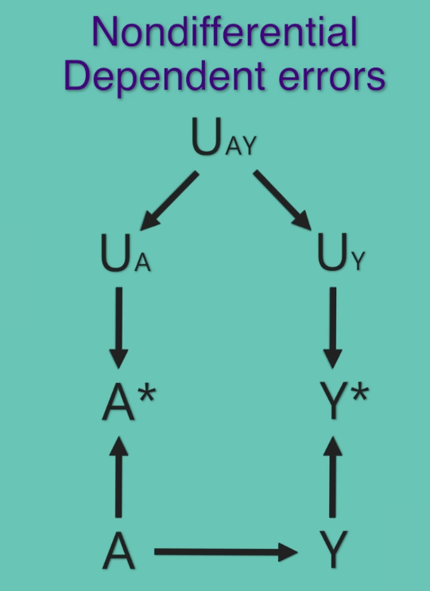

# Causal Model

A causal/scientific model $M$ for a set of RVs $\{ x_1, \dots, x_n \}$ is a model of the joint distribution $p(x_1, \dots, x_n)$ as well as the causal structure governing $\{ x_1, \dots, x_n \}$ which describes the causal relationships among the variables and how the data-generating process occurs
$$
M: y \leftarrow x
$$

## Causal Graph Model

Causal diagram/graph is a graph that can be used to represent a causal structure and hence, describe our quantitative knowledge about a causal mechanism

Causal model that uses a causal graph to represent the causal structure is called as Causal Graph Model/Causal Bayesian/Belief network.

- Causal diagrams can make assumptions scientific and "falsifiable"
- Causal diagrams can help identify which variables to randomize, include in model, or ignore

RCM was developed in statistics, causal graphical model is derived from CS/AI.

You can use LLMs to help derive causal theory

## Parts of Causal Model

1. Causal Structure $G$: Direction of causality (What causes what)
2. Statistical Model $H$: Joint distribution function

$$
M = (H, G)
$$

### Example

Consider a model $y = 2x$. This is a statistical model.

If $y \leftarrow 2x$, then it means that $x$ causes $y$. This is a causal model.

Let’s analyze the $x,y$ pairs for the following sequential changes.

| Model       | 1. do$(x=2)$ | 2. do$(x=3)$ | 3. do$(y=2)$ |
| ----------- | ------------ | ------------ | ------------ |
| Statistical | 2, 4         | 3, 6         | ==1, 2==     |
| Causal      | 2, 4         | 3, 6         | ==3, 2==     |

This is because, $x$ causes $y$; not the other way around.

## `do`-calculus

Let
- $G$ be a DAG
- $G_{\bar T}$ represent $G$ post-intervention (ie with all links into treatment $T$ removed)
- $G_{\underline T}$ represent $G$ with all links out of treatment $T$ removed

Rules
1. $P(y \vert \text{do}(t), z, w) = P(y \vert \text{do}(t), z) \iff Y \perp\!\!\!\perp W \vert (Z, T)$ in $G_{\bar T}$
2. $P(y \vert \text{do}(t), z) = P(y \vert t, z) \iff Y \perp\!\!\!\perp T \vert Z$ in $G_\underline{T}$
3. $P(y \vert \text{do}(t), z) = P(y \vert z) \iff Y \perp\!\!\!\perp T \vert Z$ in $G_{\bar T}$ and $Z$ is not a descendent of $T$

## Causal Diagram/Graph

Directed graph that represents the causal structure of a model. It is represented using a bayesian network: DAG (Directed Acyclic Graph) in which each node has associated conditional probability of the node given in its parents. 

The joint distribution is obtained by taking the product of the conditional probabilities.

$$
\begin{aligned}
p(x_1, \dots, x_n)
&= \Pi_{i=1}^n \ p( \ x_i \vert \text{pa}(x_i) \ ) \\
x_i \ & {\tiny \coprod} \ \text{nd}(x_i) \vert \text{pa}(x_i)
\end{aligned}
$$
where

- pa = parent
- nd = not descendant

Useful when you are only interested in the causal structure, and not so much in the statistical model

```mermaid
flowchart TD
B([B]) & C([z]) --> A([A])
```

$$
P(A, B, C) =
P(A | B, C) \cdot P(B) \cdot P(C)
$$

### Why DAG?

- Directed, because we want causal effects directions
- Acyclic, because a variable cannot cause itself.

my question is: What about recursive loops, such as our body’s feedback loops

### Parts

|                                    |                                                                                                                                                                                                                                                                                                                                                                                                                   |
| ---------------------------------- | ----------------------------------------------------------------------------------------------------------------------------------------------------------------------------------------------------------------------------------------------------------------------------------------------------------------------------------------------------------------------------------------------------------------- |
| Nodes - vars                       | - Rounded - Unconditioned - Square - Conditioned                                                                                                                                                                                                                                                                                                                                                              |
| Directed Edges - Causal directions | 1. The presence of an arrow from $x_i$ to $x_j$ indicates either that $x_i$ has a direct causal effect on $x_j$ – an effect not mediated through any other vars on the graph, or that we are unwilling to assume such a effect does not exist 2. The absence of an arrow from $x_i$ to $x_j$ indicates the absence of a direct effect; the absence of an arrow hence represents a more substantive assumption |

```mermaid
flowchart TB
a([a])
w([w])
x([x])
y([y])
z([z])

x --> y & z
z --> a

w --> y
```

| Term                                    | Condition                                                                                                                                                                                                                                                                                                                                           | Above Example                              |
| --------------------------------------- | --------------------------------------------------------------------------------------------------------------------------------------------------------------------------------------------------------------------------------------------------------------------------------------------------------------------------------------------------- | ------------------------------------------ |
| Parent                                  | Node from which arrow(s) originate                                                                                                                                                                                                                                                                                                                  | $x$ is parent of $y$ and $z$               |
| Child                                   | Node to which arrow(s) end                                                                                                                                                                                                                                                                                                                          | $y$ and $z$ are children of $x$            |
| Descendants                             |                                                                                                                                                                                                                                                                                                                                                     |                                            |
| Ancestors                               |                                                                                                                                                                                                                                                                                                                                                     |                                            |
| Exogenous                               | vars w/o any parent                                                                                                                                                                                                                                                                                                                                 | $w, x$                                     |
| Endogenous                              | vars w/ $\ge 1$ parent                                                                                                                                                                                                                                                                                                                              | $y, z, a$                                  |
| Causal Path                             | Uni-directional path                                                                                                                                                                                                                                                                                                                                | $x z a$ $z a$  $x y $ $w y$ |
| Non-Causal Path                         | Bi-directed path                                                                                                                                                                                                                                                                                                                                    | $x y w$                                    |
| Confounder                              | **Structural Definition** Variable that allows controlling for confounding  **Non-Structural Definition**, but not suitable for colliding confounder Node that satisfies: 1. Node associated with treatment $T$ 2. Node associated with outcome $y$, conditioned on treatment $T$ 3. Node not on causal path between $T$ and $y$ |                                            |
| Collider                                | **Structural Definition**   **Non-Structural Definition**, but not suitable always Node having multiple parents, where path ‘collides’                                                                                                                                                                                                  | $y$ in the path $x y w$                    |
| Blocked Path                            | Path with a - conditioned non-collider or - unconditioned collider, w/o conditioned descendants                                                                                                                                                                                                                                      |                                            |
| Back-Door Paths                         | Non-causal paths b/w $x$ and $y$, which if left open, induce correlation b/w $x$ and $y$ without causation                                                                                                                                                                                                                                          |                                            |
| d-separated vars                        | all paths b/w vars are blocked                                                                                                                                                                                                                                                                                                                      |                                            |
| d-connected vars                        | $\exists$ path between the vars which isn’t blocked                                                                                                                                                                                                                                                                                                 |                                            |
| conditionally-independent vars          | If 2 vars are d-separated after conditioning on a set of vars                                                                                                                                                                                                                                                                                       |                                            |
| conditionally-dependent/associated vars | If 2 vars are d-connected after conditioning on a set of vars  w/o faithfulness condition, this may not be true                                                                                                                                                                                                                           |                                            |

### Properties

Causal diagrams compatible with a joint distribution $p(x_1, \dots, x_n)$ must satisfy

| Property                | Meaning                                                                                                                                                                                                                                                                                   |
| ----------------------- | ----------------------------------------------------------------------------------------------------------------------------------------------------------------------------------------------------------------------------------------------------------------------------------------- |
| Causal Markov Condition | Every var is independent of any other vars (except its own effects) conditional on its direct causes                                                                                                                                                                                      |
| Completeness            | All common causes (even if measured) of any pair of vars on the graph are on the graph This property is as important as the requirement that all relevant factors are accounted for. Our ability to extract causal information from data is predicated on this untestable assumption |
| Faithfulness            | The joint distribution $p(x_1, \dots, x_n)$ has all the conditional independence relations implied by the causal diagram, and only those conditional independence relations                                                                                                               |

- $\text{nd}:$ non-descendent
- $\text{pa}:$ parents

## Validating Graphical Model

Consider 2 variables $v_1$ and $v_2$
- If $v_1$ is connected to $v_2$, there should be a correlation
- If $v_1$ is not connected to $v_2$, there should be no correlation between $v_1$ and $v_2$ given $\text{pa}(v_1)$, ie for each group of $\text{pa}(v_1)$

## Causal Operations

Conditioning: Broad concept of considering or restricting analysis based on certain variables
- Adjusting
- Selecting

|                                           | Adjusting                                                            | Selecting                                                                 |
| ----------------------------------------- | -------------------------------------------------------------------- | ------------------------------------------------------------------------- |
| **Definition**                            | Including variables as covariates in a statistical model             | Choosing a subset of data where treatment and control groups are balanced |
| **Scope**                                 | Specific method                                                      | Specific method                                                           |
| **Implementation**                        | Typically through regression, propensity score methods, or weighting | Often through matching techniques                                         |
| **Sample size impact**                    | Generally retains full sample                                        | May reduce sample size                                                    |
| **Primary goal**                          | Control for confounding                                              | Create comparable groups                                                  |
| **Typical use**                           | Accounting for  confounders in full dataset                          | Creating balanced comparison groups                                       |
| **Flexibility with continuous variables** | Generally high                                                       | Often requires categorization                                             |
| **Risk of introducing bias**              | Possible if adjusting for inappropriate variables                    | Possible if selection criteria are inappropriate                          |
| **Population inference**                  | Often for entire population                                          | May be limited to specific subpopulation                                  |

## Causal Relations

### General Framework

```mermaid
flowchart TB
oc([Observed<br/>Confounders])
uc([Unobserved<br/>Confounders])
oce([Observed<br/>Common<br/>Effects])
uce([Unobserved<br/>Common<br/>Effects])
x([x])
y([y])

x --> y
oc ---> x & y
uc -..-> x & y

x & y --> oce
x & y -.-> uce

classDef dotted stroke-dasharray:5
class uc,uce dotted

linkStyle 0 stroke:green
```

### Types

| Type                                 | $x, y$ are statistically-independent  Correlation $=$ Causation $E[y \vert x] = E[y \vert \text{do}(x)]$ | $E[y \vert \text{do}(x)]$                                                                        | Comment | Path ‘__’ by collider $c$                                              | Example $z$      | Example $x$                                      | Example $y$                                                                                                    |        |
| ------------------------------------ | ---------------------------------------------------------------------------------------------------------------------- | ------------------------------------------------------------------------------------------------ | ------- | ---------------------------------------------------------------------- | --------------------- | ----------------------------------------------------- | ------------------------------------------------------------------------------------------------------------------- | ------ |
|                                      | Mutual Dependence/ Confounding/ Common Cau                                                                   | ❌                                                                                                |         | Info on $x$ helps predict $y$, even if $x$ has no causal effect on $y$ |                       | Smoker                                                | Carrying a lighter                                                                                                  | Cancer |
| Conditioned Mutual Dependence        | ✅                                                                                                                      | $\sum_i E[y \vert \text{do}(x), c_i] \cdot P(c_i)$ $=\sum_i E[y \vert x, c_i] \cdot P(c_i)$ |         | blocked                                                                | Smoker=FALSE          | Carrying a lighter                                    | Cancer                                                                                                              |        |
| Mutual Causation/ Common Effect | ✅                                                                                                                      |                                                                                                  |         | blocked                                                                | Revenue of company    | Size of company                                       | Survival of company                                                                                                 |        |
| Conditioned Mutual Causation         | ❌                                                                                                                      |                                                                                                  |         | opened                                                                 | Revenue of company    | Size of company                                       | Survival of company=TRUE (we usually only have data for companies that survive)  (Survivorship bias) |        |
| Mediation                            | ❌                                                                                                                      |                                                                                                  |         |                                                                        |                       |                                                       |                                                                                                                     |        |
| Conditioned Mediation                | ✅                                                                                                                      |                                                                                                  |         | blocked                                                                | 1. Cancer 2. Tax | 1. Tar deposits in lung 2. Economic consequences | 1. Smoking 2. Economic conditions                                                                              |        |

```mermaid
flowchart TB

subgraph Mediation
  subgraph ucm[Unconditioned]
    direction TB
    x1([x]) --> c1([z]) --> y1([y])
    %% x1 --> y1
  end
  
  subgraph cm[Conditioned]
    direction TB
    x2([x]) --> c2[z] --- y2([y])
    %% x2 --> y2
  end
end

subgraph mc2[Mutual Causation 2]
	subgraph ucmc2[Unconditioned]
		direction TB
		x8([x]) & y8([y]) --> w8([w]) --> c8([z])
		%% x8 --> y8
	end
	subgraph cmc2[Conditioned]
		direction TB
		x7([x]) & y7([y]) --> w7([w]) --> c7[z]
		%% x7 --> y7
	end
end

subgraph mc[Mutual Causation 1]
	subgraph ucmc[Unconditioned]
		direction TB
		x4([x]) & y4([y]) --> c4([z])
		%% x4 --> y4
	end
	subgraph cmc[Conditioned]
		direction TB
		x3([x]) --> c3
		y3([y]) --> c3[z]
		%% x3 --> y3
	end
end

subgraph md[Mutual Dependence]
	subgraph ucmd[Unconditioned]
		direction TB
		c6([z]) --> x6([x]) & y6([y])
		%% x6 --> y6
	end
	subgraph cmd[Conditioned]
		direction TB
		c5[z] --- x5([x]) & y5([y])
		%% x5 --> y5
	end
end

%%linkStyle 4,24,23 stroke:none;
```

## Variables

Use dagitty for help
- https://www.dagitty.net/
- https://ahmedthahir.github.io/dagitty/

| Type                                       | Should adjust? | Adjustment Stage | Adjustment Reason                                                                                                                                                                            | Selection allowed? (Selection gives same result for population?) | Selection Reason |
| ------------------------------------------ | -------------- | ---------------- | -------------------------------------------------------------------------------------------------------------------------------------------------------------------------------------------- | ------------------------------------------------------------------- | ---------------- |
| Independent                                | ❌              |                  | Not related with $y$                                                                                                                                                                         | ❌                                                                   |                  |
| Treatment                                  | ✅              | 2                | Obviously                                                                                                                                                                                    | ✅                                                                   |                  |
| Non-treatment causes of $y$                | ✅              | 2                | Avoid omitted variable bias                                                                                                                                                                  | ❌                                                                   |                  |
| Cause/assignment of $T$                    | ✅              | 1                | Correct for non-random assignment                                                                                                                                                            | ✅                                                                   |                  |
| Cause/assignment of non-treatment causes   | ✅              | 1                | Correct for non-random assignment                                                                                                                                                            | ✅                                                                   |                  |
| Consequence of $T$                         | ❌              |                  | Not related with $y$                                                                                                                                                                         | ❌                                                                   |                  |
| Confounder                                 | ✅              | 2                | $z$ affects $y$ Close backdoor                                                                                                                                                            | ❌                                                                   |                  |
| Cause/assignment of confounder             | ✅              | 1                | Correct for non-random assigment                                                                                                                                                             |                                                                     |                  |
| Effect modifier                            | ✅              | 2                | Effect of $x$ on $y$ changes with $z$                                                                                                                                                        |                                                                     |                  |
| Instrumental vars                          | ⚠️             | 1                | Only if assignment to treatment not available                                                                                                                                                |                                                                     |                  |
| Surrogate/Proxy Confounder                 | ⚠️             | 1                | Only if confounder not available                                                                                                                                                             |                                                                     |                  |
| Mediator Consequence of mediator        | ❌              |                  | Conditioning causes over-controlling: Will take away some effect of $x$ on $y$  Any result is only valid for the conditioned value of mediator                                         | ✅                                                                   |                  |
| Collider Consequence of Collider        | ❌              |                  | Conditioning causes endogeneity/selection effect - Can create fake causal effects - Can hide real causal effects  Any result is only valid for the conditioned value of collider | ❌                                                                   |                  |
| Colliding mediator Colliding confounder | ❌              |                  | Opens backdoor                                                                                                                                                                               | ❌                                                                   |                  |
| Consequence of $y$                         | ❌              |                  | Logically-flawed; only predictive power, no causal power                                                                                                                                     | ❌                                                                   |                  |

### Confounding

#### Self Selection Bias

Special case of confounding, when $z$ affects the selection of $x$ and also has a causal effect on $y$, then $z$ is confounder.

```mermaid
flowchart LR
c(["Ability/Talent<br/>(Z)"])
T(["Education<br/>(T)"])
y(["Earnings<br/>(y)"])

c -->|Affects<br/>selection| T
c -->|Directly<br/>Affects| y

T -.->|Associated but<br/>not necessarily causes| y
```

Here, education may **not necessarily** causally affect earnings.

#### Unmeasured Confounding

We need to find new ways to identify causal effect

| $z$ fully observed | $\not \exists$ unmeasured confounding | Selection on  |
| ------------------ | ------------------------------------- | ------------- |
| ✅                  | ✅                                     | observables   |
| ❌                  | ❌                                     | unobservables |

However, in some cases, there can exist a set of observed vars conditioned such that it satisfies the back-door
criterion, by blocking all non-causal paths
b/w $x$ and $y$

```mermaid
flowchart TB

subgraph Conditioned
	direction TB
  wc([w]) -.- zc & yc
  zc[z] --- xc([x]) --> yc([y])
end

subgraph Unconditioned
	direction TB
  wu([w]) -.-> zu & yu
  zu([z]) --> xu([x]) --> yu([y])
end

linkStyle 3,7 stroke:green
linkStyle 0,1,2 stroke:none

classDef dotted stroke-dasharray:5
class wu,wc dotted
```

$w$ is a confounder to $x$ and $y$, but we do not need to observe it, as causal effect of $x$ on $y$ is identifiable by conditioning on $z$

### Mediator

### Collider

#### Collider Bias

'Jinxing'

```mermaid
flowchart LR
T(["Premature celebration<br/>(T)"])
y(["Bad outcome<br/>(y)"])

c["Reporting<br/>(C)"]

T & y --> c
T -.->|"Associated but<br/>not necessarily causes"| y
```

Only the bad outcomes that got 'jinxed' get reported

### Effect Modifiers

Confounders $s$ that change the causal effect of a treatment $x$, since their causal effect on the outcome $y$ interacts with treatment’s causal effect on $y$

Controlling them help control conditionally randomized experiments.

Consider the following causal diagram.

```mermaid
flowchart TD

subgraph After Simplification
	others([s<sup>y</sup>]) & x2([X]) --> y2([Y])
end

subgraph Before Simplification
	a([A]) & b([B]) & c([C]) & w([W]) & x1([X]) --> y([Y])
end
```

where $s^y$ is anything other than $x$ that can causally affect $y$; ie, the set of potential effect modifiers

An example could be gender, temperature, etc.

Mathematically, $s$ is an effect modifier if
$$
\begin{aligned}
P(y) &\ne P(y \vert s) \\
E[y \vert \text{do}(x)] &\ne E(y \vert \text{do}(x), s)
\end{aligned}
$$

### Instrumental Variable

Independent var that affects $y$ indirectly via $T$ only

Helps alleviate endogeneity bias due to simultaneity bias

```mermaid
flowchart TB

subgraph Scenario B
direction TB
T2 --> y2
v((v)) --> I2((I)) & T2
u2((u)) --> T2((T)) & y2((y))
end

subgraph Scenario A
direction TB
I((I)) --> T --> y
u((u)) --> T((T)) & y((y))
end

classDef green fill:green
class I2,I green
```

A variable $I$ can serve as an instrumental variable for identifying the causal effect of $T$ on $y$ $\iff$
1. Relevance: $I$ is associated with treatment $T$
	1. $r(I, T) \ne 0$
	2. Testable with stats
2. Exclusion: $I$ indirectly affects $y$ only through $x$
	1. $I$ affects $y$: $r(y, I) \ne 0$
	2. $I$ does not affect $y$ directly: $r(y, I \vert T) = 0$
		1. Every open path connecting $I$ and $y$ has an arrow pointing into $x$
		2. $I$ is d-separated and independent from any common causes of $x$ and $y$, since $x$ is a collider on their paths
	3. Testable with stats and theory
	4. Hardest condition to satisfy and prove
3. Exogeneity: $I$ is not associated with omitted variables $u$
	1. $r(I, u) = 0$
	2. Testable with theory

Rule of thumb: more surprising an IV is, the more likely it is a good one

#### Education

Parent’s education is IV for child wage through child education

```mermaid
flowchart TB
pe(["Parents<br/>Education<br/>(IV)"]) --> ce(["Child<br/>Education<br/>(x)"]) --> ci(["Child<br/>Income<br/>(y)"])

pe -.- ag(["Child<br/>Age, Gender<br/>(s)"]) --> ce & ci
city(["City<br/>(FE)"]) --> pe & ce & a & ci

a(["Ability<br/>(s)"]) -..-> ce & ci

classDef dotted stroke-dasharray:5
class a dotted

classDef highlight fill:darkred,color:white
class pe highlight

linkStyle 1 stroke:green
```

College-educated parents have +ve impact on children’s college attainment, either through better home education or because they are more capable of affording college education.

If we assume that more educated parents

- don’t produce children with higher unobserved abilities/preferences that affect education and wages
- don’t directly help children obtain higher wage jobs

The statement holds true as the only way parent’s education affects individual’s earnings is through effect on child’s education.

#### Demand Elasticity

```mermaid
flowchart LR

op[Oil Price]
cs[Climate @ Production]
cd[Climate @ Consumption]

subgraph Supply
direction LR
ps[Supply Price]
qs[Supply Quantity]
end

subgraph Demand
direction LR
pd[Demand Price]
qd[Demand Quantity]
end

pset["Selling Price (x)"]
qeq["Sales Quantity<br/>ie, Equilibrium Quantity<br/>(y)"]

op & cs --> Supply --> pset --> qeq
cd --> Demand --> qeq
```
- IV through supply: Oil Price and Climate at production site
- IV through demand: Climate at consumption site

#### Promotion

Randomized promotion/encourage of usage of a policy is an instrument, as it matches all 3 criteria

Will only give the CACE

### Fixed Effects

Variable that captures effect of unobserved confounders

$$
\begin{aligned}
\hat y
&= \beta_0 + \beta_1 x + \textcolor{hotpink}{\tau} + u \\
\implies
\widehat{\text{ATE}}
&= \beta_1
\end{aligned}
$$

#### City is a Fixed Effect

City captures ability, school quality, productivity and other unobserved factors

## IDK

$$
\begin{aligned}
p(x_a, \dots, x_b)
&= \Pi_i \  P(x_i \vert \text{pa}(x_i))
&& i = [a, b]
\\
p(x_a, \dots, x_b \vert \text{do}(x_c=1)) 
&= \Pi_i \  P(x_i \vert \text{pa}(x_i))
&& i = [a, b], i \ne c
\end{aligned}
$$
## Intervention

$\text{do}(x_i = a)$ implies removing all arrows entering $x_i$ while setting $x_i = a$, hence removing the effect of all parents of $x_i$

Hence $x_i$ becomes endogenous after intervention

```mermaid
flowchart TB

subgraph Post-Intervention
direction TB
a2((a)) & b2((b)) --- c2((c)) --> d2((d))
end

subgraph Pre-Intervention
direction TB
a1((a)) & b1((b)) --> c1((c)) --> d1((d))
end

linkStyle 0,1 stroke:none
```

|                   |                                                              |
| ----------------- | ------------------------------------------------------------ |
| Pre-Intervention  | $p(A, B, C, D) = p(D \vert C) \cdot p(C \vert A, B) \cdot P(A) \cdot p(B)$ |
| Post-Intervention | $p( \ A, B, C, D \vert \text{do}(C=c) \ ) = p(D \vert C=c) \cdot P(A) \cdot p(B)$ |

$$
p(A \vert \text{do}(C)) = p(A) \\
p(A \vert C) \ne p(A)
$$

## Adjusting/Conditioning

To ensure that $E(y|x=1) = E(y^1)$, we need to ensure that the population and treated-sample are the similar in their features.

2 ways of eliminating the unwanted effect of confounders/effect modifier $z$
- Adjusting - Remove the effect of $z$ on other variables
- Conditioning - Hold variable $z$ constant

## Adjusting

- Eliminates self-selection effect from confounders
- Way to adjust for backdoors
- Reduces model dependence

This allows for removal of unnecessary data

### Techniques

| Method                          | Comment                                                                                        |     | Technique                            | Steps                                                                                                                                                                                                         |
| ------------------------------- | ---------------------------------------------------------------------------------------------- | --- | ------------------------------------ | ------------------------------------------------------------------------------------------------------------------------------------------------------------------------------------------------------------- |
| Selection                       |                                                                                                |     |                                      |                                                                                                                                                                                                               |
| Stratification/ Conditioning |                                                                                                |     | Regression                           |                                                                                                                                                                                                               |
| Matching                        | Find untreated observations that are very similar to treated observations based on confounders |     | KNN K-Nearest Neighbors           |                                                                                                                                                                                                               |
|                                 |                                                                                                |     | PSM Propensity Score Matching     | Predict treatment probability as function of confounders  Not great for matching                                                                                                                        |
| G-Methods                       | Can be used in settings where treatments and confounders vary over time                        |     | IPW Inverse probability weighting | Observations with high probability for treatment but don't get it (and vice-versa) have higher weights  $\dfrac{\text{Treatment}}{\text{Propensity}} + \dfrac{1-\text{Treatment}}{1-\text{Propensity}}$ |
|                                 |                                                                                                |     | Standardization/ G-Formula        |                                                                                                                                                                                                               |
|                                 |                                                                                                |     | G-Estimation                         |                                                                                                                                                                                                               |

## Conditioning

Rule of thumb
- Condition common causes
- Do **not** condition common effects

If we condition on a set of vars $z$ that block
all open non-causal paths between treatment $x$ and outcome $y$, then

- the causal effect of $x$ on $y$ is identified (estimated from observed data)
- $z$ is said to satisfy the ‘back-door criterion’
- Conditioning on z makes $x$ exogenous to $y$

### Covariate Balance

In a sample where is $z$ is a conditioned confounder
$$
P(z \vert x = x_i) = P(z \vert x = x_j) \quad \forall i, j
$$

If $x$ is binary
$$
\begin{aligned}
& x \in \{ 0, 1 \} \\
\implies & P(z \vert x=1) = P(z \vert x=0)
\end{aligned}
$$

### Matching

Converting non-RCT observed sample into a sample that satisfies Covariate Balance, ie behaves similar to a RCT sample through control of observed confounding.

## Limitations of Causal Graph

### Effect Modifiers

There is no way for causal graph to represent the causal effect of input $x$ on output $y$ due to some effect modifier. For example

```mermaid
flowchart TD
f(("Fertilizer<br/> (x)")) & t(("Temperature<br/> (s<sup>y</sup>)")) --> y(("Yield<br/> (y)"))
```

Temperature does not affect how much usage of fertilizer, but we know that the temperature affects the **effectiveness** of the fertilizer, but we have no way of representing that here. However, the [Causal Effect Formula](09_Causal_Effect_Learning.md#Causal Effect Formula) will take care of that.

### Cycles
Does not support cycles

Workaround
```mermaid
flowchart TB

subgraph After
direction TB
1[a_t-1] --> 2[b_t] --> 3[a_t]
end

subgraph Before
direction TB
a --> b --> a
end
```

---

## Measurement Bias

The estimated causal relationship between observed values of $T$ and $y$ may be different from the true relationship

This could be due to
- Mismeasurement
- Usage of instrumental variables or surrogate confounders

Measurement error can be a confounder, mediator, collider

Dimensions
- Independence: measurement error in treatment and in outcome are independent
- Differential: 

| Differential | Dependent |                                                                  | Comment                |
| ------------ | --------- | ---------------------------------------------------------------- | ---------------------- |
| ❌            | ❌         |  | No bias under the null |
| ❌            | ✅         |    | Backdoor path          |
| ✅            | ❌         |       | Backdoor path          |
| ✅            | ✅         |         | Backdoor path          |
