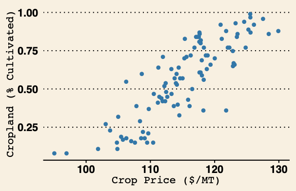
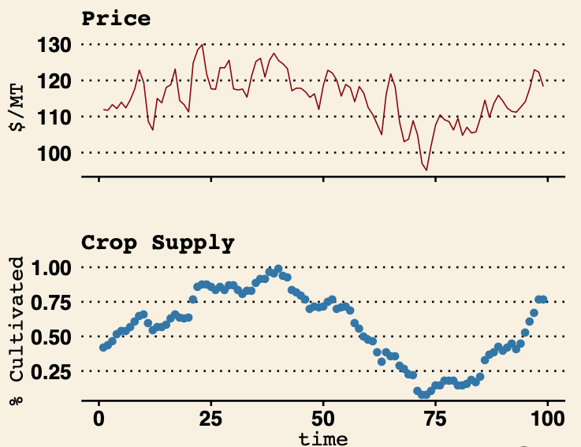
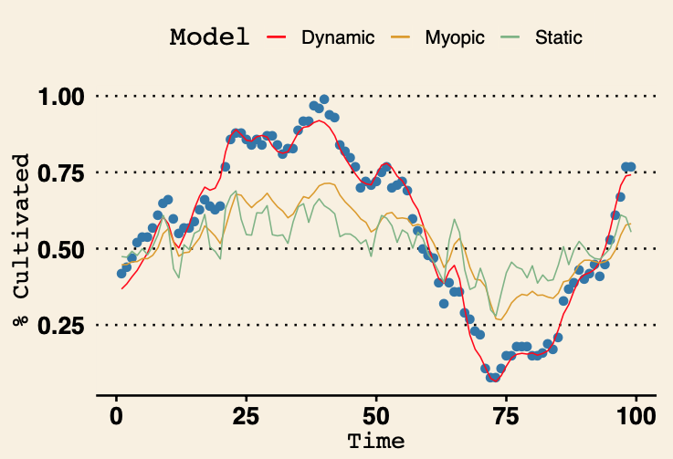

# Causal Mechanism Learning

To understand the true meaning and **scope** of a causal effect, we need to understand the underlying causal mechanism, based on **prior knowledge** - information and analyses.

This is important to understand

- causal effect - what it means, where it applies
- transportability of results

Blindly following the causal effect, without understanding the underlying mechanism, is incorrect.

The learning problem is to choose the causal model from a hypothesis set that best fits our observed data

A causal structure is a set of conditional independence relations. Its identifiability depends on whether these relations can be uniquely determined by the set of conditional independence relations observed in the population.

Causal relationships are more stable than causal effects and statistical relationships. That’s why our knowledge about the physical world is largely encoded and transmitted in the qualitative language of causal relationships (“pushing the glass off the table will cause it to break”), rather than the quantitative language of causal effects and statistical relationships (“pushing the glass off the table will result in a 95% probability of breakage.”)

## Observationally-equivalent

Causal structures that imply the same set of conditional independence relations: 2 DAGs are compatible with the same probability distribution
$$
\begin{aligned}
& A \to B \quad B \to A \\
\implies
& P(A, B)  \ne P(A) \cdot P(B)
\end{aligned}
$$
In this case, they cannot be distinguished without resorting to manipulative experimentation or temporal information. Hence, experiments are required to identify observationally-equivalent causal structures

### Markov Equivalence

Two DAGs are observationally equivalent $\iff$ they have the same skeleton and the same set of immoralities, where

- skeleton: nodes of a directed graph
- immoralities: configuration of 3 nodes: A,B,C, such that
  - C is a child of both A and B
  - A and B not directly connected
  - It’s called immorality because C is a child of A and B, but they’re not ‘married’

## Scientific Progress

We (human beings) have been learning causal mechanisms by formulating models, then conducting experiments or observational studies, and based on the results of which, updating our belief about each model’s probability of being true. This, in essence, is the process of scientific progress

This view of scientific progress as continuous Bayesian updating based on evidence has been challenged by historians like Thomas Kuhn, who pointed out that the sociological nature of the scientific community leads to periodic paradigm shifts rather than continuous progress

## Structural Estimation

Causal models based on theory are referred to as structural models. Their estimation is called structural estimation/“identification by functional form”

Structural estimation $\ne$ causal mechanism learning. Structural estimation is learning based on an assumed causal mechanism

A complete structural model may specify preferences, technology, the information available to agents, the constraints under which they operate, and the rules of interaction among agents in market and social settings

Structural models, by explicitly modeling the data-generating causal mechanisms, make clear what prior knowledge (assumptions) are relied upon to draw causal inference.

By using theory to specify the functional forms of causal relationships, structural models can be used to

- identify causal effects or the values of unobserved variables that cannot be non-parametrically identified
- serve as a model selection mechanism for causal effects that can be identified non-parametrically

Using structural models, what we learn from one set of data
 $D \sim p(x,y)$ can be potentially used to explain and predict data drawn from another distribution, say $p(u,v)$, if $\{ x,y \}$ and $\{ u, v \}$ are generated from a similar causal mechanism.

- In other words, what we learn from one observed phenomenon can be used to explain and predict other related phenomena.
- For example, we can learn individuals’ risk aversion from their investment behavior, which can help explain & predict their career choices.

Structural models make it possible to predict effects of existing treatments in a new population/environment, or the effects of completely new treatments.

- To do so, a structural model must be “deep” enough so that its parameters remain invariant in the new population/environment, or when new treatments are applied.
- The concept of invariance is closely related to the concept of stability for causal relationships. The need for invariant parameters is key to causal analysis and policy evaluation.

Once we have learned a structural model, we can use it to generate synthetic data and perform counterfactual simulations.

Structural models allow the economist to make welfare calculations and normative statements; Individual choices reveal information about their preferences and the potential outcomes they face

Structural models can potentially deliver better predictive performance than statistical models trained on single data sets, because their parameters can be learned from a combination of data from various sources that share the same underlying causal mechanism

## Counterfactual Simulation

One of the main benefits of learning a structural model is that it allows us to predict the effect of a completely new treatment – a treatment that has never been observed before

For eg: If in the observed data, $x_j =0$ always, what would be the effect of $\text{do} (x_j = 1)$?

Because structural models are generative models, once we have learned a model, we can use it to generate synthetic data

$D= \{(x_{i, 1}, \dots, x_{i,j} = a, x_{i,j+1}, x_{i,n}) \}$ from
$p(x_1, \dots, x_n|\text{do}(x_j= a))$

## Dynamic Structural Model

In a changing environment, with new information arriving each period, individual are forward-looking when making decisions: choices are made partly based on expectations of the future.

Decisions are also often influenced by the past. Since it can be costly to transition from one state to another, payoffs to different choices are often history-dependent: our past partly shapes our future.

In dynamic models, treatment effects can be time-varying and it’s often useful to distinguish between short-run and long-run effects

### Negative Political Advertising

- Candidate decides whether to go negative based on polling
- Going negative affects future polling, which in turn, affects future
  negative advertising decisions.
- Outcome: final vote share.

Static (single-shot) causal inference

Dynamic

### IDK

$$
L_t = \beta_0 + \beta_1 i_t
$$

where

- $L_t=$ Leverage taken up by financial firms
- $i_t=$ Interest rate set by central bank

Problem

- $L_t$ is forward-looking: Banks take up loans based on future expectations; nobody makes a decision-based on last year’s interest rate only
- The effect is smooth & gradual over time, not sudden

### Crop Supply

- At the beginning of each period t, each field owner decides whether or not to plant the crop in the current period
- The decision is based on observed period−t price as well as expectations of future prices.
- If a field has not been cultivated for k periods, then in order to (re)-cultivate it, the farmer needs to pay a one time cost c (k).
- Farmers have rational expectation: their expectations of future prices are unbiased conditional on the information they have.
  - Here we assume that crop prices follow an AR(1) process, which is known to the farmers.

Counter-factual simulation

- How would crop supply change in response to changes in crop prices
  if farmers are myoptic: if they are not forward-looking?
- How would crop supply change in response to changes in crop prices if farmers are static: if they are neither forward-looking, nor subject to any re-cultivation costs, so that planting decisions are made entirely based on current prices?

In general, if we are interested in the effect of x on y, but x is self-selected based on expectations of y, then without any measures of such expectations, the causal effect cannot be non-parametrically identified and we need to rely on theory to specify how expectations are formed.

- Sub-population: little/no equilibrium at play
  - Here, farmers take crop prices as given and decide whether or not to plant. Models like this are called dynamic discrete choice models
- Population: equilibrium at play
  - If prices are endogenous – if farmers’ planting decisions affect equilibrium prices – then we need to model both crop supply and crop demand. Such models are called dynamic general equilibrium models.

