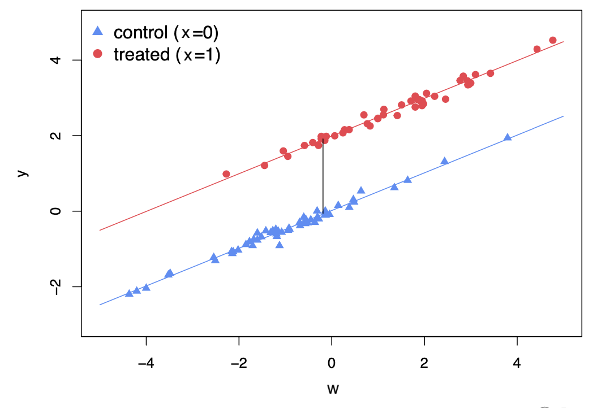
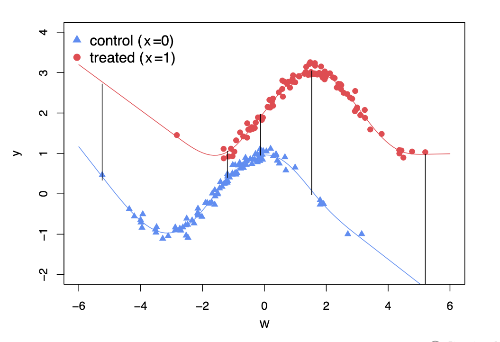

# Causal Effect Estimation under Unconfoundedness

Causal effect estimation under sufficient control for confounding is called causal effect estimation under unconfoundedness.

When there are open back-door paths from w to y, according to the back-door criterion, if we observe a set of pre-treatment variables $x$ such that conditioning on $z$ blocks these paths, then $E[y| \text{do}(z)]$ is non-parametrically identifiable

## Disjunctive Cause Criterion

Method to select what variables to control for confounding among the observed variables

Control for all (observed) direct causes of $x$ and $y$

If there is possible elimination of back-door path, then DCC will guaranteed to enforce it: Let $V$ be the set of variables selected based on the disjunctive cause criterion. If $\exists$ set of observed vars $z$ that satisfy the back-door criterion, then $z \subset V$

Advantage: Analyst only needs to know the causes $x$ and $y$, without requiring understanding of interactions of other variables

Disadvantage: Conditioning on a var may open up unobserved back-door path, but there is nothing else can be done

## Monte-Carlo Integration

Assume we observe a set of vars that satisfy the back-door criterion
$$
\begin{aligned}
&E [y \vert \text{do}(x=a)] \\
&= \int E[y \vert x = a, z] \cdot p(z) \cdot dz \\
&= \dfrac{1}{n} \sum_i^n E[y_i \vert x_i = a, z_i] \\
&\text{ATE}(x) \\
&= \dfrac{d E [ y \vert \text{do}(x) ] }{ dx } \\
&= E [ y \vert \text{do}(x=1) ] - E [ y \vert \text{do}(x=0) ] \\
& \qquad (x \text{ is binary}) \\
&= E [ y \vert x=1, z ] - E [ y \vert x=0, z ]
\end{aligned}
$$
$E[ y \vert x, z]$ can be estimated using machine learning model

In linear regression
$$
\hat y = \beta_0 + \beta_1 x + \beta_2 z \\
\text{ATE} = \beta_1
$$
Treatment effects can be

- Homogenous: same for all units
- Heterogenous: different for all units

Alternatively, you can estimate in the following manner
$$
\begin{aligned}
\hat y
&= \begin{cases}
\hat y_1 = f_1(z), & x=1 \\
\hat y_0 = f_0(z), & x=0
\end{cases} \\
\text{ATE} &= \hat y_1 - \hat y_0
\end{aligned}
$$
Where $f_1$ and $f_0$ are completely different models

## Matching

Matching is another method for controlling confounders. The goal of matching is to construct a new sample in which the confounding variables have the same distribution conditional on each value of the treatment variable.

In randomized trials, covariate balance – the balance of $w$ across values of $x$ – is achieved at the design phase.

Matching is a method that attempts to achieve covariate balance in observational studies, thereby making them resemble randomized trials.