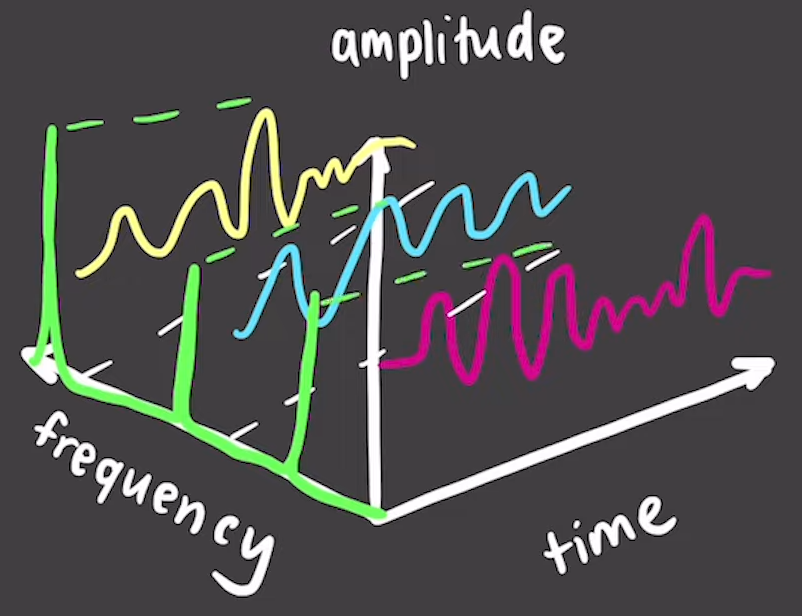
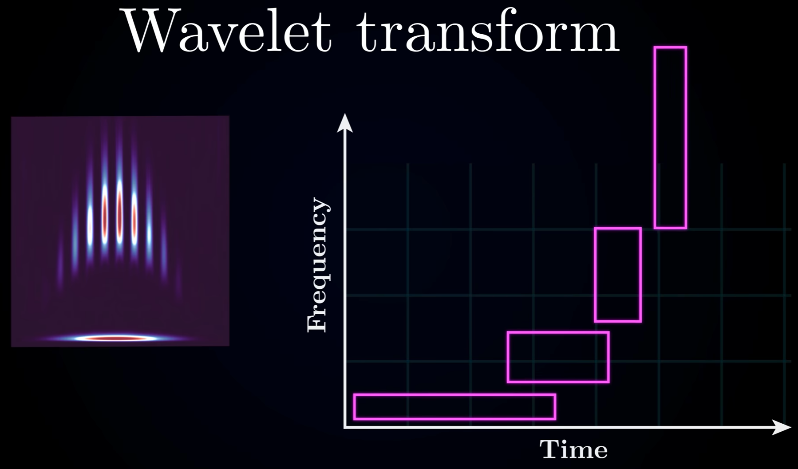
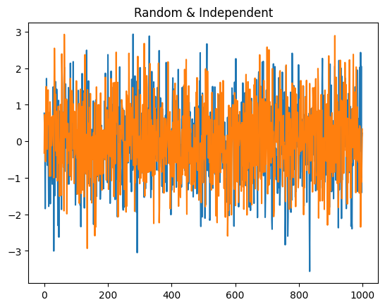
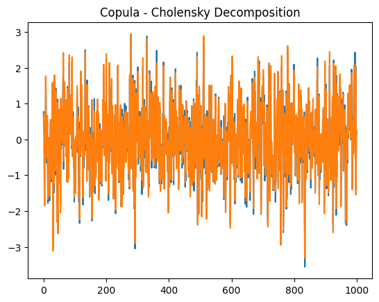

# Time Series Decomposition

|                                                     |                                                                                                                                                                                                                                                                                                                                                                                                                                                                   | Advantages                                                                                                                                                                                                                                       | Disadvantages                                                                                                                                                                     |
| --------------------------------------------------- | ----------------------------------------------------------------------------------------------------------------------------------------------------------------------------------------------------------------------------------------------------------------------------------------------------------------------------------------------------------------------------------------------------------------------------------------------------------------- | ------------------------------------------------------------------------------------------------------------------------------------------------------------------------------------------------------------------------------------------------ | --------------------------------------------------------------------------------------------------------------------------------------------------------------------------------- |
| Classical ETS                                       |                                                                                                                                                                                                                                                                                                                                                                                                                                                                   | Easy to understand & interpret                                                                                                                                                                                                                   | 1. Estimate of trend is unavailable in the first few and last few observations<br/>2. Assumes that seasonal component repeats<br/>3. Not robust to outliers due to usage of means |
| X-11                                                |                                                                                                                                                                                                                                                                                                                                                                                                                                                                   | 1. Relatively robust to outliers<br />2. Completely automated choices for trend and seasonal changes<br />3. Tried & tested method                                                                                                               | 1. No prediction/confidence intervals<br />2. Ad hoc method with no underlying model<br />3. Only for quarterly & monthly data                                                    |
| X-12-ARIMA/<br />X-13-ARIMA                         |                                                                                                                                                                                                                                                                                                                                                                                                                                                                   | 1. Allow adjustments for trading days and explanatory variables<br />2. Known outliers can be omitted<br />3. Level shifts & ramp effects can be modelled<br />4. Missing values estimated and replaced<br />5. Holiday factors can be estimated |                                                                                                                                                                                   |
| X-13-ARIMA-SEATS                                    |                                                                                                                                                                                                                                                                                                                                                                                                                                                                   | 1. Model-based<br />2. Smooth trend estimate<br />3. Allows estimates at end-points<br />4. Incorporates changing seasonality                                                                                                                    |                                                                                                                                                                                   |
| STL<br />Seasonal & Trend Decomposition using Loess | - Iterative alogirthm<br />- Starts with $\hat T = 0$<br />- Uses mixture of loess and moving averages to successively refine trend & seasonal estimates<br />- Trend window controls loess bandwidth applied to de-seasonalized values<br />- Season window controls loess bandwidth applied to detrended subseries<br />- Seasonal component allowed to change over time; Rate of change controlled by analyst<br />- Smoothness of trend controlled by analyst | - Versatile<br />- Robust<br />- Handle any type of seasonality                                                                                                                                                                                  | - Only additive (Use log/Box-Cox transformations for other)<br />- No training day/calendar adjustments                                                                           |

## ETS

Extras-Trend-Seasonality

Classical Decomposition

|                | $y_t$                       | Appropriate when                                                   |
| -------------- | --------------------------- | ------------------------------------------------------------------ |
| Addititive     | $S_t + T_t + R_t$           |                                                                    |
| Multiplicative | $S_t \times T_t \times R_t$ | Magnitude of seasonal fluctuations proportional to level of series |

Alternatively, use Box-Cox transformation, and then use additive decomposition. Logs turn multiplicative relationship into additive

$$
\begin{aligned}
y_t &= S_t \times T_t \times R_t \\ 
\implies
\ln y_t &= \ln S_t + \ln T_t + \ln R_t
\end{aligned}
$$

### Trend Estimation

Centered moving averages, to combat odd order

$$
\begin{aligned}
\hat T_t &= \dfrac{1}{2m} \left( \sum_{i = -(k+1)}^k y_{t+i} + \sum_{i = -k}^{k+1} y_{t+i} \right) \\
\text{where } k &= \dfrac{m-1}{2}
\end{aligned}
$$

| Order ($m$) | Curve             | Data Retention                  |
| ----------- | ----------------- | ------------------------------- |
| Larger      | Smoother, flatter | Less<br />(end points are lost) |
| Smaller     | Noisy             | More                            |

Moving average of the same length of a season/cycle removes its pattern

### Seasonal Adjusted Data

Component excluding the seasonal component

### Detrended Series

$$
\begin{aligned}
y_t - \hat T_t &= \hat S_t + \hat R_t \\
\frac{y_t}{\hat T_t} &= \hat S_t \times \hat R_t
\end{aligned}
$$

### Seasonal component

Average of de-trended series for that season. For eg, average of all values in Januaries

You can constraint the seasonal components such that

$$
\hat S_1 + \hat S_2 + \dots + \hat S_{n} = 0 \\
\hat S_1 \times \hat S_2 \times \dots \times \hat S_{n} = m
$$

### Remainder Component

$$
\begin{aligned}
\hat R_t &= y_t - (\hat T_t + \hat S_t) \\
\hat R_t &= \dfrac{y_t}{\hat T_t \hat S_t}
\end{aligned}
$$

## Fourier Transforms

FT’s limitation: FT is completely blind to time, in accordance with Heisenberg’s Uncertainty principle. There’s a tradeoff between correctly estimating the value of function in the frequency & time domain.

It is 1D representation

### Types of Fourier Transforms

| Type                                                      |                                                      |                                                              |
| --------------------------------------------------------- | ---------------------------------------------------- | ------------------------------------------------------------ |
| Continuous Time & Frequency                               | Functional form of time series is known analytically | $\hat x(f) = \int \limits_{-\infty}^\infty x(t) e^{-2\pi i f t} dt$ |
| Continuous Time, Discrete Frequency<br />(Fourier Series) |                                                      | $\hat x(f_n) = \dfrac{1}{T} \int \limits_{0}^T x(t) e^{-2\pi i f_n t} dt; f_n = \dfrac{n}{T}$ |
| Discrete Time & Frequency<br />(Fourier Frequencies)      |                                                      | $\hat x(f_n) = \sum \limits_{k=0}^{N-1} x_t e^{- 2 \pi i f_n (k \Delta t)} \Delta t; f_n = \dfrac{n}{N \Delta t}; \hat x_n = \hat x^*_{-n}$ |
| FFT<br />(Fast Fourier Transform)                         |                                                      |                                                              |

### Denoising using FFT

1. Apply FFT
2. Filter it to only the frequencies with the highest amplitude
3. Take inverse FFT

## Wavelet Transform

Overcomes FT’s limitation: FT is completely blind to time, by obtaining an optimal balance between accuracy in frequency & time domain

### Wavelet

Short-lived oscillation, localized in time

- Zero mean: $E[\phi(t)]=0; \int \phi(t) \cdot dt = 0$ (Admissibility condition)
- Finite energy: $\int [\phi(t)]^2 \cdot dt = k, k < \infty$
- 

| Type        | $\phi(t)$                                |
| ----------- | ---------------------------------------- |
| Daubechies  |                                          |
| Coiflet     |                                          |
| Symlet      |                                          |
| Haar        |                                          |
| Morlet      | $k_0 \cdot e^{i w_0 t} \cdot e^{-t^2/2}$ |
| Gaussian    |                                          |
| Shannon     |                                          |
| Meyer       |                                          |
| Mexican Hat |                                          |

### IDK

2D representation: $y(t) \to T(t, f)$ represents the contribution of frequency $f$ at time $t$

Scaled Wavelet $\phi(t, a, b) = \phi \left(\dfrac{t-b}{a} \right)$

The value of $T(a, b) =$ contribution of $\phi(t, a, b)$ to comprising the signal
$$
T(a, b) = \int y(t) \cdot \phi(t, a, b) \cdot dt
$$
Demonstrates the goodness of fit: local similarity

## Signals



|                   |                                                              | Time Resolution                                              | Frequency Resolution |
| ----------------- | ------------------------------------------------------------ | ------------------------------------------------------------ | -------------------- |
| Raw Time Series   |  | High                                                         | $\approx 0$          |
| Fourier Transform |  | $\approx 0$                                                  | High                 |
| Wavelet Transform |  | Low for small frequencies<br />High for high frequencies<br /><br />This is intuitive, as high freq signals are usually short-lived, and small freq signals are usually long-lived |                      |

## Synthetic Data Generation

### Cholesky Decomposition

$C$ is matrix that lower-diagonal matrix that when multiplied with its transpose gives the correlation matrix $\Sigma$

$$
C C' = \Sigma
$$
such that $\Sigma$ is positive-definite with no perfectly-correlated series: non-diagonal elements $\ne 1$, ie $\Sigma = r_{ij} \in [0, 1) \quad \forall i \ne j$

### Data Generation

Consider a multi-variate series $Y_t$ with $N(0, \sigma)$

Multiplying $C$ with a new random multi-variate series $Z_t$ gives a series $Y'_t$ with the same characteristics of $Y_t$

$$
\begin{aligned}
Y'_t &= Z_t \cdot C' \\
Y'_t &\sim N(0, \Sigma)
\end{aligned}
$$

```python
import pandas as pd
import numpy as np

# Correlation
corr = Y.corr()
# corr = np.array([ [1, 0.9, -0.9], [0.9, 1, -0.9], [-0.9, -0.9, 1] ])

# Decomposition
C = np.linalg.cholesky(corr)

# Random Data Generation
Z = np.random.randn(*Y.shape)
# Z = 0 + 1 * np.random.randn(1_000, 3)

# Correlating
Y_sim_temp = np.matmul(Z, C.T)
Y_sim = Y.mean(axis=0) + (Y.std(axis=0) * Y_sim_temp)

# Inspection
df = pd.DataFrame(Y_sim)
df.corr()
```




