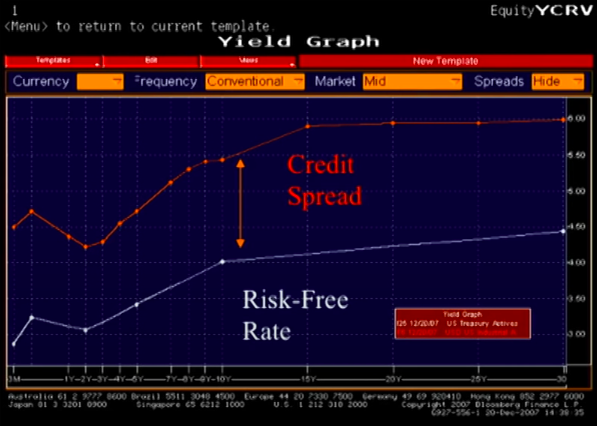
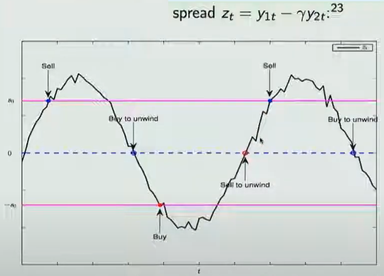

# Cointegration Modelling

## Error Correction Models

$$
\begin{aligned}
\Delta m_t
&= \lambda_m (u_{t-1}) + \epsilon_{mt} \\
&= \lambda_m (blah blah) + \epsilon_{mt} \\
\Delta p_t &= \\
\Delta y_t &= 
\end{aligned}
$$

- $\epsilon$ is white noise error
- $\lambda$ are velocity of adjustment parameters

Atleast one of the $\lambda$ should be significant, otherwise there is no error correction $\implies$ no cointegration

> Cointegration and error correction are equivalent representation
>
> ~ Granger representation theorem

## Vector regression/Structural estimation model

Used when there is no cointegration

I missed this

If the values of $\lambda$ are zero, then it is a simple VAR model and there is no cointegration. 

{ loading=lazy }

## Example: Quantity Theory of Money

$$
MV = \underbrace{PY}_{\text{GDP}}
$$

|      |                         |                                                             | Integrated of order       |
| ---- | ----------------------- | ----------------------------------------------------------- | ------------------------- |
| $M$  | Total quantity of money |                                                             | $I(1)$                    |
| $V$  | Velocity of money       | Number of times a unit of currency is transferred in a year | N/A (Constant value) |
| $P$  | Price                   |                                                             | $I(1)$                    |
| $Y$  | Real quantity of Output |                                                             | $I(1)$                    |

As they are $I(1)$, they are not mean-reverting variables. Hence, taking log on both sides of equation, and then transposing

$$
\beta_0 + \beta_1 m_t - \beta_2 p_t - \beta_3 y_t = u_t
$$

Velocity is a constant, which is an intercept. Here it is represented by $\beta_0$, but can also represented by $1\cdot V$

If $u_t$ is $I(0) \implies M, V, P, Y$ are cointegrating

### Notes

1. There can be multiple cointegrating vectors $\{\beta_0, \beta_1, \beta_2, \beta_3 \} = \{\lambda \beta_0, \lambda \beta_1, \lambda \beta_2, \lambda \beta_3 \} \iff \lambda \ne 0$
2. If $m$ and $p$ are $I(2)$ whereas $y$ is $I(1)$. The linear combination of these three variables will be $I(2)$, hence the 3 are not cointegrated
3. However, if a linear combination $\beta_1 m + \beta_2 p$ is $I(1)$, and this is cointegrated with y which is $I(1)$, then we say there is multi-cointegration
4. if monetary policy follows feedback rule that changes money supply based on inflation, then inflation will be another cointegrated variable

## Granger Causality

Let’s say we have 2 variables $x, y$. We can check if $x$ granger causes $y$

$$
y_t = \beta_1 y_{t-1} + \beta_2 x_{t-1} + u_t
$$

### Hypotheses

- $H_0: \beta_2 = 0$ 
  - $y$ is independent of $x$
  - $x$ does not granger cause $y$
- $H_1: \beta_2 \ne 0$
  - $x \to y$
  - $x$ granger causes $y$

### Procedure

1. We check if the $R_{adj}^2$ has increased by incorporating $x_{t-1}$, when compared to without it $(y_t = \beta_1 y_{t-1} + u_t)$
2. Do a hypothesis test
3. If $p \le 0.05,$ reject null hypothesis, and hence conclude that $x \to y$

## Spread

$$
\begin{aligned}
y_{1t} &= x_t + u_{1t} \\
y_{2t} &= \gamma x_t + u_{2t} \\
z_t &= y_{1t} - y_{2t} \quad \text{(Spread)}\\
&= y_{1t} - \gamma y_{2t} \\
&= u_{1t} - \gamma u_{2t} \\
y_1, y_2 &\text{ are co-integrating} \iff z_t \to \text{Stationary Process}
\end{aligned}
$$

This mean-reverting tendency of the spread can be used for “pairs trading”/“statistical arbitrage”

### Estimating $\gamma$

#### Simple

$$
\begin{aligned}
z_t \implies
y_{1t} - \gamma y_{2t} &= \mu + u_t \\
y_{1t} &= \mu + \gamma y_{2t} + u_t
\end{aligned}
$$

Perform linear regression for $\gamma$

#### Kalman

$$
\begin{aligned}
z_t \implies
y_{1t} - \gamma_\textcolor{hotpink}{t} y_{2t} &= \mu_\textcolor{hotpink}{t} + u_t \\
y_{1t} &= \mu_\textcolor{hotpink}{t} + \gamma_\textcolor{hotpink}{t} y_{2t} + u_t \\
\mu_{t+1} &= \mu_t + \eta_{1t} \\
\gamma_{t+1} &= \gamma_t + \eta_{2t}
\end{aligned}
$$
