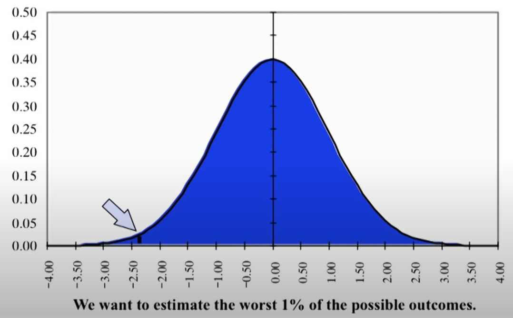
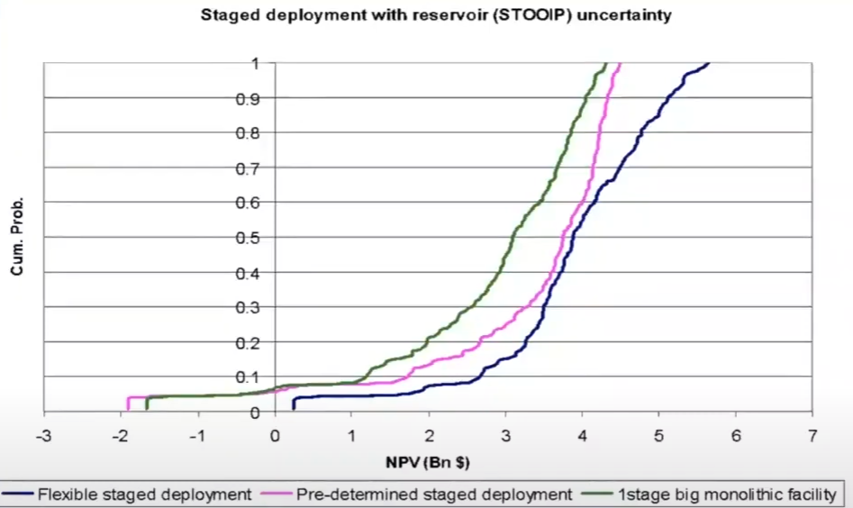
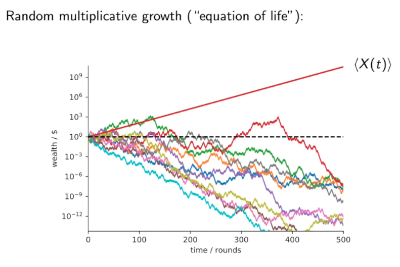

# Value Modelling

|                                                       | VAR                                           | VAG                               |
| ----------------------------------------------------- | --------------------------------------------- | --------------------------------- |
| Meaning                                               | Value at Risk                                 | Value at Gain                     |
| $p_x = x \%$ VAR/VAG is values for __ of distribution | Bottom $x \%$                                 | Top $x \%$ Bottom $(1-x) \%$ |
| Probability of __ given level                         | Losses <                                      | Gains >                           |
| Preferred for                                         | Lending (concerned about receiving repayment) | Investing (interested in gain)    |
| Example                                               | { loading=lazy }          |                                   |

Note: Both are ==**one-sided tails**==

## Target Curve

Cumulative Distribution of outcomes (rarely frequency distribution)

Goes from VAR % to VAG %

{ loading=lazy }

### Dominance

If target curve 1 always to right of another, it dominates

But it is not necessary that one alternative always performs better than other in all situations, as best case for one situation may be bad for another situation

## Evaluation Methods

| Method                         |                                                              |
| ------------------------------ | ------------------------------------------------------------ |
| Historical                     | Percentile of historical values                              |
| Parametric/Variance-Covariance | 1. Calculate covariance matrix of all securities 2. Annualize them 3. Calculate portfolio standard deviation: $\sigma_p = \sqrt{w' \Sigma w}$  |
| Monte Carlo Simulation         | 1. Obtain dist statistics: Mean, Variance, … 2. Run simulation 3. Get the required percentiles |

## Ergodicity

For non-ergodic process,
- Cross-sectional statistics $\ne$ Time-series statistic
- Eg: Mean of all series at a single time point $\ne$ Mean of a single series, across time

- If a simulation tells you that the "average" outcome is a $5\%$ return, it is including the "lucky billionaires" (the outliers) in that calculation
- ==**It ignores the fact that you cannot be an average; you are a single path**==
- If your specific path hits the "absorbing barrier" of zero, the "average" success of the market is irrelevant to you. You are out of the game.

- The "right way" involves shifting your focus from Ensemble Probability (What % of paths succeeded?) to Time Probability (How likely am I to survive this path over $N$ years?)
- As you extend the time horizon from 1 year to 10 years, the distribution doesn't just spread out—it collapses toward the typical experience
- In your "Equation of Life" example:
	- After 1 round, the distribution looks somewhat balanced
	- After 500 rounds (your second image), the distribution is so skewed that
		- $99\%$ of the paths are effectively at zero
		- while the "Average" is in the billions
	- Looking at a 1-year distribution might give you a false sense of symmetry that vanishes the longer you stay in the "game"

$$
y_t = \begin{cases}
1.5 \cdot y_{t-1}, & p=1/2 \\
0.6 \cdot y_{t-1}, & p=1/2
\end{cases}
$$

