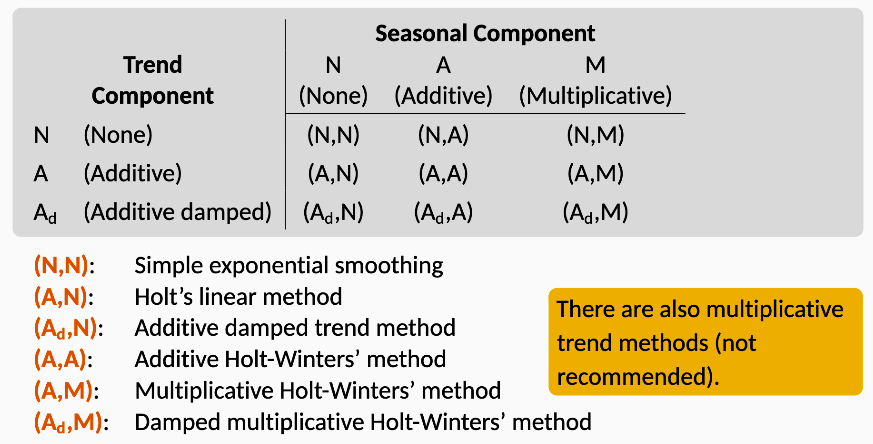
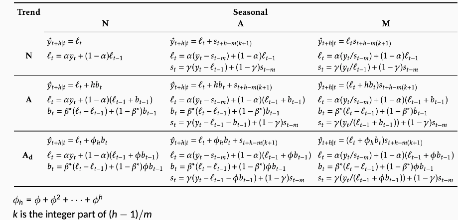
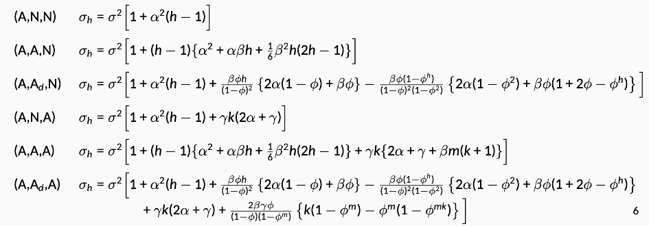
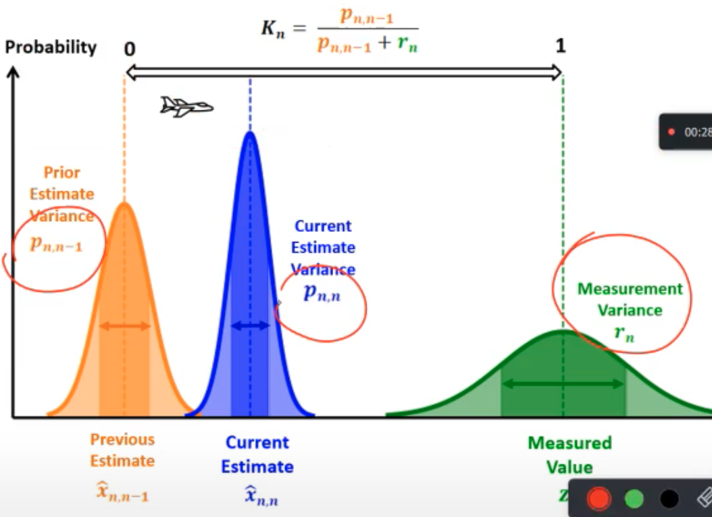
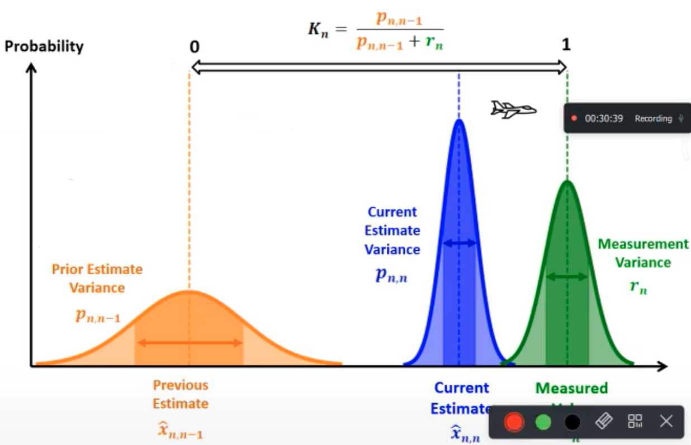
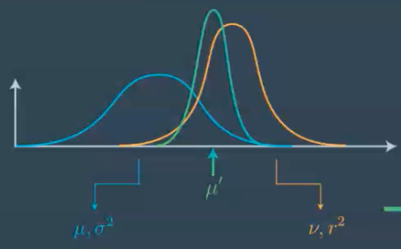
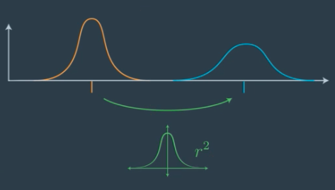

# Filters

Algorithms that use uncertain measurements from sensors to predict unknown variable with acceptable accuracy, to estimate the current state.

Help identify underlying trends, by smoothing time series and hence filtering out noise

They are not for prediction

## Working

$$
\begin{aligned}
y_t
&= y^*_t + u_{t, \text{PN}} + u_{t, \text{MN}} \\
\implies
{\tilde y}_t
&= E[y_t] \\
&= E[y^*_t] + E[u_{t, \text{PN}}] + E[u_{t, \text{MN}}] \\
&= y^*_t + \mu_\text{PN} + \mu_\text{MN} \\
&= y^*_t + 0 + 0 &
(\mu_\text{MN} = \mu_\text{PN} = 0) \\
& \approx y^*_t
\end{aligned}
$$

where

- $\tilde y_t=$ smoothed/filtered value
- $y_t=$ observed value
- $y^*_t=$ true value
- $u_{t, \text{PN}} =$ Process noise
- $u_{t, \text{MN}} =$ Measurement noise

## Filter Design

1. Define problem which consists of the state
2. Define the motion model
3. Define how the state will be measured
4. Define uncertainty in system’s dynamic model
5. Implement & test the filter in controlled environment with known inputs & outputs
6. Tune the filter

### Notes

- Window size = Duration of Seasonality will remove it
- Be wary of over-smoothing
- Never go live without tuning filter

## Types wrt Time Dependence

- Centered
- Lagging

## Filters vs Rolling Statistics

The Kalman filter is better suited for estimating things that change over time. The Kalman Filter lets you add more information about how the system you're filtering works. In other words, you can use a signal model to improve the output of the filter.

Sure, a moving average filter can give very good results when you're expecting a close-to-constant output. But as soon as the signal you're modelling is dynamic (think speech or position measurements), then the simple moving average filter will not change quickly enough (or at all) compared with what the Kalman Filter will do.

The Kalman filter uses the signal model, which captures your knowledge of how the signal changes, to improve its output in terms of the variance from "truth".

## Concepts

|             |               | Denotation        |
| ----------- | ------------- | ----------------- |
| Measurement |               | $y_{t, t}$        |
| Estimation  | Current state | $\hat y_{t, t}$   |
| Prediction  | Future state  | $\hat y_{t, t-1}$ |

## Applications

These can be used in any field, but a few examples

- Guidance
- Navigation
- Control of vehicles

## Batch vs Recursive

|            | Batch  | Recursive |
| ---------- | ------ | --------- |
| Complexity | $O(n)$ | $O(1)$    |
|            |        | Preferred |

## Uncertainty

Variance of measurement errors provided by scale vendor/derived through calibration; Even though we can’t accurately know the estimate error, we can estimate the uncertainty in the estimates

Most modern systems are equipped with multiple sensors that provide estimation of hidden/unknown variables based on series of measurements

One of the biggest challenges of tracking and control systems is to provide accurate and precise estimation of the hidden variables in the presence of uncertainty.

### Bias & Variance

Very similar to Machine Learning [Prediction Bias & Variance](../Machine_Learning/07_Evaluation.md#Prediction-Bias-&-Variance) 

## Measurement Filters

|          | System  |
| -------- | ------- |
| Alpha    | Static  |
| Beta     | Dynamic |
| Adaptive | Dynamic |

## Alpha Filter

### Average Filter

$$
\begin{aligned}
&\text{Estimated current state} \\
&= \text{Mean of all measurements} \\
&=\text{Predicted current state} \\
&\quad + \text{Factor} \times (\text{Measurement - Predicted current state})
\end{aligned}
$$

$$
\begin{aligned}
\hat y_{t, t}
&= \hat y_{t, t-1} + \alpha_t (y_t - \hat y_{t, t-1}) \\
&= \alpha_t y_t + (1-\alpha_t) \hat y_{t, t-1}\\
\hat y_{1, 0} &= 0 \\
\alpha_t &= \dfrac{1}{t}
\end{aligned}
$$

The $\alpha$ factor is called as Gain, and is taken as $\alpha_t = \dfrac{1}{t}$. As number of measurements increase, each successive measurement has less weight in estimation, as $t \uparrow \implies \alpha \downarrow$

Gives the less weight to recent data compared to past data

Kalman filter requires an initial guess as a preset; it may be approximate. 

$(y_{t, t} - \hat y_{t, t-1})$ is called the measurement residual

## Beta Filter

|                                    | $\tilde y_{t+h}$ (Recursive Additive)      | $\tilde y_{t+h}$ (Batch Additive)  | Weightage to history                |                                                                  | Parameter|
|---                                 | ---                                     | ---                                 | ---                                                              | ---|---                                 |
|SMA Simple Moving Average      | $\tilde L_t$  $\tilde L_t = \dfrac{1}{w} (y_t - y_{t-w}) + \hat y_{t, t-1}$ | $\dfrac{1}{w} \sum_{i=0}^{w-1} y_{t-i}$ | Equally for recent and past history |                                                                  | $w$: Rolling Window Size|
|EMA Exponential Moving Average | $\tilde L_t$  $\tilde L_t = \alpha_t y_t + (1-\alpha_t) \hat y_{t, t-1}$ | $\sum_{i=0}^{w-1} \alpha^{i+1} y_{t-i}$ | More weight to recent history       | Assumes that whole history is encapsulated in ${\tilde y}_{t-1}$ | Recommended $\alpha=\dfrac{2}{\text{Window Size}}$|
|Double EMA (Holt) | $\tilde L_t + h \tilde T_t$ $\tilde T_t = \beta(\tilde L_t - \tilde L_{t-1}) + (1-\beta) \tilde T_{t-1}$ $\tilde L_t = \alpha L_t + (1-\alpha) (\tilde L_{t-1} + \tilde T_{t-1})$ |  |  |  | |
|Triple EMA (Holt-Winters) | $(\tilde L_t + h \tilde T_t) + \tilde s_{t+h-s}$  $\tilde L_t = \alpha (y_t-\tilde S_{t-s}) + (1-\alpha)({\tilde L}_{t-1} + \tilde T_{t-1})$ $\tilde T_t = \beta(\tilde L_t-\tilde L_{t-1}) + (1-\beta) {\tilde T}_{t-1}$ $\tilde S_t = \gamma (y_t - \tilde L_{t-1} - \tilde T_{t-1}) + (1-\gamma) \tilde S_{t-s}$ |  |  |  | |

where

- $s=$ seasonality duration

### Complex

### Parameters

| $w, \alpha$ | Curve  | Delay |
| ----------- | ------ | ----- |
| High        | Noisy  | Low   |
| Low         | Smooth | High  |

### Dynamic System

State(s) change over time

Let’s take the case of 2 states: position & velocity
$$
\begin{align}
\hat y_{t, t} &= \hat y_{t, t-1} + \Delta t \ \hat {\dot x}_{t, t-1} \tag{1} \\
\implies \hat {\dot x}_{t, t} &= \hat {\dot x}_{t, t-1} + \beta \left( \dfrac{y_t - \hat y_{t, t-1}}{\Delta t} \right) \tag{2} \\
\hat y_{1, 0} &= 0; \hat {\dot x}_{1, 0} = 0
\end{align}
$$
However, if we assume constant velocity, but measurement residual in $x \ne 0,$ then it could be due to 2 reasons

|                          | More likely when          |
| ------------------------ | ------------------------- |
| Measurement error        | Sensor has low precision  |
| Velocity is not constant | Sensor has high precision |

- Value of $\beta = \text{const}$, unlike $\alpha_t$
- $\beta \propto \text{Precision} \propto \dfrac{1}{\sigma_\text{measurement}}$

## Adaptive Filter

### Kalman Filter

A low-pass filter with dynamically-changing $\alpha$

Assumes that the following are normally-distributed

- measurements
- current state estimates
- next state estimates

Also quantifies the uncertainties associated with the estimates

Optimal filter that combines the prior state estimate with the measurement, such that uncertainty of current state estimate is minimized

```mermaid
flowchart LR

subgraph i[Inputs]
	direction LR
	mp[Measured<br/>Parameter]
	mu[Measurement<br/>Uncertainty]
end

subgraph kf[Kalman Filter]
	direction LR
	u[Update] --> p[Predict] --> ud[Unit<br/>Delay] --> u
end

subgraph o[Outputs]
	direction LR
	sse[System State<br />Estimate]
	eu[Estimate<br />Uncertainty]
end

subgraph ii[Initial Inputs]
	direction LR
	is[Initial State]
	isu[Initial State<br />Uncertainty]
end

ii --> p
i ---> sf[Sensor<br />Fusion] --> u --> o
```

where

- $r$ is the measurement uncertainty in variance
- $p$ is the estimate uncertainty in variance

#### Equations

| Purpose          | Equation name                                                                                                   | Static System                                                   | Dynamic System                                                                                                           | Comments                                                                                                                                      |
| ---------------- | --------------------------------------------------------------------------------------------------------------- | --------------------------------------------------------------- | ------------------------------------------------------------------------------------------------------------------------ | --------------------------------------------------------------------------------------------------------------------------------------------- |
| State Update     | State Update Filtering Equation                                                                            | $\hat y_{t, t} = \hat y_{t, t-1} + K_t (y_t - \hat y_{t, t-1})$ | 👈                                                                                                                       |                                                                                                                                               |
|                  | Covariance gain Corrector Equation                                                                         | $p_{t, t} = (1-K_t) p_{t, t-1}$                                 | 👈                                                                                                                       |                                                                                                                                               |
|                  | Kalman Gain Weight Equation                                                                                | $K_t = \dfrac{p_{t, t-1}}{p_{t, t-1} + r_t}; \in [0, 1]$        | 👈                                                                                                                       | When measurement uncertainty is large and estimate uncertainty estimate is small, $K_n \approx 0$, the new measurement is given low weightage |
| State Prediction | State Extrapolation Prediction Equation Transition Equation Dynamic Model State Space Model | $\hat y_{t+1, t} = \hat y_{t, t}$                               | $\hat y_{t+1, t} = \hat y_{t, t} + \Delta t \ \hat {\dot x}_{t, t}$ $\hat {\dot x}_{t+1, t} = \hat {\dot x}_{t, t}$ |                                                                                                                                               |
|                  | Covariance Extrapolation Predictor Covariance Equation                                                     | $p_{t+1, t} = p_{t, t}$                                         | $p^y_{t+1, t} = p^y_{t, t} + \Delta t^2 p^v_{t, t}$ $p^v_{t+1, t} = p^v_{t, t}$                                     |                                                                                                                                               |

| Kalman Gain |                                                              |
| ----------- | ------------------------------------------------------------ |
| $\approx 0$ |      |
| $\approx 1$ |  |

#### Advantages

- Handles noise in initial estimate, state transitions, and observations 
- Removes need to store historical data
- Can handle asynchronous measurements, ie measurements recorded by multiple sensors at different time points
- Computationally-efficient
- Suitable for real-time applications

#### Disadvantages

- Only for **linear** gaussian state space models.
  - In practice, state transitions may be non-linear/noise and may be non-gaussian.
  - Use other types of Kalman filters for this

### Kalman Smoother

### Extended Kalman Filter

Developed for non-linear dynamics

Performs analytic linearization of the model at each point

### Unscented Kalman Filter

## Without Model-Based Approach

|                                                    | $\mu'$                                                       | ${\sigma^2}'$                                     | Estimation uncertainty |                                                              |
| -------------------------------------------------- | ------------------------------------------------------------ | ------------------------------------------------- | ---------------------- | ------------------------------------------------------------ |
| Update Parameter/Measurement Uses Bayes’ rule | $\left( \dfrac{\mu}{\sigma^2} + \dfrac{\nu}{r^2} \right) {\sigma^2}'$ | $\dfrac{1}{\dfrac{1}{r^2} + \dfrac{1}{\sigma^2}}$ | decreases              |  |
| Predict Motion                                     | $\mu + u$                                                    | ${\sigma^2} + r^2$                                | increases              |  |
## Other Estimators

### Median

$$
\widehat {\text{med}}_{t, t}
=
\widehat {\text{med}}_{t, t-1} +
\alpha_t \cdot
\text{sgn}(y_t - \widehat {\text{med}}_{t, t-1})
$$
$$
\begin{aligned}
\widehat {\text{Q}}_{q; t, t}
=
\widehat {\text{Q}}_{q; t, t-1} +
\alpha_t 
\Bigg(
\ 
\text{sgn}(y_t - \widehat {\text{Q}}_{q; t, t})
+ 2&q - 1
\
\Bigg) \\
q &\in [0, 1]
\end{aligned}
$$

