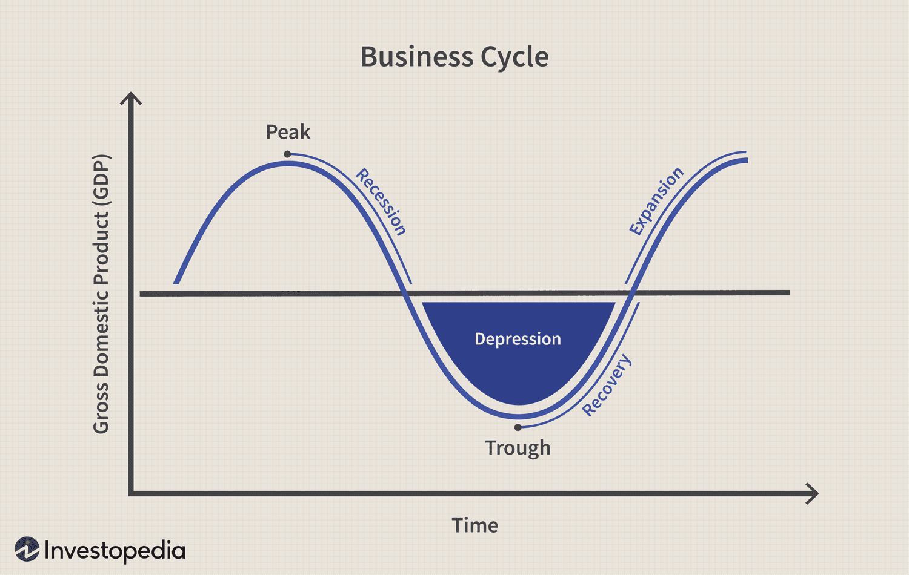

# Introduction

The main instrument for central banks is the interest rates

Inflation $\propto$ Wage Rate

Immediately after the pandemic, there is a sudden growth as:
- people are desperate to do something now
- savings from all the time inside

### Phases of economy

| Phase     | Indicator                                          | Unemployment     | Inflation          | Policy: Incentivize | Policy: Action                                                                                                                    |
| --------- | -------------------------------------------------- | ---------------- | ------------------ | ---------------------- | ------------------------------------------------------------------------------------------------------------------------------------ |
| Recovery  |                                                    |                  |                    |                        |                                                                                                                                      |
| Boom      |                                                    | actual < natural | actual > potential |                        |                                                                                                                                      |
| Recession | Rule of thumb: 2 consecutive quarters of deflation | actual > natural | actual < potential | Investments            | Lower interest rate Subsidies                                                                                                     |
|           |                                                    |                  |                    | Consumer spending      | Universal Basic Income/Direct income transfers to people (only effective till a limit - excessive causes inflation) Tax reduction |

## Trickle-down Effect

The benefits of improving a particular country/sector will improve others also eventually
