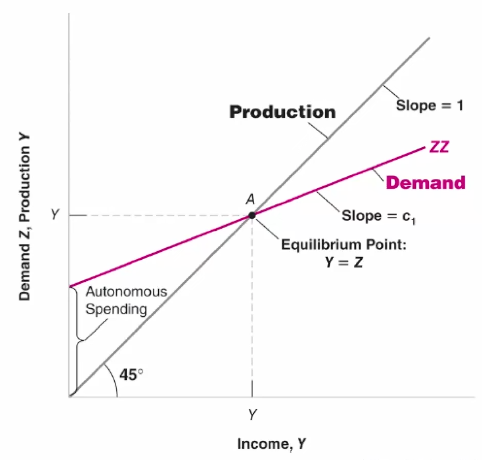
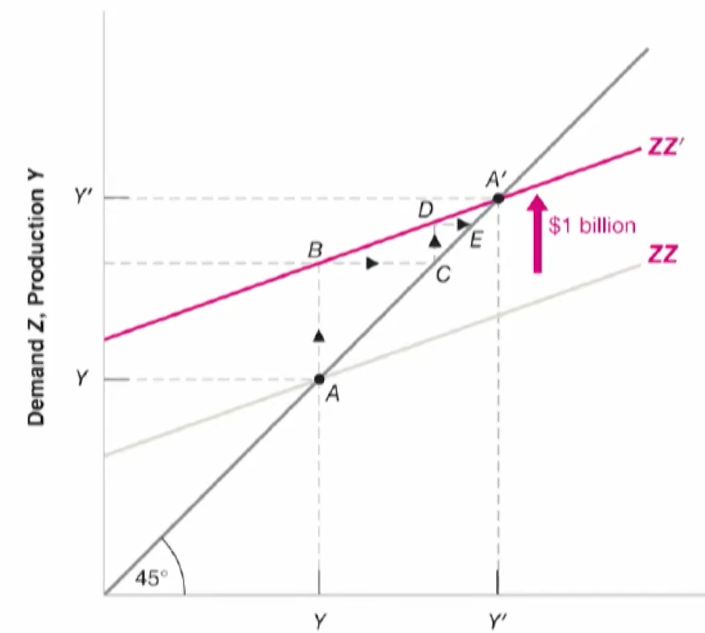
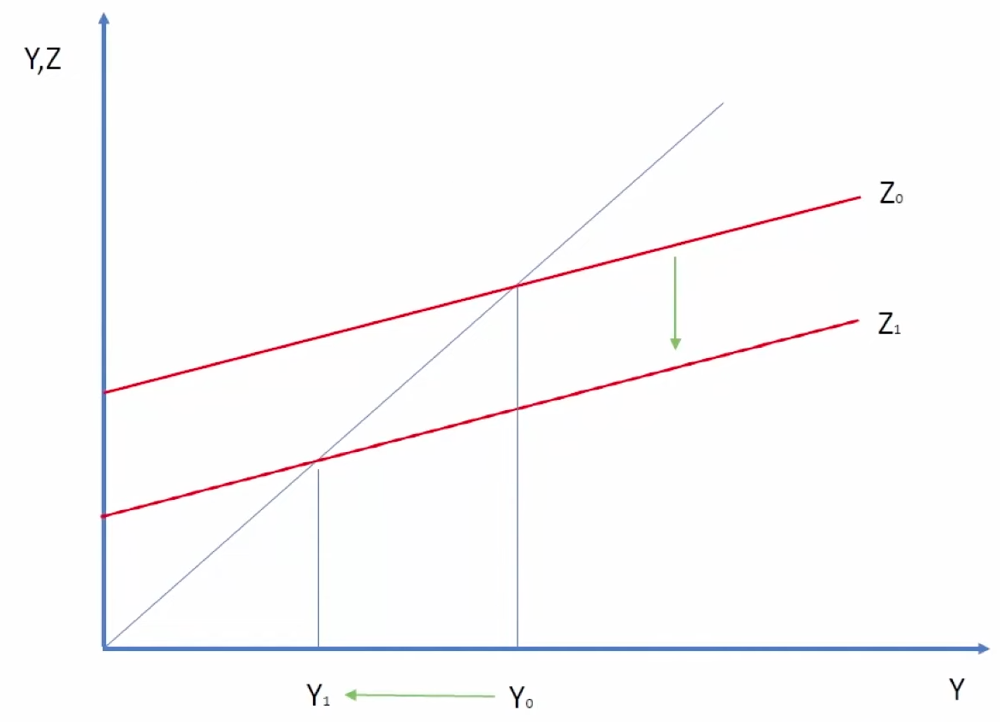

# Goods & Services Market

## Aggregate Demand

| Sign | Component            | Symbol | Meaning                                                                           |
| ---: | -------------------- | ------ | --------------------------------------------------------------------------------- |
|    + | Consumption          | $C$    | G&S purchased by consumers                                                        |
|    + | Investment           | $I$    | Sum of residential and non-residential investment                                 |
|    + | Government spending  | $G$    | Purchases of G&S by federal, state, and local govts (excluding Govt transfers) |
|    + | Exports              | $E$    | Goods & services produced by country purchased by foreign countries               |
|    - | Imports              |        | Foreign goods & services purchased by country                                     |
|    + | Inventory Investment |        | Difference between production and sales                                           |

Behavioral Assumptions
- Investment is exogenous of fiscal policy
- Consumption is endogenous to disposable income

### Consumption

Assuming Consumption $\propto$ Income

$$
C = c_0 + c_1 (I-T)
$$

- $C =$ total consumption
- $c_0 =$ base/autonomous consumption
    - $c \ne 0$
- $c_1 =$ MPC (Marginal Propensity to Consume)
- $I =$ Income
- $T=$ Taxes
- $(I-T)=$ disposable income

## IDk

|                                          | Short-Run                                                                                                       | Medium-Run | Long-Run |
| ---------------------------------------- | --------------------------------------------------------------------------------------------------------------- | ---------- | -------- |
| Equilibrium Output Factors               | - Aggregate Demand - Production - Income                                                                  |            |          |
| Equilibrium Condition                    | $\text{Aggregate Demand} = \text{Aggregate Income}$ $\text{Aggregate Investment} = \text{Aggregate Savings}$ |            |          |
| Equilibrium Output                       | $\dfrac{1}{1-c_1} (c_0 - T + I + G)$                                                                            |            |          |
|                                          |                                                                             |            |          |
| Increase in autonomous consumption $c_0$ |                                                  |            |          |

### Output Multiplier

$m = \dfrac{1}{1-c_1}$ 

Implication
- If $m>1$: even small consumer spending will lead to increased output
- If $m \le 1$: lots of consumer spending required for growth

## Short-Run

```mermaid
flowchart LR
d[Demand] -->
s[Supply] -->
i[Income] -->
d
```

## Paradox of Saving

$$
\begin{aligned}
\text{Investment} &= \bar S^G + S(Y) \\
S(Y) &= \dfrac{1}{1-c_1} Y & (\text{Output $Y$ = Income})
\end{aligned}
$$

If savings $S(Y)$ increase due to decrease in $c_1$
- then savings > investment, ie consumption decreases 
- then $Y$ reduces to restore equilibrium
- this reduces income
- this reduces consumption
- this reduces output
- vicious cycle

where $Y =$ Real output

This is why drastic contractionary fiscal policy is detrimental
- introducing high GST/VAT
- decrease in govt expenditure