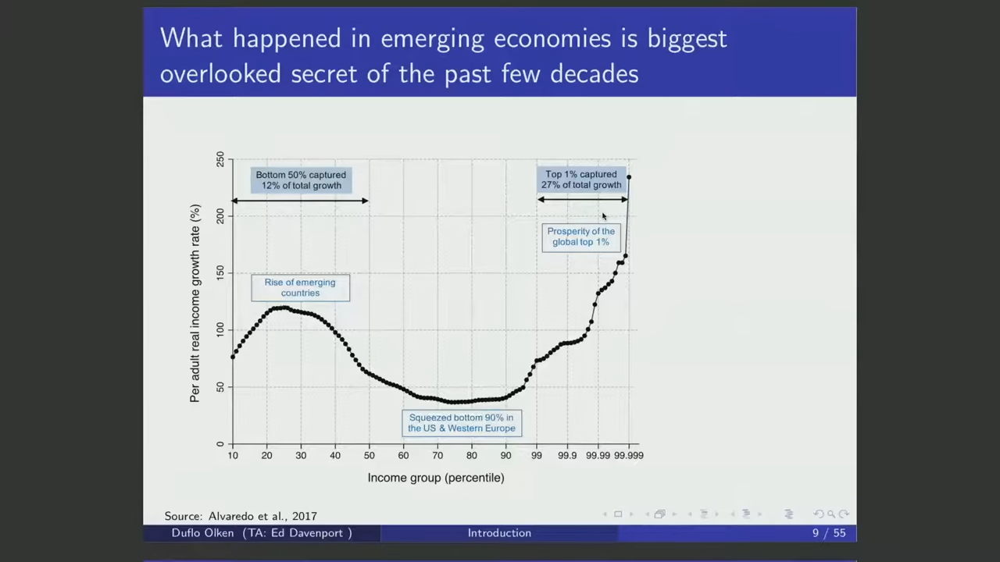

# Introduction

## Steady State (Ramsey Model)

$$
A \frac{\partial f}{\partial k} = \rho
$$

where 

- LHS = Return on capital
- $\rho$ = discount state

Otherwise, people would save more

## Aggregate Production Function

$$
y = A \times f(k, h)
$$

where

- $y$ is output (real GDP)
- $A$ is measure of productivity of economy
  - 
- $k$ is capital per-capita
- $h$ is human capital per-capita (skills, knowledge, etc)

For most of history, Development Economics was mostly macro-oriented: focusing on aggregate income difference

If the most of per-capita income difference $y$ was mostly $k$, just give the developing countries more $k$, and likewise for $h$.

But just giving $k$ would reduce the saving in the country due to [Steady State (Ramsey Model)](#Steady State (Ramsey Model)), as $k$ responds to A in equilibrium. If you increase $k$ beyond steady state level, returns will be low, and the economy will adjust endogenously and move back to its previous point in time.

Variation in policies lead to variation in the growth rate in A.

### Assumption of this model

Aggregation works as we are assuming that capital and human capital are optimally distributed by the economy, so the marginal return of investment is equalized.

However, in reality, this is not true: some sectors of the economy within the same location may have different return to capital, as $h$ and $k$ are not allocated optimally. For eg, even though it would be more effective to invest into a highly-qualified stranger, we would prefer to invest in an average known-person. This ties back to [Behavioral Economics](./../Behavioral_Economics).

## Income

Income and development are not always related.

Countries with higher GDP may have worse infant mortality.

## IMF Stimulus

The emergency “special drawing rights” is allocated based on the country’s contribution to the IMF. Thereby, the rich countries get money easily compared to poor countries.

## Poverty

## Poverty Rate

How many people can a baseline basket of goods

