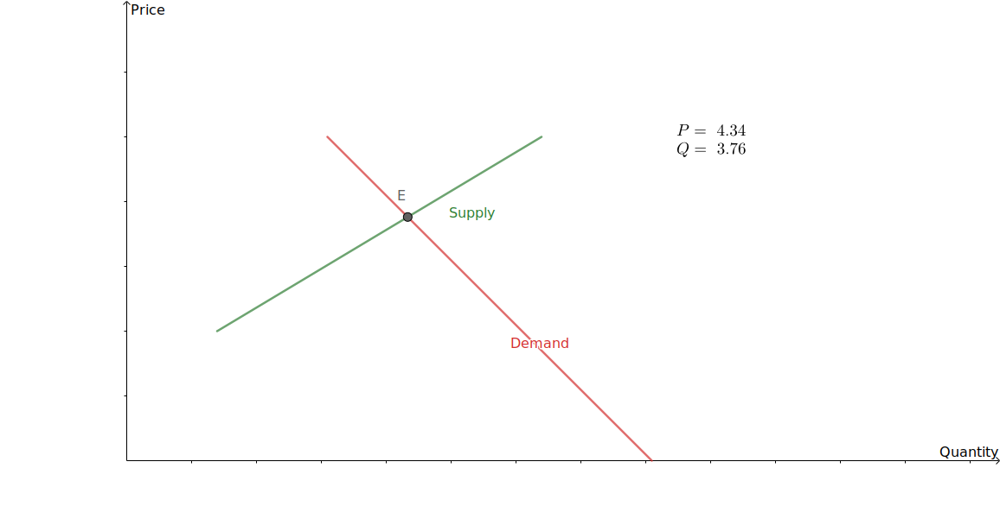
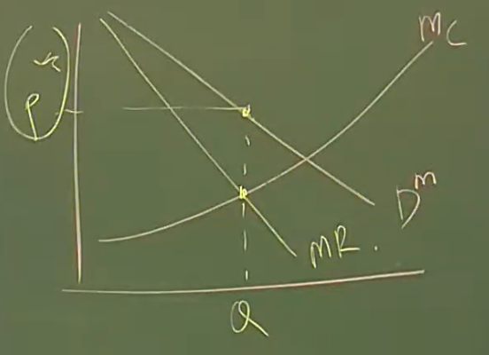

## Elements of Market

1. Demand
2. Supply
3. Equilibrium

## Demand

indicates **optimal** quantity of commodities which consumers are willing and able to buy at a particular price, in a particular period

if prices change, demand also changes

### Law of Demand

Assuming every factor (like preferences, current state affairs) remains constant, $\text{demand} \propto \frac{1}{\text{price}}$
this goes other way round too

### Individual Demand Curve

can vary from one individual to another even for the same commodity, due to [Factors of Trade](01_Intro.md#factors of trade)

graph is a straight line with a negative slope

- x = Demand
- y = price

Be careful of the slope, cuz the slope formula is for the inversed graph of the demand Curve
Slope $= \frac 1 {\alpha_2}$

$$
\text{Demand as a function of price}\\
\begin{aligned}
D &= f(P) \\
&= \alpha_1 - \alpha_2 P \\
\alpha_2 &= -\frac{\partial D}{\partial P}
\end{aligned}
$$

| Term       | Meaning                                                      |
| ---------- | ------------------------------------------------------------ |
| $x$        | Demand                                                       |
| $P$        | Price                                                        |
| $\alpha_2$ | Sensitivity of demand wrt price The no of units of demand decreases by when the price increases by 1 unit  - Necessities have low sensitivity  - Luxury goods have high sensitivity |
| $\alpha_1$ | Demand even when commodity is free Captures impact of all other factors that affect the demand (Income of consumers, advertising, etc) |

### Graph Characteristics

|                | Horizontal Graph                                             | Vertical Graph                                               |
| -------------- | ------------------------------------------------------------ | ------------------------------------------------------------ |
| Slope of graph | $\to 0$                                                      | $\to \infty$                                                 |
| $\alpha_2$     | $\to \infty$                                                 | $\to 0$                                                      |
| sensitivity    | High                                                         | Low                                                          |
|                | even a small change in price will cause variation in demand  | even large changes in price cause negligible change in demand |
| Example        | when there are too many sellers and buyers; and only one seller changes the price | medicines, food                                              |

### Market Demand

total demand for a commodity in a market at a particular price

summation of individual demands for commodity at particular prices

### Giffen Goods

Law of demand not applicable for them

eg: BW TVs, Nokia Phone

$\text{demand} \propto \text{price}$

## Factors of Demand

Out of the following factors, economic policies mainly target the expectations factor

$$
x_1 = 
\alpha
- \alpha_1 p
\pm \alpha_2 M
\pm \alpha_3 W
\pm \alpha_4 M^e
\pm \alpha_5 p^e
+ \alpha_6 A
$$

### Income and Wealth

More income and wealth means more spending and hence, higher demand

- Income is flow of money currently
- Wealth is what we have accumulated over time

| Relationship Type | Elastic Demand? | Shift in individual demand curve | Consumption at same price |          Example          |
| :--------------------: | :------------------: | :-----------------------------------: | :----------------------------: | :-----------------------: |
|          +ve           |          ✅           |               Rightward               |            Greater             |       Luxury Items        |
|        Neutral         |          ❌           |                 None                  |              Same              |       Staple foods        |
|          -ve           |          ✅           |               Leftward                |             Lower              | Inferior and Giffen goods |

#### Types of Goods based on Income Elasticity

| Type        | Income Elasticity |                                          |
| ----------- | :---------------: | ---------------------------------------- |
| Superior    |        +ve        | Smartphones, LED TVs, Cars               |
| Necessities |         0         | Staple foods                             |
| Inferior    |        -ve        | B/W TV, tungsten bulbs, public transport |

### Price of Other goods

Cross Price is measured by $\alpha_3$

when price of complimentary good increases, the demand of main commodity decreases
when price of substitute good increases, the demand of main commodity increases

hence, if

- $\alpha_3 > 0$ substitute
- $\alpha_3 < 0$ complimentary

#### Types of Goods based on Income Elasticity

|                     |                                           | Example      |
| ------------------- | ----------------------------------------- | ------------ |
| Complimentary goods | Goods that are consumed together          | Car & Petrol |
| Substitute Goods    | Goods that are alternatives of each other | Pepsi & Coke |

### Tastes/Preferences

idk how to write this

### Customer Expectations

| Expectation    | Meaning                                                      | Explanation                                                  |
| -------------- | ------------------------------------------------------------ | ------------------------------------------------------------ |
| Expected Price | What I predict to be the price of the commodity in the future | If expected price > current price, then demand increases, which ends up increasing the price; whether or not it would’ve happened naturally, nobody will know 😆; here, our expectations clearly affects the actual outcome If expected price < current price, then demand decreases |
| Expected       | What I predict to be my income in the future                 |                                                              |

### Market Size

No of buyers in the market

$$
\text{Demand} \propto \text{Market Size}
$$

### Advertising Expenditure

Does not affect the product, but changes the perception of the product in consumers’ heads

$$
\text{Demand} \propto \text{Advertising Expenditure}
$$

### Season/Time of the Year

- demand for cotton is greater in summer
- demand for wool is greater in winter

## Supply

is the **optimal** quantity which sellers are willing and able to sell at a given price, in a particular period

## Law of Supply

Assuming that factors are same, supply $\propto$ selling price of commodity

### Contemporary Relation

$S = \beta_1 + \beta_2 P_{t}$

- land
- eggs
- milk

### Lagged Relation

$S = \beta_1 + \beta_2 P_{t-1}$

For commodities with large gestation period, such as agricultural

### Terms

- $\beta_1 =$ minimum selling price for which suppliers are willing to produce commodity
- $\beta_2 =$ sensitivity of supply wrt price

### Graph

- y = P
- x = S

| Shift   | Supply for the same price |
| ------- | ------------------------- |
| Outward | Greater                   |
| Inward  | Lower                     |

All points on the supply curve show the optimal supplies
Any point inside/outside the supply curve will not provide maximum profit

### Individual Supply

Every firm has different supply curve due to difference in cost structures

$$
\text{Cost} \propto \frac{1}{\text{Scale}} \quad (\because \text{Benefits of Scale})
$$

### Market Supply

Total supply for a commodity in a market at a particular price

Summation of supplies of commodity by different firms at particular prices

## Factors of Supply

$$
S = \beta_1 + \beta_2 P + \beta_3 F + \beta_4 T + \beta_5 E
$$

### Cost of Production

input prices, technology

if cost inc, supply dec

### Expectations

- if expected price/returns > current price, then supply increases
- else supply decreases

### Price of related products

$S \propto \frac{1}{p_r}$

if price of raw materials, transport and complimentary goods like oil increase, then supply decreases

### Number of Sellers

$S \propto n$

greater the no of sellers, greater the market supply

### Producer Sentiments

mindset of producers

- if it is positive, then supply increases
- else supply decreases

## Market Equilibrium

market situation when price has reached the level where
quantity supplied = quantity demand

no tendency for change in price/decisions, as both producers and consumers are satisfied

in the long run, excess demand and supply tends to 0

Auctions take place until equilibrium is reached

### Evaluating Equilibrium Price/Quantity

1. Get $P$ by equating demand and supply functions and solving them
2. Get $Q$ by substituting $P$ in either function
   (both gives the same answer)

we can also draw a graph and obtain the point of interception of the supply and demand curves

{ loading=lazy }

### Dis-equilibrium

Whenever there is a disequilibrium, the market automatically adjusts the price

|                           | Surplus                                                      | Shortage                                                     |
| ------------------------- | ------------------------------------------------------------ | ------------------------------------------------------------ |
| Characteristic            | Excess Supply/ Low Demand                               | Excess Demand/ Low Supply                               |
|                           | Buyers not willing to buy                                    | Sellers not willing to sell                                  |
| Price                     | Actual > Equilibrium                                         | Actual < equilibrium                                         |
| Automatic Correction | Actual price will reduce to equilibrium price automatically, as there is low demand | actual price will increase to equilibrium price automatically, as there is low supply |

Automatic market correction mechanism always occurs, given that

1. Prices are flexible
2. Market free from government intervention
3. Both buyers and sellers are equally-informed about the market (internet has helped with making information symmetric); otherwise there will be one or more of the following
   - sellers will manipulate buyers
   - all the sellers will be selling bad products, as it more profitable to do so
   - company recruiters will only get bad candidates as the salary they provide will be amazing for bad candidates, but too low for good candidates
     so only the bad candidates will end up accepting the job
   - buyers will be hesitant to pay higher price, even when the seller is justified to ask that much

#### Govt

Whenever there is govt intervention in market dis-equilibrium, there will be always be a tendency for the existence of a parallel black market. Black market (not the illegal market one) is a market that sells commodity at price cheaper than govt-issued price.

### Events

1. Determine if the event changes the demand/supply
2. Determine the shift in the curves
3. Find how the equilibrium price and quantity are affected

### Change in Equilibrium

[Equilibrium Geogebra](demo/equilibrium.ggb)

| Direction of Shift in Demand & Supply Curve | Cause                          | Meaning                            |
| ------------------------------------------- | ------------------------------ | ---------------------------------- |
| Right/Left                                  | Change in constant             | Change in factors other than price |
| Angular upward/downward                     | Change in coefficient of price | Change in price                    |

Imagine an auction

|              | Supply const       | Supply inc           | Supply dec           |
| ------------ | ------------------ | -------------------- | -------------------- |
| demand const | P same Q same | P ⬇ Q ⬆         | P ⬆ Q ⬇         |
| demand inc   | P ⬆ Q ⬆       | P ambiguous Q ⬆ | P ⬆ Q ambiguous |
| demand dec   | P ⬇ Q ⬇       | P ⬇ Q ambiguous | P ambiguous Q ⬇ |

Ambiguous –> it depends on the relative change bw the supply and demand

## Misc

### Black Money

The money isn’t necessarily illegal, the problem is that the transaction is unofficial, to avoid paying taxes for the transaction.

### Demonetization

They assumed that all black wealth is in the form of cash, but if you look at data
- 0.0002% of total wealth is in the form of cash
- only ~1% of black wealth is in cash

Demerits were the cost of
- Printing the notes
- Time of people in queues wasted and hence they did not perform productively
- Informal sector shops lost everything, due to the above

It mainly did one thing: introduction of a new commodity: old currency

### Fake Currency

Fake currency is only an issue if it facilitates illegal activities. However, as long as fake currency is used for legal activities, then there is no problem from the perspective of economics. However, if the proportion of fake money is too large, then there is risk of inflation

## Monopoly

Monopoly supplier produces at the quantity where Marginal Revenue & Marginal Cost intersect

