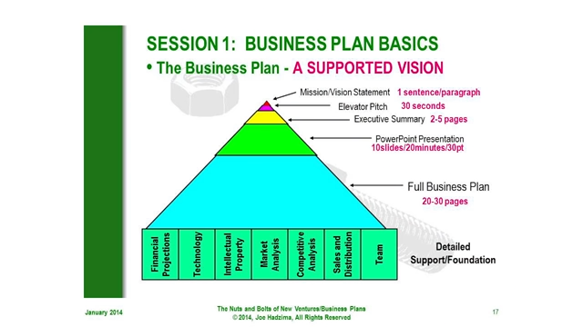

# Business Plan

Dynamic & shared vision with team on where we are, where we’re going, how we’re going there

## Elements

1. Executive Summary
2. Opportunity and the Company & its Services/Products
3. Market Research/Analysis
4. Economics of the Business
5. Marketing Plan
6. Design & Development Plan
7. Manufacturing & Operations Plan
8. Management Team
9. Schedule
10. Critical Risks, Problems & Assumptions
11. Financial Plan
12. Assumptions

Technology isn’t a section, as it is a means to the end. The real point is the value produced.

Cover Page

- Name of Venture
- Address, Contact Details
- Confidentiality Legend
- Securities Law Legend
  - Control numbering of copies

## Table of Contents

1. Put one in
2. Include page numbers

## Executive Summary

Resume for the full plan

Goal is to get the interview to give the pitch, and answer [What do investors look for?](#What do investors look for?)

### Elements

1. Description of Business Concept
2. Opportunity & Strategy
3. Target Market & Projections
4. Competitive Advantages
5. Economics, Profitability, Harvest Potential
6. The Team

### Characteristics

- 2 - 5 pages long
- Should be Logical, Clear, Interesting/Exciting

## Body

1. IDK Plan
   1. Marketing Strategy
   2. Pricing & Distribution
   3. Sales Tactics
   4. Advertising & Promotion
2. Opportunity
   1. How big is it now?
   2. Trends
3. Market Analysis
   1. Existing competitors
   2. ==**Who loses if you win and what will be their response?**==
   3. Are customers interested?
4. Development Plan
   1. Current Product Status
   2. Further steps (Time & Resources) required
   3. Difficulty & Risks
   4. Product Pipeline Plans
5. Action Plan
   1. What will you do and when?
   2. Identification of ‘Credibility Testers’
   3. Sequencing to build value
   4. Eliminate/Reduce Dependencies
   5. Coordination of Schedule, Value Recognition Events, and Financing Requirements
6. Appendix

## Business Plan as a Financing Document

### First reading: Like a resume

1. Excellent Idea
2. Excellent financial promise
3. Excellent team
4. Action plan is credible and focused
5. Details that give assurance of insight, commitment, and follow-through

#### Why some plans fail here

- Insufficient market
- Non-Credible technology
- Too large investment
- Failure to understand market
- Overly optimistic action plan
- Non-Credible team
- Poor business plan submission (misspellings, poor grammar)

### Second reading: Justify the investment

### Third reading: Commit to a plan

## What do investors look for?

1. Why this? Why should I be interested?
2. Why now?
3. Why this team?
4. Why will this succeed?

## Business Model Canvas

- Value proposition
- Customer segment
- Distribution channel
- Customer relationship: Feedback mechanism
- Key activities
- Key resources
- Key partnerships
- Cost structure
- Revenue stream