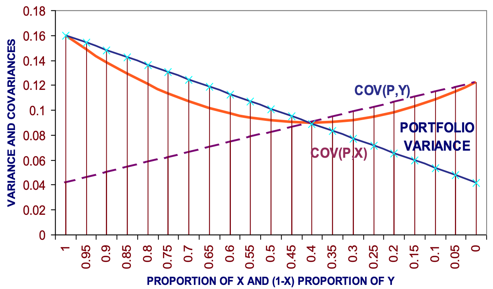
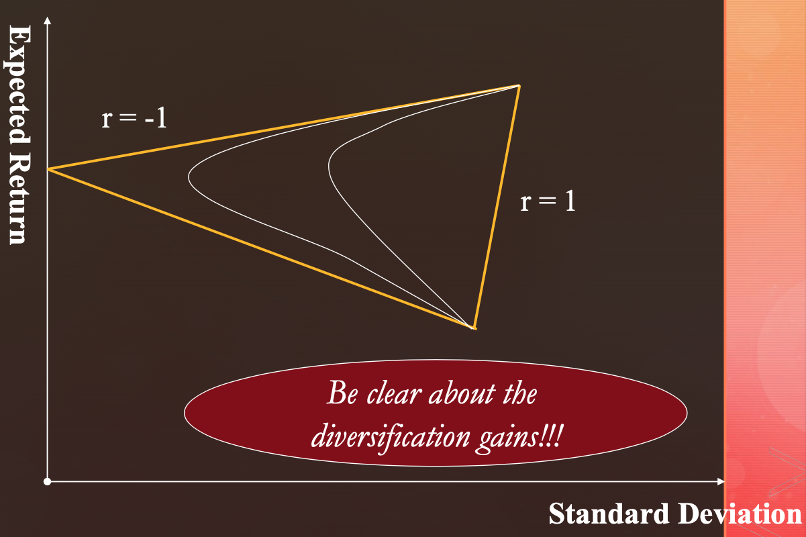

# Portfolio

Pool of securities combined such that

- Maximizes expected returns
- Minimizes unsystematic risk

Concept of hedging

Try to diversify on all 4 pillars of GEIC

## Aspects

- What set of securities to be selected
- What proportions
- Selection of optimum portfolio

## Characteristics

Let $w_i$ be the fraction of investment allocation to security $i$

- $w_i \in [0, 1]$
- $\sum_i w_i = 1$
- $w_i<0 \implies$ Taking loan?

Note: We assume Gaussian distribution of returns for all securities. If violated, then analyze accordingly
$$
\begin{aligned}
E[R_p] &=
\sum_i^n w_i R_i \\

\sigma^2_{R_p} &=
\sum_i^n (w_i \sigma_i)^2 + 2 \sum_{i=1}^{\lceil n/2 \rceil}
\sum_{j>i}^n
w_i w_j \sigma_i \sigma_j \rho_{ij} \\
\beta_p &= \sum_i^n w_i \beta_i
\end{aligned}
$$

where

- $\rho_{ij} =$ correlation between 2 securities $i$ and $j$
- $\beta_i =$ $\beta$ of security $i$
- Given +ve portfolio weights on 2 shares, the lower the correlation between them, the lower the variance of the portfolio

## Minimum Variance Portfolio

A portfolio of group of shares that minimizes the return variance is the portfolio that has equal variance with every share return
$$
w^* = \arg \min \sigma^2_{R_p} \\
\implies w^* = w  \ @  \ \dfrac{d \sigma^2_{R_p}}{dw} = 0
$$

### 2 Securities

$$
\begin{aligned}
w^* &= (w_1^*, 1-w_1^*) \\
w_1^* &= \dfrac{\sigma_2^2 - \sigma_1 \sigma_2 \rho_{12}}{\sigma_1^2 + \sigma_2^2 - 2 \sigma_1 \sigma_2 \rho_{12}}
\end{aligned}
$$

## Types of Portfolios

|                |      |
| -------------- | ---- |
| Value-Weighted |      |
|                |      |

## Benchmark

- 60% Equity, 40% Bonds

## India

Nifty50 makes a 12% average return, but actually, entire pool of Indian stock market makes a negative return

Retail investors lose money due to single-stock investment

Exane, Expose

