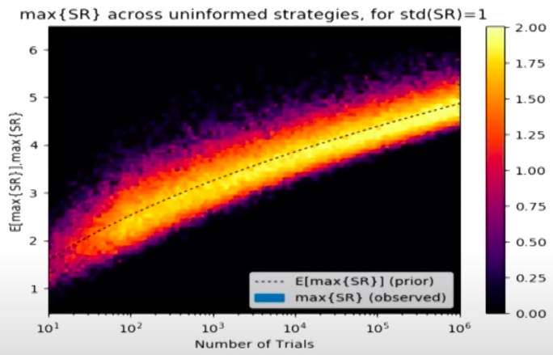
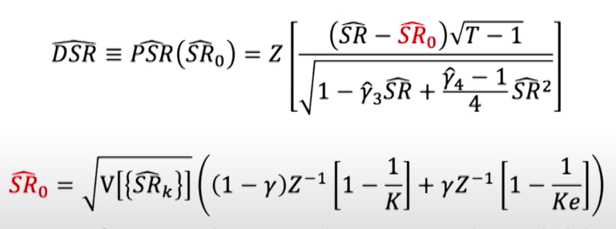

# Portfolio Evaluation

Evaluation of portfolio as whole, without examining the individual securities.

However, for portfolio revision, you need to examine the individual securities.

## Metrics

| Ratio           |                                            |                                  |
| --------------- | ------------------------------------------ | -------------------------------- |
| Sharpe          | $\dfrac{R_P - R_f}{\sigma_p}$              | Price premium per unit risk      |
| Treynor         | $\dfrac{R_P-R_f}{\beta_P}$                 | Price premium per unit $\beta$   |
| Jensen $\alpha$ | $R_p - R_\min$                             | Excess return more than required |
| Calmar          | $\dfrac{R_p}{\text{Max Drawdown}}$         |                                  |
| Sterling        | $\dfrac{R_p}{\text{Max Drawdown} - 10 \%}$ |                                  |

### Drawdown

Percentage peak-to-trough decline during a specific time period

Measured once a new high is reached, because a minimum cannot be measured yet since the value could decrease further

## Sharpe Ratio

### Limitations

Selection bias of strategies results in false-positives regarding the success of a strategy

### Deflated Sharpe Ratio

Probability that SR is statistically-significant, after controlling for inflationary effect of

- No of independent trials with the strategy $k$
  - List all the returns of all strategies
  - Find the independent series

- Data Dredging $V \left[ \widehat{\text{SR}}_k \right]$
- Non-normality of returns: $\hat y_3, \hat y_4$
- Length of time series $T$

Can help identify if the benefits is due to chance
