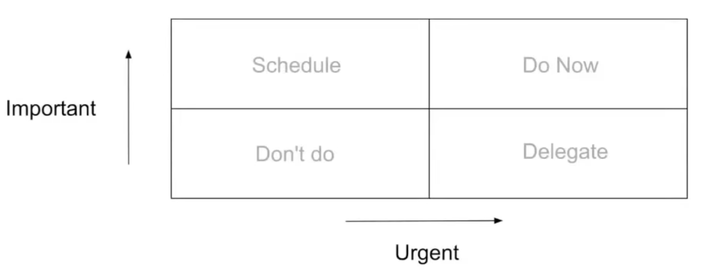

# General

## General Notes

- [ ] Work-life balance
	- [ ] Determine what's important: on your deathbed, what do you want to say that you have done
	- [ ] Never have regrets: on your deathbed, don't have anything you'd wish that you had done
	- [ ] Make key goals: personal & professional
	- [ ] Spend time with friends and family
	- [ ] Take hare of health
	- [ ] Complete work
	- [ ] Cut everything else
	- [ ] Profile your activities
		- [ ] Self-logging post hoc (end of the day) is notoriously unreliable
		- [ ] Is your time spent aligned with your goals
		- [ ] Organize and build systems
		- [ ] How much is your time worth
- [ ] Professional
	- [ ] Interview
		- [ ] Interview
			- [ ] Be confident, not over-confident
			- [ ] Make it clear that
				- [ ] you are great what you do
				- [ ] you have lots to learn, as one cannot know everything
				- [ ] you need ~~hand-holding~~ guidance
	- [ ] Understand the problem, don't immediately provide the solution
		- [ ] "If you understand your solution better than the problem you're doing something wrong" ~ Vincent Warmerdam
		- [ ] Understand the final goal is not the solution itself, but the solving of the problem.
		- [ ] Many a times people get caught up with the solution or just do their work as is without truly understanding the goal - mainly seen in the IT and AI industry.
		- [ ] I believe the problem is not with the people, but a problem with the objectives set for the people in organizations - to finish as many tasks/tickets/publications as possible
	- [ ] Response if you don't know something,
		- [ ] ❌ "I don't know"
		- [ ] ✅ "I am not aware; I will check and get back to you ASAP"
	- [ ] Reuse, don't redo
	- [ ] Decisions
		- [ ] Plan decisions for potential scenarios in advance as much as possible
		- [ ] Spontaneous decisions are prone to biases
	- [ ] Time Management
		- [ ] 
	- [ ] Never directly trust anything you read; always do the derivations & test everything for yourself
	- [ ] [How to read a paper](https://cseweb.ucsd.edu/~dstefan/cse227-spring19/papers/keshav:how.pdf)
	- [ ] Always be prepared; new opportunities may arise any time
	- [ ] Always be eager to continuously learn & explore
	- [ ] Be wary about the [Hype Cycle](#hype-cycle)

## Hype Cycle

Technology adoption cycle

Venture Capitalists know that 9/10 investments fail, but expect at least 1/10 makes enough money to compensate for the others

## General Tasks involved in Job Roles

[O*Net](https://www.onetonline.org/)

## Parts of Profile

- Knowledge - Theory
- Skill - Practical
- Craft - Projects
- Experience - Time?