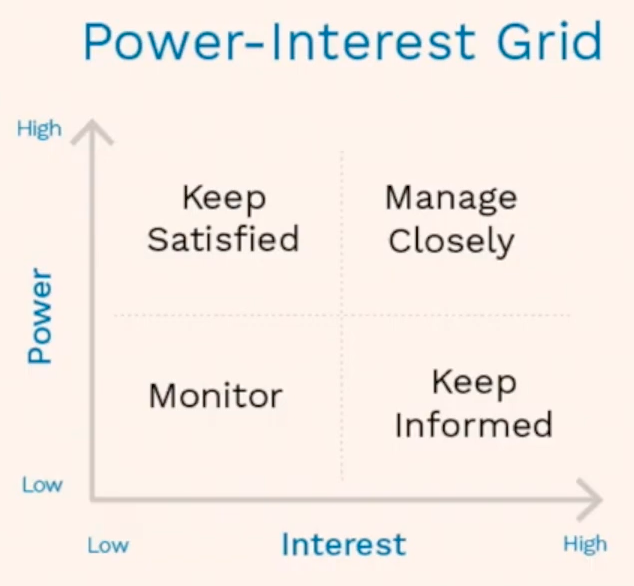
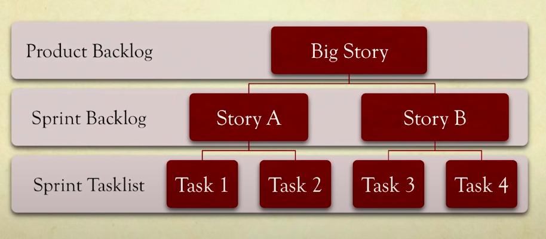
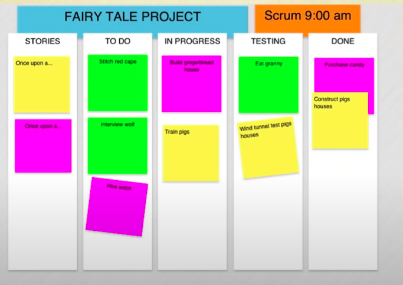

# Project Management

Project Management is the planning, organization, securing, motivation and control of resources to successfully complete a project, while minimizing unproductive efforts

- The goal is to be 'agile'; 'agile' is an adjective, not a noun
	- Able to adapt to changing requirements
- What to do
	- Find out where you are
	- Take a small step towards the goal
	- Adjust understanding based on what you learnt
	- Repeat
- How to do
	- When faced with 2/more alternatives that deliver similar value, choose the path that makes future change easier

## Biggest Pitfall

Avoid unnecessary [Meetings](03_Meetings.md)

## Basics

Every project should have the following

- [ ] Clear goal/vision/problem statement
	- [ ] Why
	- [ ] Who: Stakeholder identification
	- [ ] What
		- [ ] Scope
		- [ ] Ideas
		- [ ] Theme
	- [ ] How: Implementation
	- [ ] Design doc not recommended
		- [ ] hard to maintain
		- [ ] long; hard to refer to
- [ ] Stakeholder Management
	- [ ] Fields
		- [ ] Stakeholder
		- [ ] Role
		- [ ] Power
		- [ ] Interest: What's in it for them
		- [ ] Interest: Level
		- [ ] Engagement: Frequency
		- [ ] Engagement: Mode (presentation, call, email)
		- [ ] Actions to take on-site
	- [ ] Rows
		- [ ] Project Sponsor
		- [ ] Project Manager
		- [ ] Data Engineer, IT, etc...
		- [ ] End-Users: Clients, Company users
	- [ ] Plot
		- [ ] 
- [ ] Valuation
	- [ ] IRR
	- [ ] NPV
- [ ] IDK
	- [ ] Define KPIs
	- [ ] Set expectations for each person
	- [ ] Security/Permissions
	- [ ] Scenario-Planning for bad things that could go wrong
		- [ ] Over-budget
- [ ] Organizing
	- [ ] Processes
		- [ ] ISO/IEC DIS 42001 IT-AI-Management System
	- [ ] Documentation
	- [ ] Tools
		- [ ] Version Control
	- [ ] Requirements
		- [ ] Data
		- [ ] Model
		- [ ] Access
	- [ ] Methods
		- [ ] Data Flow
- [ ] Relationships
	- [ ] Different stakeholders
	- [ ] Communication
- [ ] Usability
	- [ ] Interpretability
	- [ ] Ease of setup
	- [ ] Ease of modification
- [ ] Testing
	- [ ] Prioritize, integrate and cut features early
	- [ ] Plan backup procedures
		- [ ] Test data format
		- [ ] Test plan
		- [ ] Usage scenarios
	- [ ] Monitor
		- [ ] Model accuracy
- [ ] Life Cycle
	- [ ] Data drift
	- [ ] Model drift
	- [ ] Handling new requests
		- [ ] Scope creep
			- [ ] Have client prioritize
			- [ ] Request additional resources
		- [ ] Nonsense requests
			- [ ] Understand why
- [ ] Assessing
	- [ ] Perform regular assessments at a fix periodicity
- [ ] Neatness

### Change Log

- Datetime
- Change
- Reason

## Popular Project Management Models

|                 |                                                                                                                                                                                                                                                        | Advantage                             | Disadvantages                                                                                                                             |
| --------------- | ------------------------------------------------------------------------------------------------------------------------------------------------------------------------------------------------------------------------------------------------------ | ------------------------------------- | ----------------------------------------------------------------------------------------------------------------------------------------- |
| Waterfall       | - Concept: Setting the goal - Design: Acquire the requirements, such as programmers - Pre-Production: Verify if the concept and design are feasible - Production - Testing   - Alpha   - Beta - Shipping - Maintenance |                                       | Most of the actual feedback will occur at beta testing, which is too far ahead in the timeline, and hence it will be too late to respond. |
| Classical Agile | - Individuals and interactions > processes and tools - Working software > comprehensive documentation - Customer collaboration > contract negotiation - Responding rather > over following a plan                                          | Focus on features that consumers want | Assumes interchangeable tasks & team members Depends on good communication                                                           |
| Scrum           | 1. Transparency - Everyone on the team related to a decision is involved - Shared responsibility 2. Inspection: Anyone on the team curious on why something is the way it is, can 3. Adaptability                                  |                                       |                                                                                                                                           |

## Scrum

Velocity tracking is flawed
- Every sprint is different, as this isn't a repetitive assembly line
- Velocity tracking does not help tech team
- Only gives management a false sense of control

### Keywords

|               |                                                                                                                                                              |
| ------------- | ------------------------------------------------------------------------------------------------------------------------------------------------------------ |
| Sprint        | Group of tasks to be completed by all teams concurrently                                                                                                     |
| Sprint Length | Duration of sprint Usually 1 week                                                                                                                       |
| Task          | Atomic chunk of work an individual can do independently that you can estimate duration for Usually $\le 8 \text{hrs}$ Usually assigned to 1 person |

### Artifacts

|                                       |                                                                                                                                       |
| ------------------------------------- | ------------------------------------------------------------------------------------------------------------------------------------- |
| Feature                               | Requirement in User Story format:  “As the user/designer/artist, I want `something testable` so that `explain reason`"                |
| Feature List                          | List of features                                                                                                                      |
| Backlog (Product/Project/Sprint) | Prioritized list of functionality which a product should contain, or a project/sprint should achieve Maintained by Product Owner |
| Tasklist                              | Exhaustive list of tasks                                                                                                              |
| Scrumboard                            | Task list visualized based on status like on Trello                                                                                   |
| Target                                | Goal “Has to be done in 2days”                                                                                                   |
| Estimation                            | “It’ll take about 2 days to do it”                                                                                                    |
| Plan                                  | “I’ll need 2 days to do it”                                                                                                           |
| Reality                               | “It took 2 days to do it”                                                                                                             |

### Meetings

| Frequency | Meeting               | Goal                                                         | Details                                                                                                                                                                                 | Timebox |
| --------- | --------------------- | ------------------------------------------------------------ | --------------------------------------------------------------------------------------------------------------------------------------------------------------------------------------- | ------- |
| Weekly    | Sprint Planning       | Plan sprint backlog by converting project backlog into tasks |                                                                                                                                                                                         | 1hr     |
|           | Scrum/Standups        | Accountability & Communication                               | What did you do since last meeting What will you do until next meeting What is blocking you. Just note this down. Create a new meeting if someone wants to discuss this block | 10min   |
|           | Sprint Review         | Review product                                               | Demonstrate working product Review & evaluate product Review & update product backlog                                                                                         | 1hr     |
| Monthly   | Retrospective Meeting | Review process                                               | Things to keep doing Things to stop doing New things to try                                                                                                                   | 30min   |
| Quarterly | Stakeholder meeting   |                                                              |                                                                                                                                                                                         |         |

### People

| Person        |                                                                      |
| ------------- | -------------------------------------------------------------------- |
| Product Owner | Has complete understanding of the product Guides the team       |
| Scrum Master  | Administrative Runs the meetings Facilitator Mediator |
| Team Member   |                                                                      |

Ideally Product Owner and Scrum master should always be different, as each of their roles is very tiring as is.

### Feature Size

Categorize features as S, M, L

IDK

- Discuss as an entire team whenever possible
- Each role should try to lend its perspective
- Listen & try to make sense of what others are saying
- Offer alternate solutions & point out problems
- Divide huge features into atomic features
- Everyone related to the decision should be there
- Everyone should agree on the feature size
  - Don’t average out the opinions if someone says S & another person says L, don’t conclude it’s M
- Should not take too long. If you get stuck on a feature, put it aside & come back to it

### Estimation

Get a clear view of project reality to make informed decisions to control project to hit targets. You need to identify what the team is capable of, not what you can/want to happen

```mermaid
---
title: Estimation
---

flowchart LR

subgraph pb[Product Backlog]
	direction LR
	f1[Feature 1]
	f2[Feature 2]
end

subgraph sb[Sprint Backlog]
	direction LR
	t1[Task 1]
	t2[Task 2]
end


pb --> Size --> Effort --> People --> Time --> sb
```

- Don’t estimate in “ideal work hours”
- Include breaks, distractions & meetings in the estimate

Need to know the __ of your estimates

- Uncertainty
- Accuracy
- Precision

You need to commit to a point estimate; don’t use the average of a range.

### Estimation $\ne$ Planning

|                        | Planning              | Estimation                                                                |
| ---------------------- | --------------------- | ------------------------------------------------------------------------- |
| Goal                   | Achieve a target      | Verify if plan is realistic                                               |
| Commitment occurs when | Person accepts a task | when estimation is accurate (not necessary person takes up the task) |
| Nature                 | Fixed                 | Variable Re-estimate as you work on the task                         |

### Tracking Estimates

| Feature | Task | Original Estimate | Elapsed | Remaining | Current Estimate |
| ------- | ---- | ----------------- | ------- | --------- | ---------------- |
|         |      |                   |         |           |                  |

Get summary statistics of feature’s resources

Use this for better estimating in the future

Compare against feature size

### Backlog to Tasklist

By breaking up story into tasks, you can understand all dependencies & potential overloading of individuals

### Scrum Board

|                  |
| ---------------- |
| Doing            |
| Todo-This Sprint |
| Todo-Long Term   |
| Discussion       |
| Testing          |
| Completed        |
| Cancelled        |

## Software Engineering

### Aspects

- Frontend
  - UI
  - UX
- Backend
  - Database
  - APIs
- Design/Spec/Customer
- Features
- Ease of use

### Write Less Code

- Low Prototyping: Paper, Whiteboard, Digital Sketch
- Iterative Design
- Testing early

### Low Fidelity Prototyping

#### Why prototype

- Cheaper
- Visualize idea to others
- Get feedback earlier
- Experiment with alternatives
- Easier to change
- Easier to discard ideas

### Version Control
- backup system
- way to share code
- history of project
- restore to checkpoint
- simultaneously work on the same files, without affecting others
- comment log

Operations
- Pull
- Push
- Check status
- Lock files
- Diff: compare
- Merge changes and resolve conflict

Note
- Perfect copy on the main branch
	- should always build and run
	- with 0 errors
	- with 0 warnings
		- ignoring warnings can become troublesome when you actually have a problematic warning
- Ignore unneeded files
- Lock binary files

### Testing/Quality Assurance
Systematic process of checking if product/service being developed meets requirements

Types
- Technical testing: looking for defects/logical errors
- Playtesting: Dev team usage testing
- User testing: Real end-user testing

Aspects
- Technical standards
- Bug database
- Build and test before check in
- Daily builds, daily play throughs
- Planned feature cuts
- Code reviews/freezes
- Asset freezes

Bug reporting
- Actual behavior
- Expected behavior
- How to reproduce
- How common
- Seriousness of bug
- Supporting data (screenshots, numbers, etc)

### Stages

- Wireframe design
- Wireframe approval
- Mockup design
- Mockup approval
- Backend development
- Frontend development
- Integration
- Code review
	- Do not
		- nitpick on style guide: use a linter
		- discuss large scale: should be discussed elsewhere and before
	- Do
		- Naming
		- Forms of input
		- Anticipating future needs
- Testing
- Functional testing
- User testing
- Deployment
- Maintenance