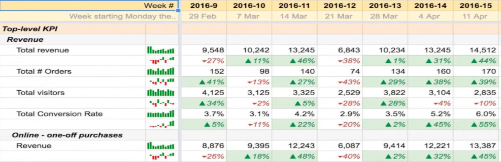

# Analytics

- Financial Reporting
- Strategy
	- Opportunity sizing
	- Incremental revenue estimation
	- Forecasting
- Product Analytics
	- Customer Journey
	- Customer Growth
## IDK

- Define KPIs = key metrics
	- If a KPI going up/down does not instigate any action, then it is useless
- Have a Northstar KPI
	- Best growth KPI:            Retained `MAU` `YOY`
	- Best performance KPI: Total `GMV`
- Decompose KPI into drivers to form a metric tree
	- For eg:
		- Total `GMV`
			- = `# Orders` x `AOV`
			- `# Orders`
				- = `# Customers` x `Order Frequency`

## Tracking

- Column:
	- Time period
- Rows:
	- Metric
	- Compared to
		- Change in metric
		- % change in metric
	- Impact of change in metric on change in north-star
		- KPI decomposition
- Values
	- Spark line/bar
	- Value
- Color
	- For every metric, the ranges must be defined
		- Red = Horrible
		- Orange = Poor
		- No color = Neutral
		- Light green = Good
		- Green = Great
- Comparison
	- Comparison value
		- Target for period
		- Base period common for all
		- PoP (Period-on-Period: Current period vs Previous period)
	- Resolution
		- YoY
		- YTDoYTD
		- MoM
		- MTDoMTD
		- WoW
		- WTDoWTD
		- DoD
		- DTHoDTH
		- HoH

### Metrics

1. North star
2. Top-Level
	- Orders
	- Users
	- Conversion
3. Financials
	- Net Profit
	- Gross Profit
	- Revenue
4. Performance
	- GMV
	- Basket Value
5. Drivers/Levers
	- `#` Vendors
	- CARC %
	- Discount %
6. Product
	- [03_Product_Analytics](03_Product_Analytics.md)

## Incrementality using Diff-in-Diff

Cohort
- Order Month

Segments
- Country, in $T-1$
- Order frequency, in $T-1$
	- 0-1
	- 2-3
	- etc
- Lifecycle, in $T$

- Overall incrementality is a weighted average
- The estimated incrementality is the ATT

| Lifecycle   | Sub-Group                                                                                                                                | User Definition                                                              | ==ATT== in ==T+h==                                                                                                                                                                                                                                                  |
| ----------- | ---------------------------------------------------------------------------------------------------------------------------------------- | ---------------------------------------------------------------------------- | ------------------------------------------------------------------------------------------------------------------------------------------------------------------------------------------------------------------------------------------------------------------- |
| Retention   | Control                                                                                                                                  | Not interacted with treatment until $T+h$, but retention customer            | 0                                                                                                                                                                                                                                                                   |
|             | Treatment attributed                                                                                                                     | Retention order via treatment                                                | **Diff-in-diff** (Order frequency of cohort in $T+h$) - (Order frequency of cohort in $T-1$) - (Order frequency of `Control` in $T+h$) - (Order frequency of `Control` in $T-1$)                                                                           |
|             | Non-Treatment attributed                                                                                                                 | Retention order not via treatment, but interacted with treatment otherwise   | **Diff-in-diff** (Order frequency of cohort in $T+h$) - (Order frequency of cohort in $T-1$) - (Order frequency of `Control` in $T+h$) - (Order frequency of `Control` in $T-1$)                                                                           |
| Winback     | Control, $T-p$  Use as many $p$ lag cohorts as required, for eg: $(T-2), (T-3), (T-{4,6}), (T-{7,12}), (T-{13+})$                  | Not interacted with treatment until $T+h$, but winback customer              | 0                                                                                                                                                                                                                                                                   |
|             | Treatment attributed, $T-p$  Use as many $p$ lag cohorts as required, for eg: $(T-2), (T-3), (T-{4,6}), (T-{7,12}), (T-{13+})$     | Winback order via treatment                                                  | Order frequency of cohort in $T+h$  OR  **Diff-in-diff** (Order frequency of cohort in $T+h$) - (Order frequency of cohort in $T-p$) - (Order frequency of `Control` in $T+h$) - (Order frequency of `Control` in $T-p$)                       |
|             | Non-Treatment attributed, $T-p$  Use as many $p$ lag cohorts as required, for eg: $(T-2), (T-3), (T-{4,6}), (T-{7,12}), (T-{13+})$ | Winback order not via treatment, but interacted with treatment otherwise     | Same increment as `Retention - Non-Treatment attributed`  OR  **Diff-in-diff** (Order frequency of cohort in $T+h$) - (Order frequency of cohort in $T-p$) - (Order frequency of `Control` in $T+h$) - (Order frequency of `Control` in $T-p$) |
| Acquisition | Control                                                                                                                                  | Not interacted with treatment until $T+h$, but acquired customer             | 0                                                                                                                                                                                                                                                                   |
|             | Treatment attributed                                                                                                                     | Acquisition order via treatment                                              | Order frequency of cohort in $T+h$  OR  **Diff-in-diff** (Order frequency of cohort in $T+h$) - (0) - (Order frequency of `Control` in $T+h$) - (0)                                                                                            |
|             | Non-Treatment attributed                                                                                                                 | Acquisition order not via treatment, but interacted with treatment otherwise | **Diff-in-diff** (Order frequency of cohort in $T+h$) - (0) - (Order frequency of `Control` in $T+h$) - (0)                                                                                                                                                |

### Output

| Cohort     |    $T-3$    |    $T-2$    |    $T-1$    | ==$T$== | $T+1$ | $T+2$ | $T+3$ |
| ---------- | :---------: | :---------: | :---------: | :-----: | :---: | :---: | :---: |
| 2025-01-01 | $\approx 0$ | $\approx 0$ | $\approx 0$ |         |       |       |       |
| 2025-02-01 | $\approx 0$ | $\approx 0$ | $\approx 0$ |         |       |       |       |
| 2025-02-01 | $\approx 0$ | $\approx 0$ | $\approx 0$ |         |       |       |       |
