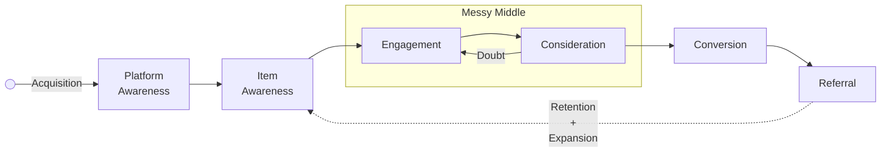
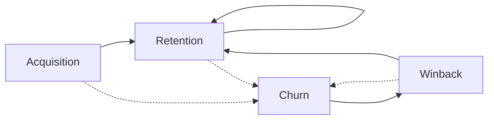

# Product Analytics

## Metrics

- 3 ways to look at metrics
	1. Hits
	2. Sessions
	3. Users
- Why are sessions usually preferable to hits?
	- Hits may inflate/deflate the metrics, and may mislead the analysis


- Define KPIs = key metrics
	- If a KPI going up/down does not instigate any action, then it is useless
- Have a Northstar KPI
	- Best growth KPI:            Retained `MAU` `YOY`
	- Best performance KPI: Total `GMV`
- Decompose KPI into drivers to form a metric tree
	- For eg:
		- Total `GMV`
			- = `# Orders` x `AOV`
			- `# Orders`
				- = `# Customers` x `Order Frequency`

## Frameworks

- [Customer Funnel](#Customer%20Funnel)
- [Customer Lifecycle](#Customer%20Lifecycle)
- [Cohort Analysis](#Cohort%20Analysis)


Things to define

|               | Definition            | Sub definition |                                                         | Example                        |
| ------------- | --------------------- | -------------- | ------------------------------------------------------- | ------------------------------ |
| **Fact**      | Metric                | Metric action  | What is to be tracked                                   | Retention %, user count, GMV   |
|               |                       | Metric horizon | Time period for metric                                  | Monthly                        |
| **Dimension** | Cohort                | Cohort action  | What constitutes as being part of time-series group     | Acquisition conversion         |
|               |                       | Cohort period  | Time period to aggregate group                          | Monthly                        |
|               | Segment               |                | What constitutes as being part of cross-sectional group | Geography, OS                  |
|               | Lifecycle group       |                | Which phase of the customer lifecycle                   | Activation, retention, winback |
|               | Order frequency group |                | Single<br>Repeat                                        |                                |

## Customer Funnel/Loop

- Exclude easy-to-convert aspects from the analysis, such as platform-associated vendors' funnel
- Consider `Item` = interested thing
	- Ecommerce item
	- Restaurant/Vendor

```
Loop = Funnel + Cycle
```

### Stages




|                        | Stage                                               | Metric                                   | Meaning                                                                           | Measurement                                 | Desired                  |
| ---------------------- | --------------------------------------------------- | ---------------------------------------- | --------------------------------------------------------------------------------- | ------------------------------------------- | ------------------------ |
| Before Funnel          | Platform Awareness/<br>Trigger                      | Home Visits                              | Entry point                                                                       | Sessions, Hits                              | Higher                   |
|                        |                                                     | Home Visitors                            | Entry point users                                                                 | Users                                       | Higher                   |
|                        |                                                     | Home Clicks                              |                                                                                   | Sessions, Hits                              | Higher                   |
|                        |                                                     | Home Clickers                            |                                                                                   | Users                                       | Higher                   |
|                        |                                                     | Home Overall CTR<br>(Click-Through Rate) | Home Clicks/Home Visits                                                           | Ratio<br>(Sessions/Sessions)<br>(Hits/Hits) | Higher                   |
|                        |                                                     | Home User CTR                            | Home Clicks/Home Visitors                                                         | Ratio<br>(User/User)                        | Higher                   |
|                        | Churn/<br>Doubt                                     | IDK                                      |                                                                                   |                                             |                          |
| Top of Funnel          | Item Awareness/<br>Trigger                          | Item Impressions                         | `#` of times ad appears on screen                                                 | Sessions, Hits                              | Higher                   |
|                        |                                                     | Item Reach                               | `#` of people associated with impressions                                         | Users                                       | Higher                   |
|                        |                                                     | Frequency                                | `#` of times ad appears appears per person<br>`Impressions / Reach`               | Ratio<br>(Sessions/Sessions)<br>(Hits/Hits) | Higher                   |
|                        | Doubt                                               | IDK                                      |                                                                                   |                                             |                          |
| Messy Middle           | Engagement/<br>Interest/<br>Exploration             | Item Views                               |                                                                                   | Sessions, Hits                              | Higher                   |
|                        |                                                     | Item Viewers                             |                                                                                   | Users                                       | Higher                   |
|                        |                                                     | Item Searches                            |                                                                                   | Sessions                                    | Depends                  |
|                        |                                                     | Item Search reach                        |                                                                                   | Users                                       | Higher                   |
|                        |                                                     | Item Clicks                              |                                                                                   | Sessions, Hits                              | Higher                   |
|                        |                                                     | Item Clickers                            |                                                                                   | Users                                       | Higher                   |
|                        |                                                     | Pages/Visitor                            |                                                                                   | Ratio<br>(Pages/User)                       | Depends                  |
|                        |                                                     | Sign-ups                                 |                                                                                   | Users                                       | Higher                   |
|                        |                                                     | Item Overall CTR<br>(Click-Through Rate) | Item Clicks/Item Views                                                            | Ratio<br>(Sessions/Sessions)<br>(Hits/Hits) | Higher                   |
|                        |                                                     | Item User CTR                            | Item Clickers/Item Viewers                                                        | Ratio<br>(User/User)                        | Higher                   |
|                        | Consideration/<br>Desire/<br>Evaluation             | Checkout Views                           |                                                                                   | Sessions, Hits                              | Higher                   |
|                        |                                                     | Checkout Viewers                         |                                                                                   | Users                                       | Higher                   |
|                        |                                                     | Checkout Clicks                          |                                                                                   | Sessions, Hits                              | Higher                   |
|                        |                                                     | Checkout Clickers                        |                                                                                   | Users                                       | Higher                   |
|                        |                                                     | Checkout Overall CTR                     | Checkout Clicks/Checkout Views                                                    | Ratio<br>(Sessions/Sessions)<br>(Hits/Hits) | Higher                   |
|                        |                                                     | Checkout User CTR                        | Checkout Clickers/Checkout Viewers                                                | Ratio<br>(User/User)                        | Higher                   |
|                        | Doubt/<br>Confusion                                 | Back and forth Clicks/User               |                                                                                   | Ratio<br>(Hits/User)                        | Lower                    |
|                        |                                                     | Time spent/User                          |                                                                                   | Ratio<br>(Time/User)                        | Depends                  |
|                        |                                                     | Time spent/page                          |                                                                                   | Ratio<br>(Time/Pages)                       | Depends                  |
|                        |                                                     | Scrolling time                           |                                                                                   | Hits, Sessions, Time                        | Depends                  |
|                        |                                                     | Time per view                            |                                                                                   | Ratio<br>(Time/Hit)                         | Lower                    |
|                        |                                                     | Avg `#` of touch points                  |                                                                                   | Hits, Sessions                              | Lower                    |
| Bottom of Funnel       | Conversion/<br>Activation/<br>Action/<br>Experience | Conversions/Activations                  | Desired action (for eg: orders)                                                   | Hits, Sessions                              | Higher                   |
|                        |                                                     | Cart abandonment rate                    | Customer adds item(s) to card, but does not complete purchase                     | Ratio<br>(Sessions/Sessions)<br>(Hits/Hits) | Lower                    |
|                        |                                                     | Customers                                | `#` of users who made orders                                                      | Users                                       | Higher                   |
|                        |                                                     | Overall CVR<br>(Conversion Rate)         | Conversions/App visits                                                            | Ratio<br>(Sessions/Sessions)<br>(Hits/Hits) | Higher                   |
|                        |                                                     | Customer CVR                             | Customers/App visitors                                                            | Ratio<br>(User/User)                        | Higher                   |
|                        |                                                     | BV                                       | Basket Value<br>Bill amt (Pre-Discount)                                           | Currency                                    | Higher                   |
|                        |                                                     | GMV                                      | Gross Merchandise Value<br>(post discount)                                        | Currency                                    | Higher                   |
|                        |                                                     | ABV                                      | Average Basket Value<br>= BV/Orders                                               | Currency                                    | Higher                   |
|                        |                                                     | AOV                                      | Average Order Value<br>= GMV/Orders                                               | Currency                                    | Higher                   |
|                        |                                                     | ABV_customer                             | BV/Customers                                                                      |                                             | Higher                   |
|                        |                                                     | AOV_customer                             | GMV/Customers                                                                     |                                             | Higher                   |
|                        |                                                     | Avg Time to convert                      |                                                                                   | Time                                        | Lower                    |
|                        |                                                     | Cost per conversion                      |                                                                                   | Currency                                    | Lower                    |
|                        |                                                     | Conversions attempted                    |                                                                                   | Hits, Sessions                              | Higher                   |
|                        |                                                     | Conversion success rate                  | # Conversion Completed/# Conversion Attempted<br><br>For eg: Payment success rate | Ratio<br>(Hits/Hits)<br>(Sessions/Sessions) | Higher<br>(ideally 100%) |
| Cycle/<br>After Funnel | Retention/<br>Loyalty/<br>Stickiness                |                                          |                                                                                   |                                             |                          |
|                        | Expansion                                           | Order Frequency                          | `#` of orders per customer                                                        | Ratio<br>(Orders/Customer)                  | Higher                   |
|                        |                                                     | Duration of time between purchases       |                                                                                   | Time                                        | Lower                    |
|                        |                                                     | Rate of repeat purchases                 |                                                                                   | Ratio<br>(Hits/Time)<br>(Sessions/Time)     | Higher                   |
|                        |                                                     | Rate of account activation after sign-up |                                                                                   | Ratio<br>(Activation/Time)                  | Higher                   |
|                        |                                                     | Engagement with rewards program          |                                                                                   |                                             | Higher                   |
|                        | Referral                                            |                                          |                                                                                   |                                             |                          |

Note: make sure to backfill
- For eg, if there is a click, there should be a view

## Customer Lifecycle

Each of the [Customer Funnel stages](#stages) have the following states in the lifecycle
- Primarily, for reporting, we look at user lifecycle states in terms of conversion

### States



#### Better Understanding


Think of it as
- a leaky pipeline,
- with a funnel at each time point,
- determining the customer lifecycle for each funnel stage
#### Growth Accounting

```
Users_t
= Acq_t + Ret_t + Winback_t

Users_t-1
= Ret_t + Churn_t

Growth_t
= Users_t - Users_t-1
= (Acq_t + Winback_t) - Churn_t
```

## Cohort Analysis

| Curve           | Common                                                      | Visualization                                                    |                                                                             | Visual                          | Desired                                                                 |
| --------------- | ----------------------------------------------------------- | ---------------------------------------------------------------- | --------------------------------------------------------------------------- | ------------------------------- | ----------------------------------------------------------------------- |
| Retention Curve | Usually, conversion retention % from conversion acquisition | Line chart with cohorts as color and X axis as horizon           | Metric action trend of cohort of different cohorts from first cohort action |  | - Flatter curve<br>- Higher curves<br>- Across later cohorts above both |
|                 |                                                             | Line chart with horizon as color and X axis as *rolling* cohorts | Cohort trend for different metric horizons<br><br>eg: 1 month retention     |                                 | - Improving trend                                                       |
| Layer cake      | Usually, user base/GMV                                      | Stacked chart                                                    | Composition of metric at different time points from different cohorts       |       | Thick layers coming from old cohorts                                    |
|                 |                                                             | 100% Stacked chart                                               | Proportion of metric at different time points from different cohorts        |                                 |                                                                         |

## Top of Funnel vs Bottom of Funnel

When the cost of top-of-funnel reach is zero, the conversion rate matters more than the volume of engagement
- long-term success is predicated on intentionally filtering for the highest-probability, customers to maximize conversion
- Spending time on skeptical leads is a waste of resources. An intentional "top of the funnel" acts as a qualifier, not just a reach mechanism

The Nigerian prince scam
- Scammers send mass emails offering a share of a massive fortune in exchange for a small upfront fee.
- The goal of the initial email is not just to get a reply, but to identify victims with high gullibility and low tech literacy.
- The infamous grammatical errors and bizarre narratives are not accidental
- By filtering out skeptical, rational, or busy individuals early, scammers ensure they only spend time engaging with highly gullible, high-intent leads


## Churn Attribution

When did user churn?

- jan 15th: user makes order
- ⁠feb: no order

Idea
- If comes back on app in Feb, then they are churned in Feb, as they came on top of funnel but did not convert which could be poor app experience
- If they do not come back on app in Feb, then they are churned in Jan as they did not even come to top of funnel, either due to poor order experience or no longer interested