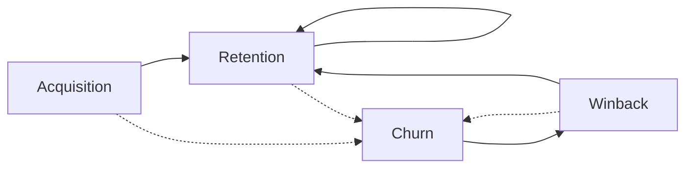
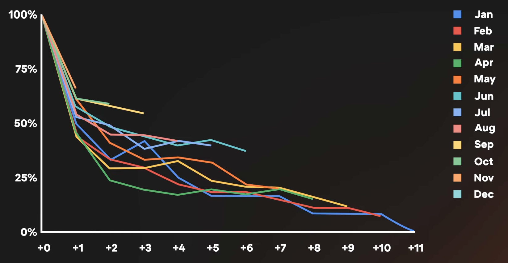
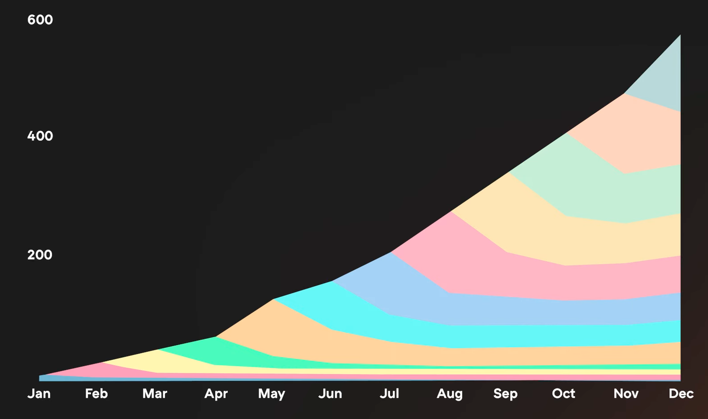

# Product Analytics

## Metrics

- 3 ways to look at metrics
	1. Hits
	2. Sessions
	3. Users
- Why are sessions usually preferable to hits?
	- Hits may inflate/deflate the metrics, and may mislead the analysis


- Define KPIs = key metrics
	- If a KPI going up/down does not instigate any action, then it is useless
- Have a Northstar KPI
	- Best growth KPI:            Retained `MAU` `YOY`
	- Best performance KPI: Total `GMV`
- Decompose KPI into drivers to form a metric tree
	- For eg:
		- Total `GMV`
			- = `# Orders` x `AOV`
			- `# Orders`
				- = `# Customers` x `Order Frequency`

## Dimensions for Analysis

- [Customer Funnel](#Customer%20Funnel)
- [Customer Lifecycle](#Customer%20Lifecycle)
- [Cohort Analysis](#Cohort%20Analysis)

## Customer Funnel

- Exclude easy-to-convert aspects from the analysis, such as platform-associated vendors' funnel
- Consider `Item` = interested thing
	- Ecommerce item
	- Restaurant/Vendor

### Stages

| Stage                    | Metric                                   | Meaning                                                                           | Measurement                                 | Desired                  |
| ------------------------ | ---------------------------------------- | --------------------------------------------------------------------------------- | ------------------------------------------- | ------------------------ |
| Platform Awareness       | Home Visits                              | Entry point                                                                       | Sessions, Hits                              | Higher                   |
|                          | Home Visitors                            | Entry point users                                                                 | Users                                       | Higher                   |
|                          | Home Clicks                              |                                                                                   | Sessions, Hits                              | Higher                   |
|                          | Home Clickers                            |                                                                                   | Users                                       | Higher                   |
|                          | Home Overall CTR<br>(Click-Through Rate) | Home Clicks/Home Visits                                                           | Ratio<br>(Sessions/Sessions)<br>(Hits/Hits) | Higher                   |
|                          | Home User CTR                            | Home Clicks/Home Visitors                                                         | Ratio<br>(User/User)                        | Higher                   |
| Item Awareness           | Item Impressions                         | `#` of times ad appears on screen                                                 | Sessions, Hits                              | Higher                   |
|                          | Item Reach                               | `#` of people associated with impressions                                         | Users                                       | Higher                   |
|                          | Frequency                                | `#` of times ad appears appears per person<br>`Impressions / Reach`               | Ratio<br>(Sessions/Sessions)<br>(Hits/Hits) | Higher                   |
| Engagement/<br>Interest  | Item Views                               |                                                                                   | Sessions, Hits                              | Higher                   |
|                          | Item Viewers                             |                                                                                   | Users                                       | Higher                   |
|                          | Item Searches                            |                                                                                   | Sessions                                    | Depends                  |
|                          | Item Search reach                        |                                                                                   | Users                                       | Higher                   |
|                          | Item Clicks                              |                                                                                   | Sessions, Hits                              | Higher                   |
|                          | Item Clickers                            |                                                                                   | Users                                       | Higher                   |
|                          | Pages/Visitor                            |                                                                                   | Ratio<br>(Pages/User)                       | Depends                  |
|                          | Time spent/page                          |                                                                                   | Ratio<br>(Time/Pages)                       | Depends                  |
|                          | Time spent/User                          |                                                                                   | Ratio<br>(Time/User)                        | Depends                  |
|                          | Sign-ups                                 |                                                                                   | Users                                       | Higher                   |
|                          | Item Overall CTR<br>(Click-Through Rate) | Item Clicks/Item Views                                                            | Ratio<br>(Sessions/Sessions)<br>(Hits/Hits) | Higher                   |
|                          | Item User CTR                            | Item Clickers/Item Viewers                                                        | Ratio<br>(User/User)                        | Higher                   |
| Consideration/<br>Desire | Checkout Views                           |                                                                                   | Sessions, Hits                              | Higher                   |
|                          | Checkout Viewers                         |                                                                                   | Users                                       | Higher                   |
|                          | Checkout Clicks                          |                                                                                   | Sessions, Hits                              | Higher                   |
|                          | Checkout Clickers                        |                                                                                   | Users                                       | Higher                   |
|                          | Checkout Overall CTR                     | Checkout Clicks/Checkout Views                                                    | Ratio<br>(Sessions/Sessions)<br>(Hits/Hits) | Higher                   |
|                          | Checkout User CTR                        | Checkout Clickers/Checkout Viewers                                                | Ratio<br>(User/User)                        | Higher                   |
| Conversion/<br>Action    | Conversions                              | Desired action (for eg: orders)                                                   | Hits, Sessions                              | Higher                   |
|                          | Customers                                | `#` of users who made orders                                                      | Users                                       | Higher                   |
|                          | Overall CVR<br>(Conversion Rate)         | Conversions/App visits                                                            | Ratio<br>(Sessions/Sessions)<br>(Hits/Hits) | Higher                   |
|                          | Customer CVR                             | Customers/App visitors                                                            | Ratio<br>(User/User)                        | Higher                   |
|                          | BV                                       | Basket Value<br>Bill amt (Pre-Discount)                                           | Currency                                    | Higher                   |
|                          | GMV                                      | Gross Merchandise Value<br>(post discount)                                        | Currency                                    | Higher                   |
|                          | ABV                                      | Average Basket Value<br>= BV/Orders                                               | Currency                                    | Higher                   |
|                          | AOV                                      | Average Order Value<br>= GMV/Orders                                               | Currency                                    | Higher                   |
|                          | ABV_customer                             | BV/Customers                                                                      |                                             | Higher                   |
|                          | AOV_customer                             | GMV/Customers                                                                     |                                             | Higher                   |
|                          | Cart abandonment rate                    | Customer adds item(s) to card, but does not complete purchase                     | Ratio<br>(Sessions/Sessions)<br>(Hits/Hits) | Lower                    |
|                          | Avg Time to convert                      |                                                                                   | Time                                        | Lower                    |
|                          | Cost per conversion                      |                                                                                   | Currency                                    | Lower                    |
|                          | Avg `#` of touch points                  |                                                                                   | Hits, Sessions                              | Lower                    |
|                          | Conversions attempted                    |                                                                                   | Hits, Sessions                              | Higher                   |
|                          | Conversion success rate                  | # Conversion Completed/# Conversion Attempted<br><br>For eg: Payment success rate | Ratio<br>(Hits/Hits)<br>(Sessions/Sessions) | Higher<br>(ideally 100%) |
| Expansion/<br>Loyalty    | Order Frequency                          | `#` of orders per customer                                                        | Ratio<br>(Orders/Customer)                  | Higher                   |
|                          | Duration of time between purchases       |                                                                                   | Time                                        | Lower                    |
|                          | Rate of repeat purchases                 |                                                                                   | Ratio<br>(Hits/Time)<br>(Sessions/Time)     | Higher                   |
|                          | Rate of account activation after sign-up |                                                                                   | Ratio<br>(Activation/Time)                  | Higher                   |
|                          | Engagement with rewards program          |                                                                                   |                                             | Higher                   |

Note: make sure to backfill
- For eg, if there is a click, there should be a view

## Customer Lifecycle

Each of the [Customer Funnel stages](#stages) have the following states in the lifecycle
- Primarily, for reporting, we look at user lifecycle states in terms of conversion

### States


```mermaid
flowchart LR

a[Acquisition]
r[Retention]
c[Churn]
w[Winback]

a --> r
c ---> w

a & r & w -.-> c
w & r --> r
```

#### Better Understanding


Think of it as
- a leaky pipeline,
- with a funnel at each time point,
- determining the customer lifecycle for each funnel stage
#### Growth Accounting

```
Users_t
= Acq_t + Ret_t + Winback_t

Users_t-1
= Ret_t + Churn_t

Growth_t
= Users_t - Users_t-1
= (Acq_t + Winback_t) - Churn_t
```

## Cohort Analysis

Things to define

| Definition | Sub definition |                                                         | Example                      |
| ---------- | -------------- | ------------------------------------------------------- | ---------------------------- |
| Metric     | Metric action  | What is to be tracked                                   | Retention %, user count, GMV |
|            | Metric horizon | Time period for metric                                  | Monthly                      |
| Cohort     | Cohort action  | What constitutes as being part of time-series group     | Acquisition conversion       |
|            | Cohort period  | Time period to aggregate group                          | Monthly                      |
| Segment    |                | What constitutes as being part of cross-sectional group | Geography, OS                |

| Curve           | Common                                                      | Visualization                                                    |                                                                             | Visual                          | Desired                                                                 |
| --------------- | ----------------------------------------------------------- | ---------------------------------------------------------------- | --------------------------------------------------------------------------- | ------------------------------- | ----------------------------------------------------------------------- |
| Retention Curve | Usually, conversion retention % from conversion acquisition | Line chart with cohorts as color and X axis as horizon           | Metric action trend of cohort of different cohorts from first cohort action |  | - Flatter curve<br>- Higher curves<br>- Across later cohorts above both |
|                 |                                                             | Line chart with horizon as color and X axis as *rolling* cohorts | Cohort trend for different metric horizons<br><br>eg: 1 month retention     |                                 | - Improving trend                                                       |
| Layer cake      | Usually, user base/GMV                                      | Stacked chart                                                    | Composition of metric at different time points from different cohorts       |       | Thick layers coming from old cohorts                                    |
|                 |                                                             | 100% Stacked chart                                               | Proportion of metric at different time points from different cohorts        |                                 |                                                                         |
