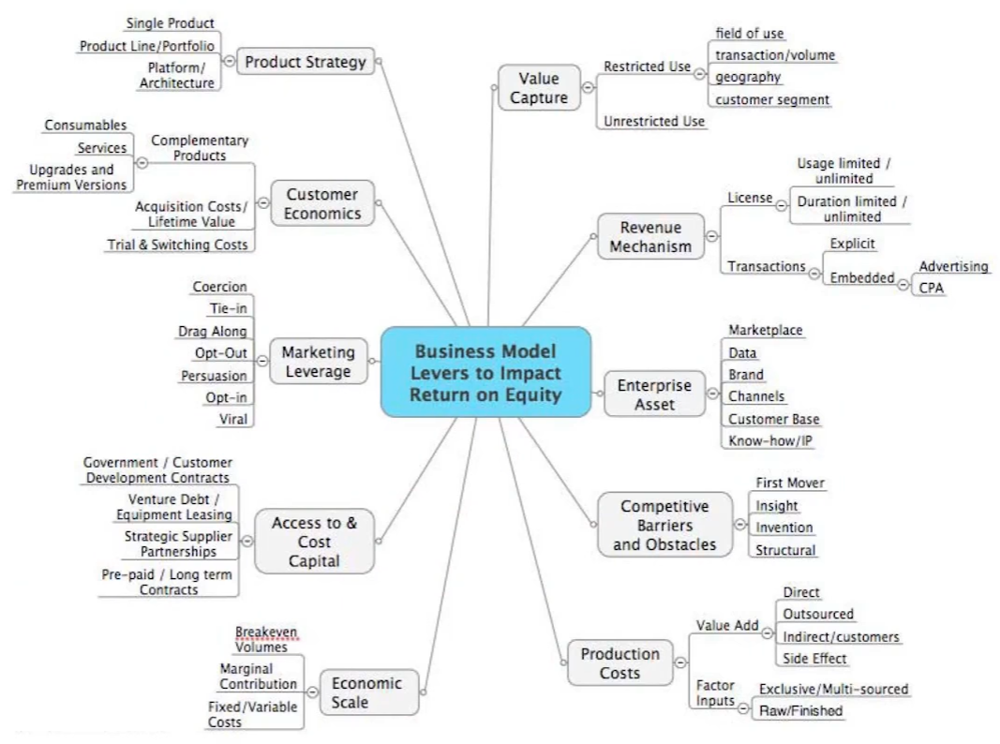

# Business Models

## IDK

- Health
	- Liquidity
	- Fragmentation on all sides
- Profitability
- Scalability
	- Network effects
- Defensibility
	- Brand
	- Embed
	- Scale
	- Intellectual Property

## Stages of Startup

- Pre-liquidity
	- PMF
		- What is core action
		- Frequency
		- Time between core action
- Post-Liquidity
	- Growth / Engagement to core action
		- Acquisition
		- Activation
		- Retention
		- Revenue
		- Referral / Virality
	- Loyalty
		- Network effects

## IDK

Participants
- Supply
- Demand
- Facilitators

Domains
- Value Creation
- Marketing
- Sales
- Value Delivery
- Finance

For each participant and domain, you have these pillars
Pillars
- Selection
- Experience
- Value
- Affordability
- Loyalty
- NCR
- Fintech

## Properties of Networks

- Participants
	- One-sided
	- Two-sided
	- 3-sided
	- Multi-sided
- Frequency
- Ticket size
- No of users on both sides
- Fragmentation
- Payment flow
- Types of network effects
	- Same-side
	- Cross-side
- Locality
	- Hyper-local
	- Cross-border
- Types of product/service
	- Commoditized
	- Differentiated
	- Personal
- Asymmetric
	- Supply-constrained
	- Demand-constrained
- Value prop
	- Full
	- Partial
- Homogeneity
	- Homogenous
	- Heterogenous
- Time
	- Real-time
	- Quick
	- Same-day
	- Slow
- Verticals
	- Multi-vertical
	- Single-vertical
- Size of market - PAM, TAM, SAM, SOM
- Pollution
- Defensibility
	- Nativity
		- Native apps
		- Extender
		- Platform
		- Integrations
		- Plugin
	- Disintermediation
	- Multi-tenanting
- Formation of network
	- Density
	- Identity
	- Proximity
	- Difficulties

## Types of Networks

- Physical
- Protocol
- Personal Utility
- Personal
- Market network
- Hub & Spoke
- Marketplace
- Platform
- Asymptotic marketplace
- Experties
- Data
- Tech performance
- Tribal
- Belief
- Language
- Bandwagon

---

{ loading=lazy }

Business model $\ne$ Business

Business model innovation is critical to develop a quality business, attack new markets and drive profitability

## Components

- Value Proposition
- Market Segment
- Value Chain Structure
- Position in the Value Network
- Revenue Generation and Margins
  - High volume/Low margin
  - Low volume/High margin
- Competitive Strategy
- Stage of Development

## Business Model Canvas

- Value proposition
- Customer segment
- Distribution channel
- Customer relationship: Feedback mechanism
- Key activities
- Key resources
- Key partnerships
- Cost structure
- Revenue stream
