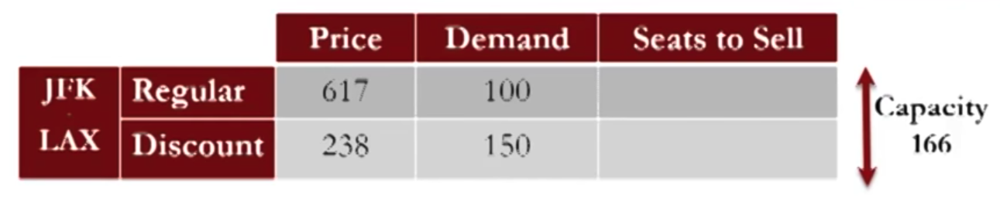
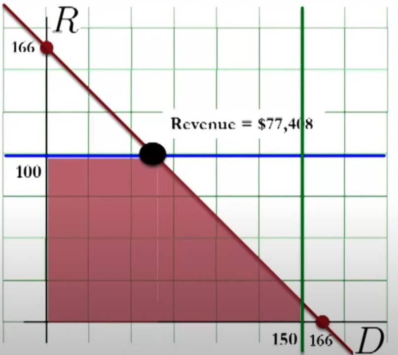
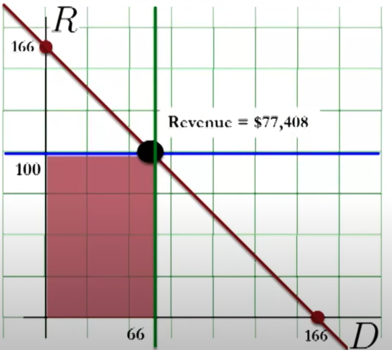
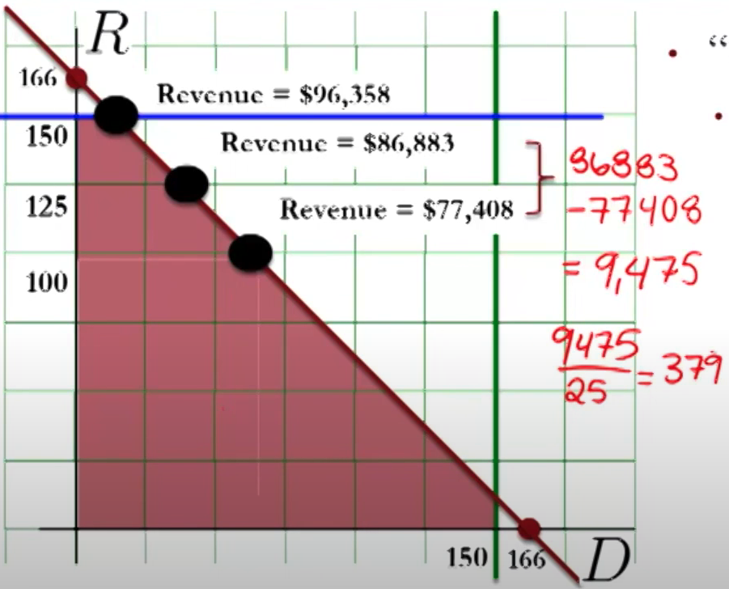
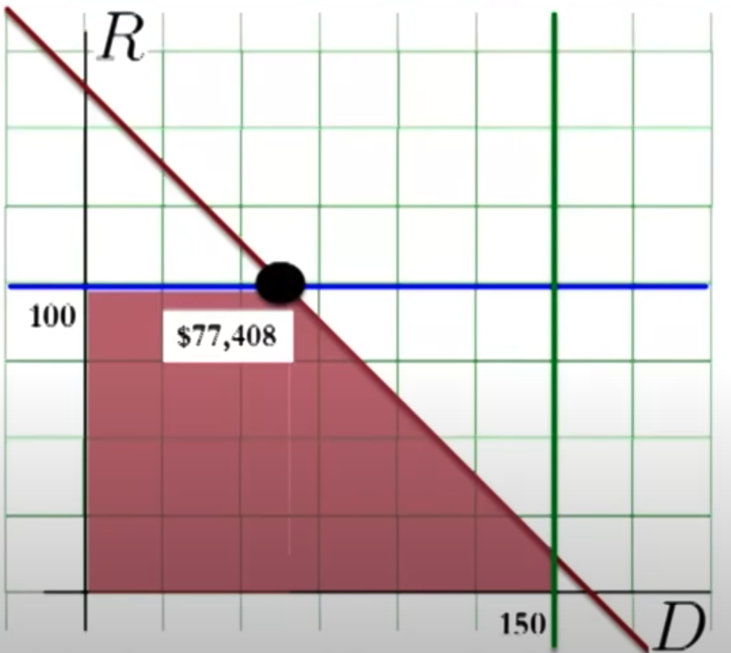
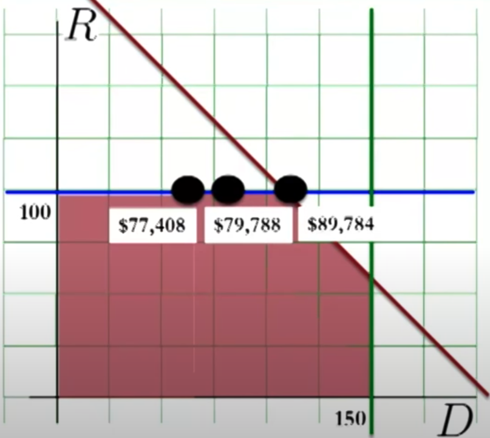
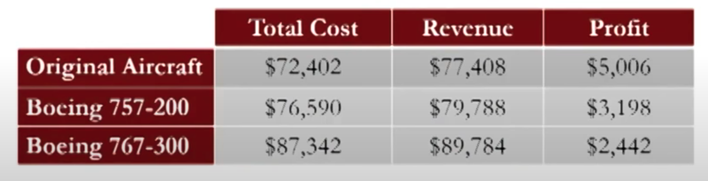
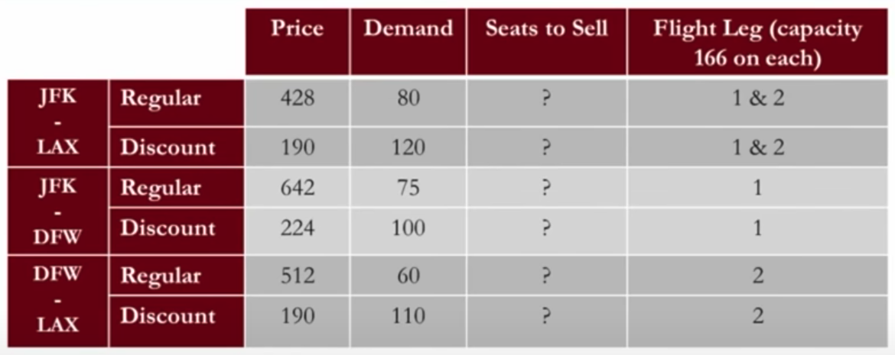

# Airline Industry

## Types of Optimization

|                |             |
| -------------- | ----------- |
| Point-to-Point |             |
| Network        | Entire trip |

## Single-Leg

{ loading=lazy }

## Marketing Focus

Marginal revenue analysis

|                                                     |                                                              |
| --------------------------------------------------- | ------------------------------------------------------------ |
| Initial                                             | { loading=lazy } |
| Increasing discounted fare demand through marketing | { loading=lazy } |
| Increasing regular fare demand through marketing    | { loading=lazy } |

{ loading=lazy }

## Capacity Allocation

|                                                             |                                                              |
| ----------------------------------------------------------- | ------------------------------------------------------------ |
| Initial                                                     | { loading=lazy } |
| Increasing capacity (assuming demand remains constant) | { loading=lazy } |

{ loading=lazy }

## Multi-Leg

{ loading=lazy }

Passengers on multiple legs must be considered for all the legs that they are a part of.