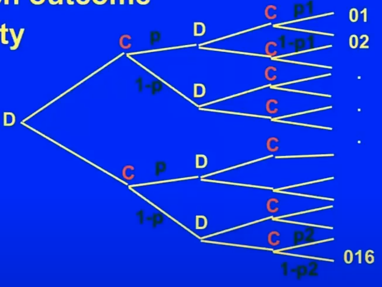

# Decision Analysis

## Decision Analysis vs Flexibility Analysis

Due to this, flexibility analysis is preferred over decision analysis

- Decision analysis

  - assumes you can define choices to take at any stage
  - Implies focus on a few distant choices

- Flexibility analysis

  - encourages to explore

    - What decisions to take

      and

    - When to take them

  - as granular as required

## Outcome

1. Strategies for altering choices as future is revealed, not a unique “optimal choice”

2. ‘Second best’ choices which offer

   1. Insurance against downside
   2. Opportunity to exploit upside

   ‘Second best’ strategies are sub-optimal for each outcome, but preferable as they offer flexibility to do well in a range of outcomes. It is never the best, but never the worst

3. Education of client about distribution, range of possible results (Value at Risk)

## Motivation

People acting intuitively deal poorly with complex, uncertain situations. They

- Process probability info poorly
- Over-simplify complexity & alter reality
- Focus on extremes
- Focus on end states, not whole process

Decision analysis helps overcome this

## Characteristics

- Assumes that every decision in the set of choices is discrete
- Looks over several time periods
- Deals with uncertainties
- Standard method
- Can include utility assessment (such as levels of consumer satisfaction)

## Decision Tree

- Structure
  - Decision points: Choices
  - Chance points (possible outcomes) after each decision
- Data
  - Value of each possible outcome
  - Probability
  - Uncertainties

Goal: Maximize expected value of outcomes

For each set of alternatives, calculate expected value. Then choose alternative with maximum EV
