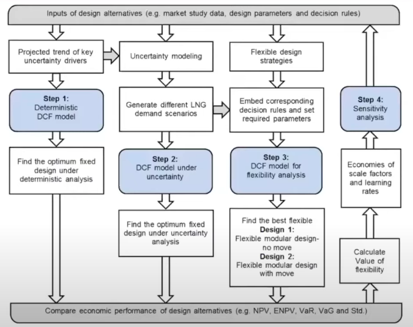
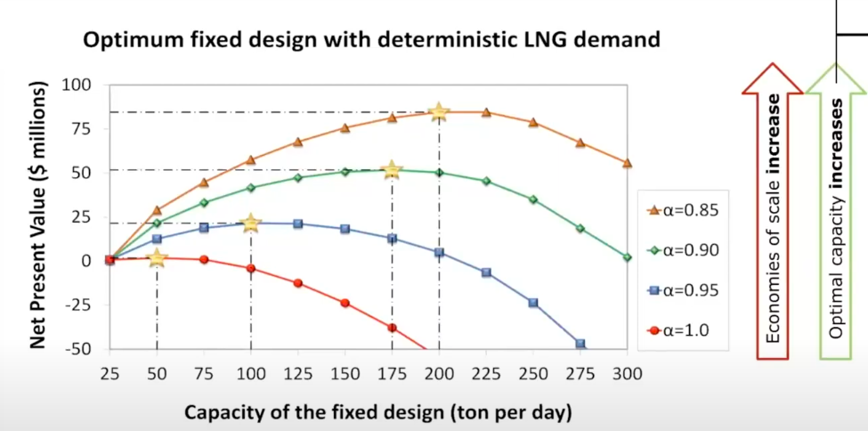
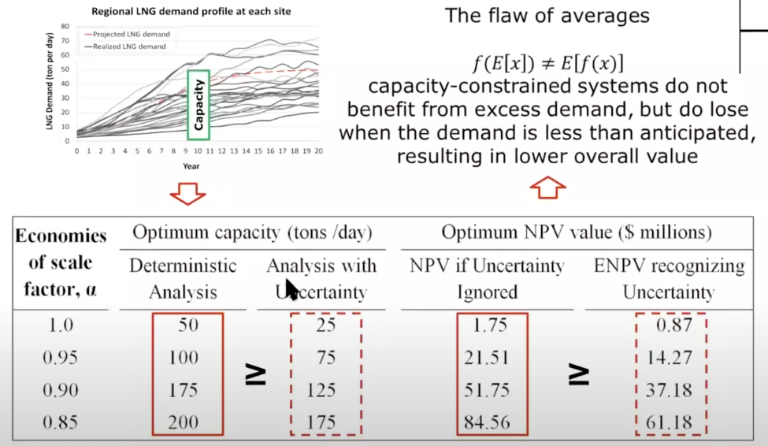
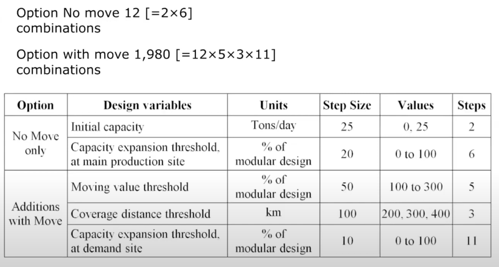
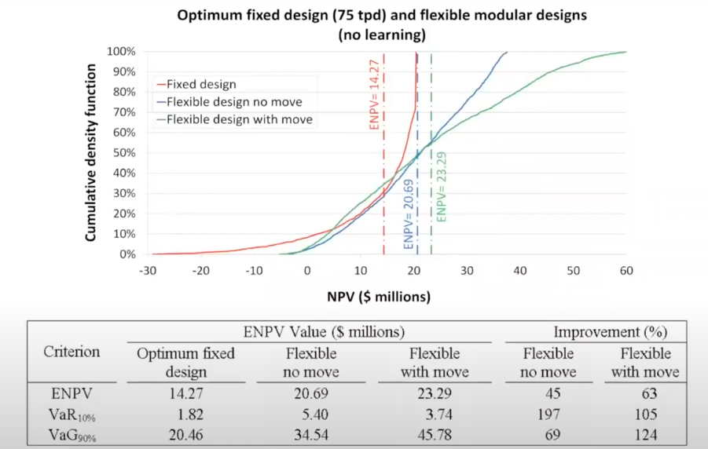
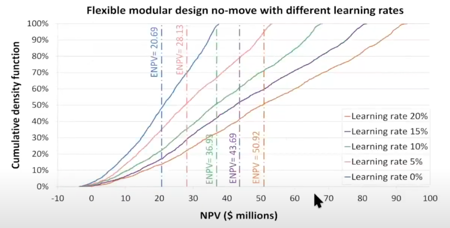
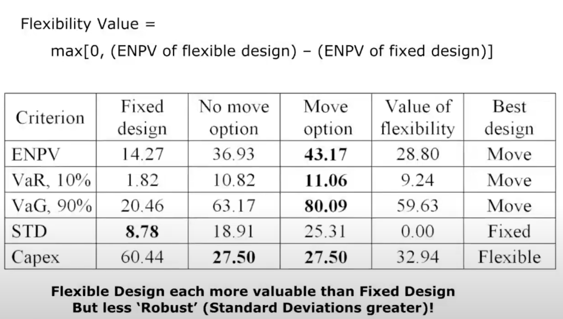
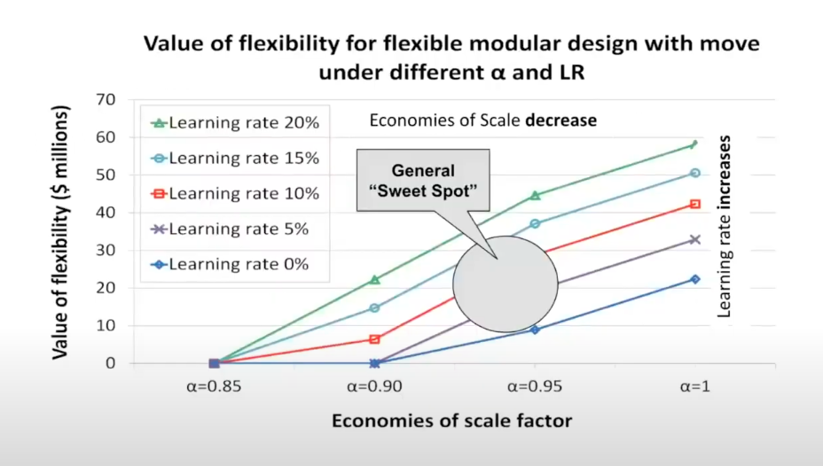

# Summary

{ loading=lazy }

## Deterministic Analysis

{ loading=lazy }

## Uncertainty Analysis

{ loading=lazy }

## Characterization of enumeration space to find best flexible designs

{ loading=lazy }

## Comparison of fixed vs flexible design

{ loading=lazy }

## Learning Rates

{ loading=lazy }

## Multi-Criteria Decision Table

With $\alpha=0.95, \text{LR}=10\%$

{ loading=lazy }

## Value of flexibility for different economies of scale & learning rates

{ loading=lazy }
