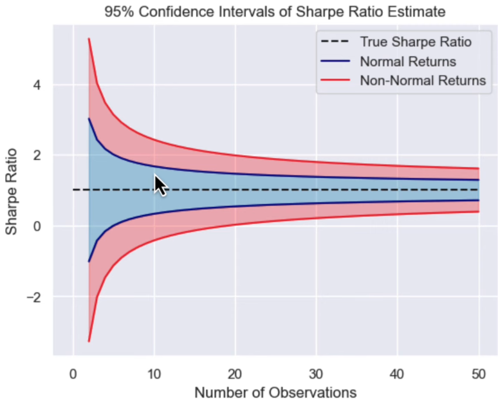
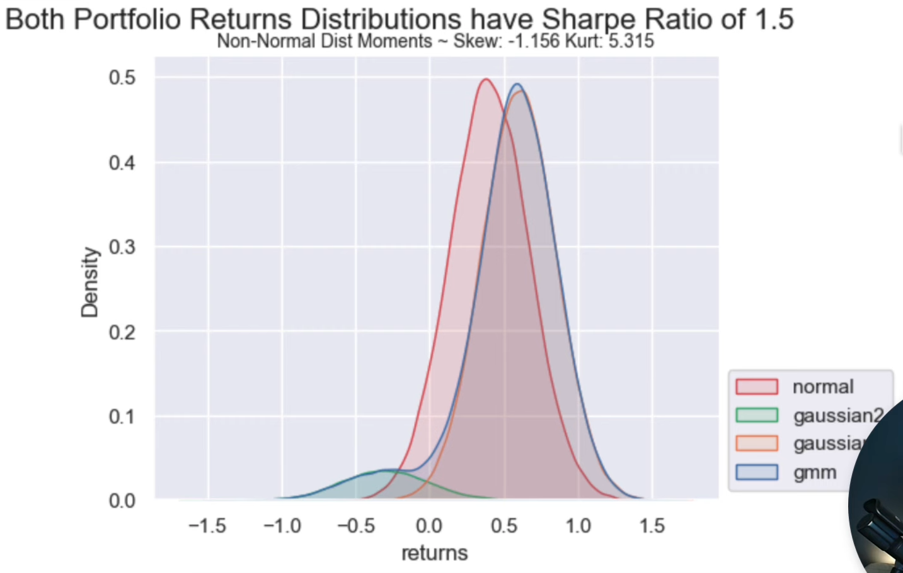

# Portfolio Evaluation

- Evaluation of portfolio as whole, without examining the individual securities.
- However, for portfolio revision, you need to examine the individual securities.
- Always perform evaluation using synthetic dataset (Gaussian Copula, Cholesky decomposition) to ensure portfolio will perform well in different possible scenarios

## Metrics

| Ratio           |                                             |                                         |
| --------------- | ------------------------------------------- | --------------------------------------- |
| Sharpe          | $\dfrac{R_P - R_f}{\sigma_p}$               | Price premium per unit risk             |
| Sortino         | $\dfrac{R_P - R_f}{{\sigma_\text{semi}}_p}$ | Price premium per unit of downside risk |
| Treynor         | $\dfrac{R_P-R_f}{\beta_P}$                  | Price premium per unit $\beta$          |
| Jensen $\alpha$ | $R_p - R_\min$                              | Excess return more than required        |
| Calmar          | $\dfrac{R_p}{\text{Max Drawdown}}$          |                                         |
| Sterling        | $\dfrac{R_p}{\text{Max Drawdown} - 10 \%}$  |                                         |

### Drawdown

Percentage peak-to-trough decline during a specific time period

Measured once a new high is reached, because a minimum cannot be measured yet since the value could decrease further

## Sharpe Ratio

### Limitations

Non-normality leads to under-estimating the variance in sharpe ratio estimate

Selection bias of strategies results in false-positives regarding the success of a strategy

## Non-Normality Adjusted Sharpe Ratio

$$
\hat \sigma^2 (\widehat {\text{SR}})
= \dfrac{1}{n-1}
\left(
1 - \hat \gamma_3 \widehat {\text{SR}} + \dfrac{\hat \gamma_4 - 1}{4} \widehat {\text{SR}}^2
\right)
$$

### Deflated Sharpe Ratio

$$
\begin{aligned}
\text{DSR}
&= P(\text{SR}^* \le \widehat {\text{SR}} ) \\
&= \Phi \left( \dfrac{ \text{SR}^* - \widehat {\text{SR}} }{\hat \sigma(\widehat {\text{SR}})} \right)
\end{aligned}
$$

- $\text{SR}^* =$ benchmark sharpe ratio
- $\widehat{\text{SR}} =$ estimated sharpe ratio of portfolio
- $\phi=$ cdf of normal distribution

Probability that SR is statistically-significant, after controlling for inflationary effect of

- No of independent trials with the strategy $k$
  - List all the returns of all strategies
  - Find the independent series

- Data Dredging $V \left[ \widehat{\text{SR}}_k \right]$
- Non-normality of returns: $\hat y_3, \hat y_4$
- Length of time series $T$

Can help identify if the benefits is due to chance
