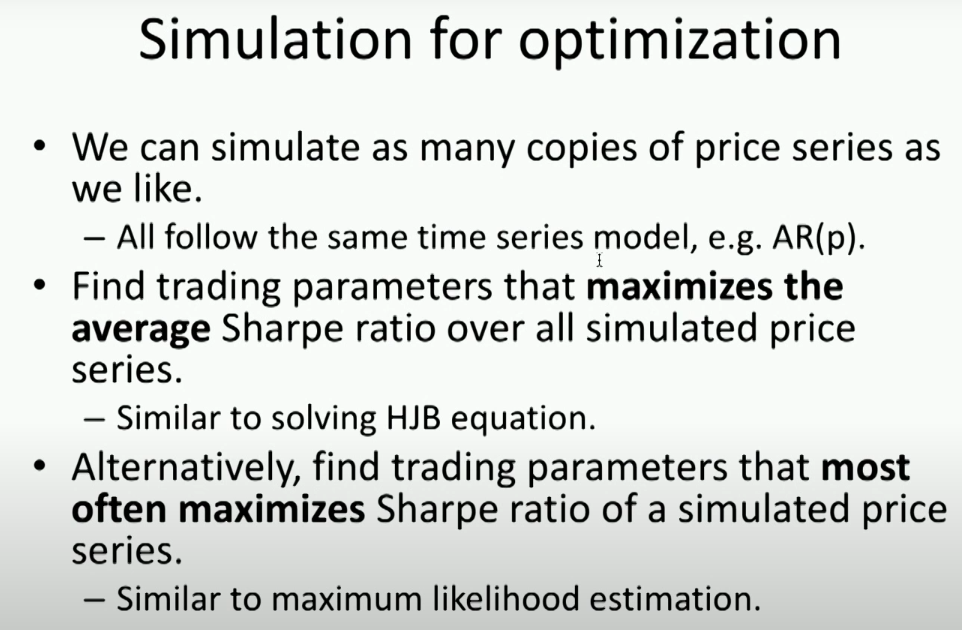

# Portfolio Optimization

## Key Words

|                  |                                                              |
| ---------------- | ------------------------------------------------------------ |
| Delta            | Relationship of whole book to underlying stock (1st derivative of something) |
| Gamma            | Change of the portfolio (1st derivative of delta)       |
| Theta            | How trading book is carrying/bleeding away money, when nothing changes in market/position |
| Vega/ Kappa | Book/Portfolio/Positions’s sensitivity to volatility         |
| OTC              | Over The Counter                                             |

## Variables

| Variable                                 | Meaning |
| ---------------------------------------- | ------- |
| Interest rate sensitivity                |         |
| Equity exposure                          |         |
| Commodity exposure                       |         |
| Credit                                   |         |
| Distribution/Linearity of price behavior |         |
| Regularity of cash flow/prepayment       |         |
| Correlation across sectors & classes     |         |

## Variance of Portfolio

If the portfolio has one unit of each security whose prices are tracked in the Covariance matrix, the portfolio variance is the sum of the items in the covariance matrix.

If set of positions $X=\{ x_1, x_2, \dots \}$, then the variance of the portfolio is given by $\hat \sigma_p^2 = X' \text{Cov}_{XX}  X$

## Index Tracking/Benchmark Replication

Portfolio compression strategy aimed at mimicking the risk/return profile of a financial instrument, by focusing on a reduced basket of representative assets

Intuitively similar to L1 regularization
$$
\begin{aligned}
\text{Tracking error TE}(w) &= {\vert\vert r_b - Xw \vert\vert}_2 \\
\implies \min \text{TE}(w) & + \lambda {\vert\vert w \vert\vert}_0
\end{aligned}
$$
where

- $r_b \in R^T$ : returns of benchmark instrument in the past T days
- $X = [r_1, \dots r_T]^T \in R^{T \times N}$ : returns of $N$ stocks in the past T days

## Pairs Trading Portfolio

Spread $z_t = y_{1t} - \gamma y_{2t}$ with weights $w = \begin{bmatrix} 1 \\ -\gamma \end{bmatrix}$

Use VECM modelling of the universe of stocks

From the parameter $\beta$ contained in the low-ranked matrix $\Pi = \alpha \beta^T$, one can simply use any/all column(s) of $\beta$

$\beta$ defines a co-integration subspace and we can then optimize the portfolio within that con integration subspace

## Conversion from Yield to Price

Fixed-income securities (such as bonds) trade as yield (ROI)
$$
\text{Price} = \text{PV01} \cdot \text{Close} \cdot 100
$$
“PV01” of a portfolio of assets is the sensitivity of the total scheme assets to a one basis point (or 0.01 per cent) change in interest rates

## Duration vs DV01

|               | Duration                                                     | DV01                                                   |
| ------------- | ------------------------------------------------------------ | ------------------------------------------------------ |
| Measures      | Measures the weighted average time to a security's cash flows, where the weighting is the cash flow. |                                                        |
| Signifies     | Also shows the % change in price per change in yield         | Shows the % change in price per 1million of face value |
| Preferred for | Equities                                                     | Fixed-Income Securities                                |

Either measure is fine, but be mindful of units

## Spread PV01

For credit-risky securities, we should distinguish b/w interest rate risk & credit risk

Credit spread takes default (and recovery) into consideration

If recovery = 0, PV01 = CSPV01

Different sources of spread

- Calculated
- CDS
- Asset Swap Spreads

Larger the credit spread, higher the probability of credit defaults

## Game Theory

When designing your portfolio, you need to incorporate external factors and others’ ideas as well (kinda like Game Theory)

## Kelly Criterion

## Simulation for Optimization

- Simulate the validation prices series

  - Even a simple AR(1) is fine

- Naive Benchmark

  - Buy if expected log return > $k \sigma_0$
  - Sell if expected log return < $-k \sigma_0$
  - Flatten, otherwise

- Find trading parameters that

  - maximizes the average Sharpe Ratio over all simulated price series

    - $\implies$ Solving HJB Equation

  - or

    maximizes the average Sharpe Ratio over all simulated series

    - $\implies$ Solving MLE

