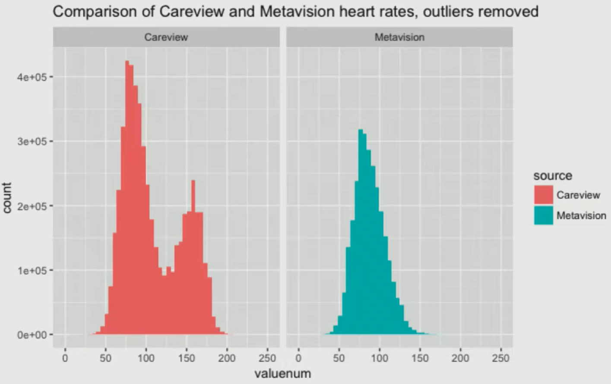
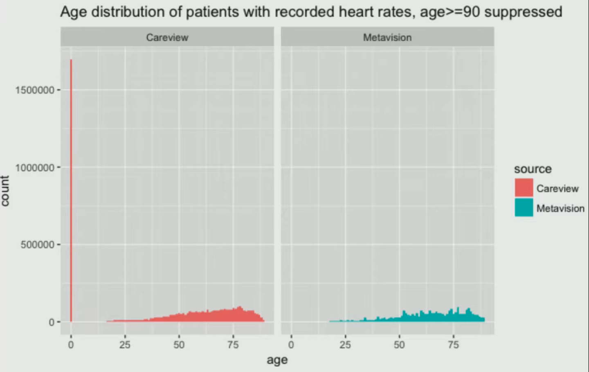

# Clinical Data

## Basic Exploration

Who are these 300 yr old people? According to law, you are not supposed to specify age of someone older than 90, as they will be easily identified due to small subpopulation size

Why are some greater than 300? Their age is 300+time spent in hospital

## Types of Data

- Demographics
- Vital signs
- Medications
- Laboratory
- Pathology
- Microbiology
- Notes
  - Discharge summary
  - Attending/resident
  - Nurse
  - Specialist
  - Consultant
  - Referring physician
  - Emergency room
- Imaging: XRay, CTScan, etc
- Quantified self
  - Activity
  - Vitals
  - Diet
  - Blood sugar
  - Allergies
  - Mindfulness
  - Mood
  - Sleep
  - Pain
  - Sexual activity
- Billing data
  - Diagnoses
  - Procedures
  - Diagnose related groups
- Adminstrative
  - Service
  - Transfers

## Issues

- Missing data
- Non-stationarity
  - Change in definition of disease over time, resulting in number of people with disease change over time
  - Lab tests performed changes over times

- Discontinuation medication intake by patient not tracked
- Standards are often lacking

## Coding Systems

- Medication
  - NDC
  - MedDRA
  - HCPCS
  - GSN
  - CPT
- Procedure
  - ICD9
  - CPT

CPT: owned by American College of Physicians; codes are copywrited 😳

## Censors

- Left-sensored: Missing features
- Right-sensored: Missing label
