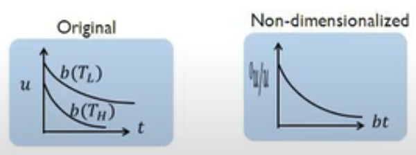

# Experimental Design

Important goal: equalize leverage of every point during multiple regression
$$
h_{ii} = \dfrac{k}{n}, \forall i
$$

## Known Functional Form

Non-dimensionalization

### Actions

- Simplify differential equations
- Rescale variables to unitless form
- Get rid of unnecessary parameters
- Reduce number of experiments needed to test hypothesis

### Rules

1. Identify differential equation
2. Identify independent & dependent vars
3. Replace each of them with a quantity scaled relative to characteristic unit of measure to be determined
4. Divided through by the coefficient of the highest order polynomial/derivative term
5. Scale boundary conditions
6. Choose the definition of the characteristic unit for each var so that the coefficients of as many terms as possible become 1
7. Rewrite system of equations in terms of new dimensionless quantities

### Example

$$
\begin{aligned}
c_t = c_0 e^{-kt} &\implies (c_t/c_0) = e^{-kt} \\
3 \text{ var} & \implies 2 \text{ var}
\end{aligned}
$$

## Unknown Functional Form

Buckingham Pi Theorem

