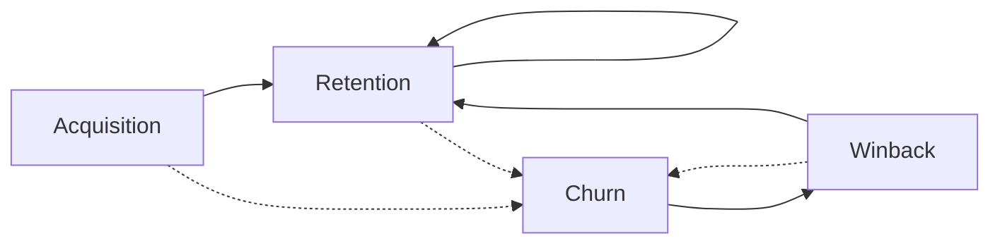

# Introduction

## Customer Funnel

- 3 ways to look at metrics
	- Hits
	- Sessions
	- Users
- Why are sessions usually preferable to hits?
	- Hits may inflate/deflate the KPIs, and may mislead the analysis
- Exclude easy-to-convert aspects from the analysis, such as platform-associated vendors' funnel
- Consider `Item` = interested thing
	- Ecommerce item
	- Restaurant/Vendor

### Stages

| Stage                    | Metric                                   | Meaning                                                             | Measurement                                 | Desired                  |
| ------------------------ | ---------------------------------------- | ------------------------------------------------------------------- | ------------------------------------------- | ------------------------ |
| Awareness                | App Visits                               | Entry point                                                         | Sessions, Hits                              | Higher                   |
|                          | App Visitors                             | Entry point users                                                   | Users                                       | Higher                   |
|                          | Item Impressions                         | `#` of times ad appears on screen                                   | Sessions, Hits                              | Higher                   |
|                          | Item Reach                               | `#` of people associated with impressions                           | Users                                       | Higher                   |
|                          | Frequency                                | `#` of times ad appears appears per person<br>`Impressions / Reach` | Ratio<br>(Sessions/Sessions)<br>(Hits/Hits) | Higher                   |
| Engagement/<br>Interest  | Item Views                               |                                                                     | Sessions, Hits                              | Higher                   |
|                          | Item Viewed reach                        |                                                                     | Users                                       | Higher                   |
|                          | Item Searches                            |                                                                     | Sessions                                    | Depends                  |
|                          | Item Search reach                        |                                                                     | Users                                       | Higher                   |
|                          | Item Clicks                              |                                                                     | Sessions, Hits                              | Higher                   |
|                          | Item Clicked reach                       |                                                                     | Users                                       | Higher                   |
|                          | Pages/Visitor                            |                                                                     | Ratio<br>(Pages/User)                       | Depends                  |
|                          | Time spent/page                          |                                                                     | Ratio<br>(Time/Pages)                       | Depends                  |
|                          | Time spent/User                          |                                                                     | Ratio<br>(Time/User)                        | Depends                  |
|                          | Sign-ups                                 |                                                                     | Users                                       | Higher                   |
| Consideration/<br>Desire | Checkout Views                           |                                                                     | Sessions, Hits                              | Higher                   |
|                          | Checkout Viewed reach                    |                                                                     | Users                                       | Higher                   |
|                          | Checkout Clicks                          |                                                                     | Sessions, Hits                              | Higher                   |
|                          | Checkout Clicked reach                   |                                                                     | Users                                       | Higher                   |
| Conversion/<br>Action    | Conversions                              | Desired action (for eg: orders)                                     | Hits, Sessions                              | Higher                   |
|                          | Customers                                | `#` of users who made orders                                        | Users                                       | Higher                   |
|                          | BV                                       | Basket Value<br>Bill amt (Pre-Discount)                             | Currency                                    |                          |
|                          | GMV                                      | Gross Merchandise Value<br>(post discount)                          | Currency                                    |                          |
|                          | ABV                                      | Average Basket Value<br>= BV/Orders                                 | Currency                                    |                          |
|                          | AOV                                      | Average Order Value<br>= GMV/Orders                                 | Currency                                    |                          |
|                          | ABV_customer                             | BV/Customers                                                        |                                             |                          |
|                          | AOV_customer                             | GMV/Customers                                                       |                                             |                          |
|                          | Cart abandonment rate                    | Customer adds item(s) to card, but does not complete purchase       | Ratio<br>(Sessions/Sessions)<br>(Hits/Hits) | Lower                    |
|                          | Avg Time to convert                      |                                                                     | Time                                        | Lower                    |
|                          | Cost per conversion                      |                                                                     | Currency                                    | Lower                    |
|                          | Avg `#` of touch points                  |                                                                     | Hits, Sessions                              | Lower                    |
|                          | Conversions attempted                    |                                                                     | Hits, Sessions                              | Higher                   |
|                          | Conversion success rate                  | # Conversion Completed/# Conversion Attempted                       | Ratio<br>(Hits/Hits)<br>(Sessions/Sessions) | Higher<br>(ideally 100%) |
| Expansion/<br>Loyalty    | Order Frequency                          | `#` of orders per customer                                          | Ratio<br>(Orders/Customer)                  | Higher                   |
|                          | Duration of time between purchases       |                                                                     | Time                                        | Lower                    |
|                          | Rate of repeat purchases                 |                                                                     | Ratio<br>(Hits/Time)<br>(Sessions/Time)     | Higher                   |
|                          | Rate of account activation after sign-up |                                                                     | Ratio<br>(Activation/Time)                  | Higher                   |
|                          | Engagement with rewards program          |                                                                     |                                             | Higher                   |

## Customer Lifecycle

Each of the [Customer Funnel stages](#stages) have the following states in the lifecycle
- Primarily, for reporting, we look at user lifecycle states in terms of conversion

### States



#### Better Understanding


Think of it as leaky pipeline
#### Growth Accounting

```
Users_t
= Acq_t + Ret_t + Winback_t

Users_t-1
= Ret_t + Churn_t

Growth_t
= Users_t - Users_t-1
= (Acq_t + Winback_t) - Churn_t
```

### Cohort Curves

| Curve           |                                                   | Visual                          | Desired                                                                 |
| --------------- | ------------------------------------------------- | ------------------------------- | ----------------------------------------------------------------------- |
| Retention Curve | Retention rates of different cohorts              |  | - Flatter curve<br>- Higher curves<br>- Across later cohorts above both |
| Layer cake      | Composition of user base at different time points |       | Thick layers coming from old cohorts                                    |
