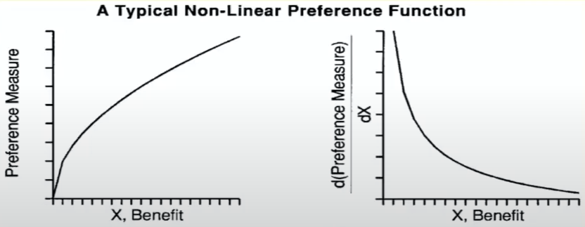
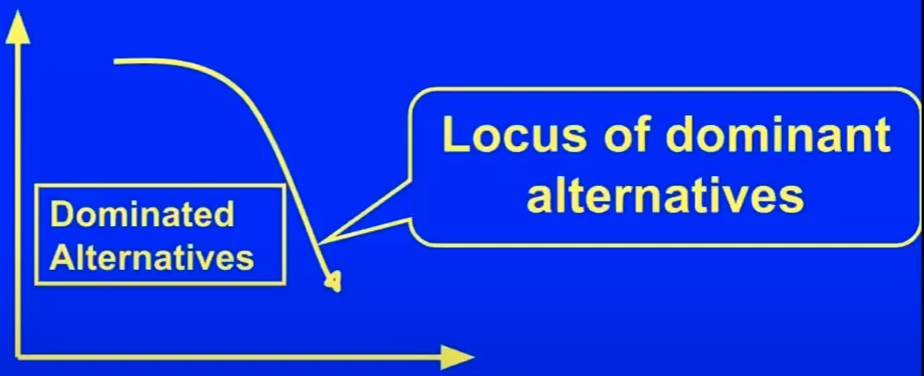
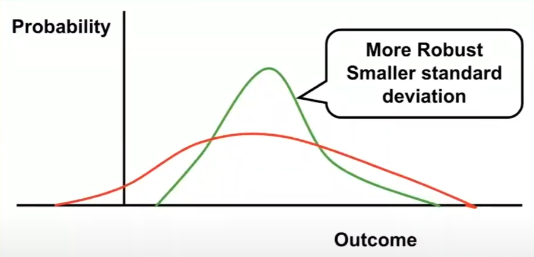

# Project Evaluation

It is nearly impossible to derive the “best” choice. Therefore, we try to find the **“preferred solution”**

## What is “best”?

Extreme (high/low) of all possibilities

Either

1. 1 metric of performance

  or

2. Metrics can be put on single scale

However, both 1 and 2 are not realistic

## Value/Preference/Utility Function

$V(x)$ is a means of ranking the relative preference of an individual for a bundle of consequences $x$

### Diminishing marginal utility curve

### Exceptions to Diminishing Marginal Utility

Very common in real life

- Critical mass: only valuable if you have enough
- Network/Connectivity: more connections $\implies$ more valuable
- Threshold/Competition: only valuable if
  - Minimum reached (absolute graded exams)
  - Matches/beats competition (relative grading exams)

## Conditions for a Value function

### Axioms

1. Completeness/Complete Pre-order: $V(x)$ is defined $\forall x_i$
2. Transitivity: $V(a)>V(b) \ \land \ V(b)>V(c) \implies V(a)>V(c)$
   - General true for individuals
   - Not necessarily true for groups; not all group members share the same preferences 
     - 
   - Ellsberg Paradox: Under ambiguity, transitivity does not always hold, as people will want to choose the non-ambiguous option usually
   - Allais Paradox: 
3. Monotonicity/Archimedean Principle
   - $V(x)$ is monotonically-increasing/decreasing
   - $a > b \implies (V(a) > V(b) \quad \forall a, b) \lor (V(a) < V(b) \quad \forall a, b)$
   - This assumption does not hold for all utility functions
     - Inflation rate
     - Audio volume
     - Salt on food
       - Problem can be re-formulated as “Salt available on table”

### Consequences

- Existence of $V(x)$
- Only ranking $x_1, x_2, \dots$ possible. We cannot quantify the distances between $V(x_1), V(x_2), \dots$
- Strategic equivalence: Monotonic transformation of $V(x) \equiv V(x)$; $V(x_1, x_2) = {x_1}^2 x_2 \equiv 2 \log \vert x_1 \vert + \log \vert x_2 \vert$
- Values not good basis for absolute value
- Arrow’s Impossibility Theorem/Paradox
  - No “fair” voting system, without a dictator, that satisfies everyone’s preferences
  - Hence, concept of “best” is not meaningful in design of complex systems
  - Therefore, we try to find the “preferred solution”

### Outcomes

Nature of Evaluation

- Many dimensions & metrics of performance
- Uncertainty about metrics
- “Best” is undefined
- We can screen out dominated solutions

Nature of Choice

- Any person must make tradeoffs
- Group inevitably have to negotiate deal

## Concept of Dominance

One alternative better than others on all dimensions

Dominated alternatives can be discarded

Feasible region or “Trade Space” is area under & left of the curve

## Metrics

- Expected Value: Useful, but insufficient, as it cannot describe range of effects
- Worst-case scenario with some notion of probability of loss: People are “risk-averse”; more sensitive to loss
- Best case scenario
- CapEx: Capital Expenditure = Investment
- Some measure of benefit-cost
- Value-Modelling
  - VAR
  - VAG

## Robustness

Taguchi method

Robust design is a product whose performance is minimally-sensitive to factors causing variability

Robustness measured by standard deviation of distribution of outcomes

Preferred when we particular result

- Tuning into a signal
- Fitting parts together

However, this is **not necessarily value maximizing**. We would prefer to

- limit downside
- maximize upside

