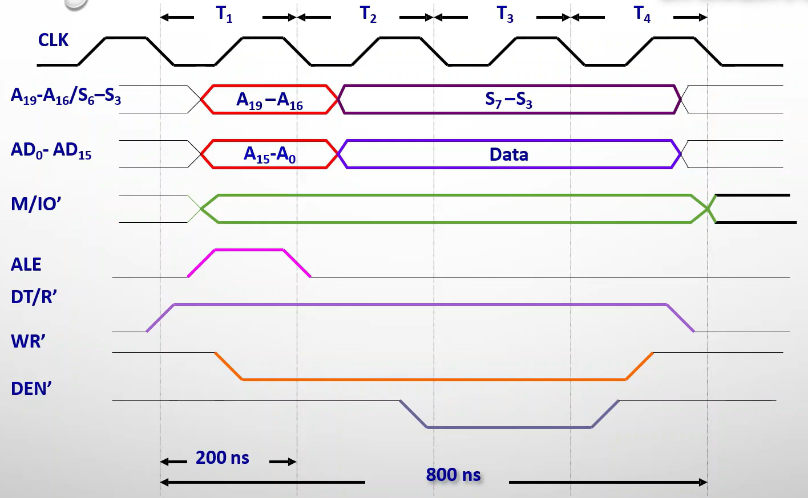

## Cycles

**Instuction cycle** is the time taken by the processor to execute one instruction.

As 8086 is a CISC processor, each instruction cycle consists of multiple **machine cycles**.

Each machine cycle consists of **T states**.

All operations occur sequentially, controlled by the clock signal.

### Machine Cycles

```mermaid
flowchart LR
1[Instruction Fetch] --> 2[Instruction Decode] --> 3[Operand Fetch] --> 4[Instruction Execution] --> 5[Store] --> 1
```

### T State

Time Period = $\frac{1}{\nu}$

Getting from/to Register does not require anything

## Timing Diagram

Tutorial

## Machine Cycles
Getting from/to ==Register== does not require anything
The number of bits readable in 1 cycle = 16bits
1. opcode
   - 16bits requires 2
   - 
1. Reading from memory = 1
1. Writing to memory = 1
## Time
Total Time
= No of T States $\times$ Duration of each T state 
= No of cycles $\times$ No of T States in each cycle $\times$ Duration of each T state 

No of T states in each cycle = 4
Duration of each T state = 1 Time Period = $\frac{1}{\nu}$
## 2 memory operations
1. Read (Data/Instruction)
2. Write (Data)

## Timing Diagram

In write operation, the data is available in the 2nd state itself, as there will not be any delay.

In read operation, it is available in the 3rd state.

## Slow Device

Active High signal from slow device/memory, acknowledging that it is ready for data transfer.

Else, the processor inserts a wait state, before $T_3$ state.

Number of wait states depends on the difference in the speed between the microprocessor and the slow device.

## Read/Write

### Write

### Read

