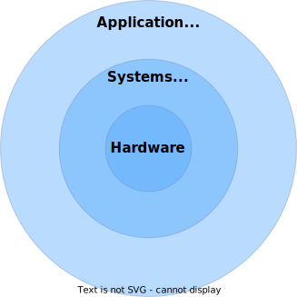

## Overall View of Computer Engineering

```mermaid
flowchart TB
app -->
algo[Algorithm] -->
pl[Programming Language] -->
osvm[Operating System/<br />Virtual Machine] -->
isa["ISA<br />(Instruction Set Architeture)"] -->
ma[Microarchitecture] -->
rtl[Register-Transfer Level] -->
g[Gates] -->
c[Circuits] -->
d[Devices] -->
p[Physics]
subgraph app[Application]
	direction TB
	sd[Software Development]
	AI
	ml[Machine Learning]
end

subgraph Computer Science
	algo
	pl
end

subgraph Computer Architecture
	isa
	ma
	rtl
end

subgraph Digital Design
	g
	c
	d
	p
end
```

## MIPS

Microprocessors without Interlocked Pipelined Stages

|                             | Architecture                                      | Organization                                                 |
| --------------------------- | ------------------------------------------------- | ------------------------------------------------------------ |
| Describes ___ computer does | what                                              | how                                                          |
| Role                        | Interface b/w hardware & software                 | Way comuper components are connected in a system             |
| Programmer’s View           | Instructions Addressing Modes Registers | Realization of architecture (Circuit Design, signals, peripherals) |

## CISC vs RISC

|                                          | CISC                              | RISC                              |
| ---------------------------------------- | --------------------------------- | --------------------------------- |
| Full Form                                | Complex Instruction Set Computing | Reduced Instruction Set Computing |
| Gives importance to                      | Hardware                          | Software                          |
| Can access memory directly?              | ✅                                 | ❌ (requires registers)       |
| Coding Instructions                      | Simple                            | Complex                           |
| Machine Instructions                     | Complex                           | Simple                            |
| Clock cyles for executing an instruction | Multiple                          | $1$                               |
| Complexity lies in                       | Microprogram                      | Compiler                          |

### Microprogram

It is a microinstruction program that controls the functions of a central processing unit or peripheral controller of a computer

Microcode is low-level code that defines how a microprocessor should function when it executes machine-language instructions. 

Typically, one machine-language instruction translates into several microcode instructions

## Class of Computers

| Computer Class | Purpose                                                      | Characteristic                                            | Size                |
| -------------- | ------------------------------------------------------------ | --------------------------------------------------------- | ------------------- |
| Personal       | General                                                      | Cost/Performance Tradeoff                                 | Small               |
| Server         | Network Based                                                | High Capacity High Performance High Reliability | Small-Building Size |
| Super          | Scientific calculations (weather forecasting, oil exploration) | Highest capacity                                          |                     |
| Embedded       | Embedded within systems (Digital TVs, cameras) Specific application | Stringent power/performance/cost constraints              | Small               |
| Datacenters    | Storage and retrieval of data                                | High performance                                          |                     |

## Levels of Computing System

| Level                |                                            |
| -------------------- | ------------------------------------------ |
| Application Software | Written in High Level Language             |
| System Software      | Compiler OS                           |
| Hardware             | Processor Memory I/O Controllers |

## Levels of Program Code

- Machine Language
- Assembly
- High-Level

## Components of Computer

| Component |                                                              |
| --------- | ------------------------------------------------------------ |
| Input     | Write data to memory (from user)                        |
| Output    | Read data from memory (to user)                         |
| Registers |                                                              |
| Cache     | Small fast SRAM                                              |
| Datapath  | Performs data operations                                     |
| Control   | sends signals that determine operations of datapath, memory, I/O |

## ISA

Instruction Set Architecture

Interface between hardware and lowest level of software

Includes information necessary (instructions, registers, memory access, I/O, and so on) to write a machine language program that will
run correctly

### ABI

Application Binary Interface

Combination of the basic instruction set and the operating system interface

