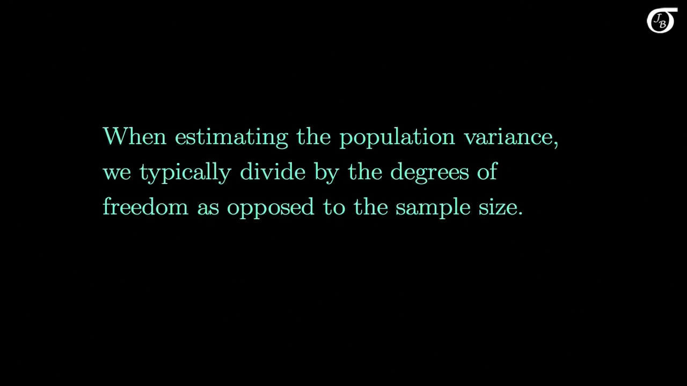
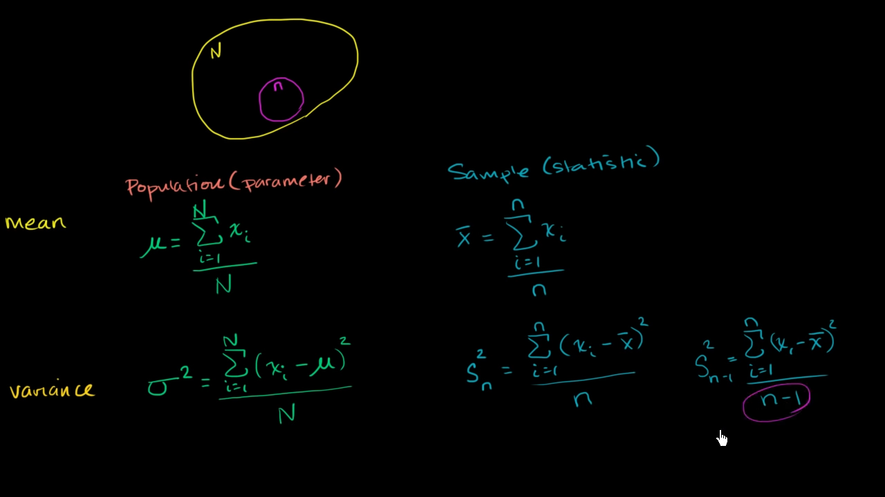
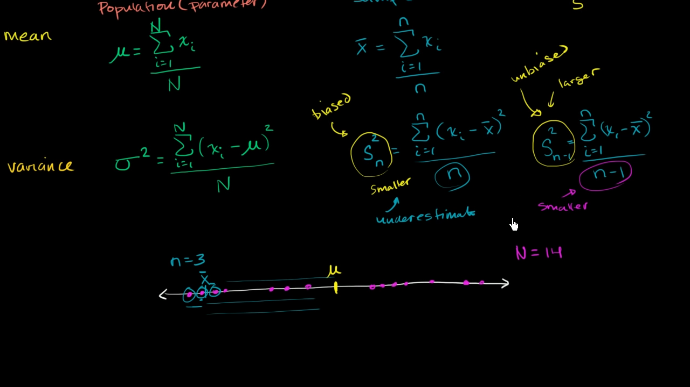

## Exploratory Data Analysis

Preliminary investigation of data, to understand its characteristics

Helps identify appropriate pre-processing technique and data mining algorithm

Involves

- Summary Statistics
- Visualization

## Univariate Summary Statistics

Minimal set of value(s) that captures the characteristics of large amounts of data

| Measure of       | Values                                   |                                                              | Disadvantage                                                 |
| ---------------- | ---------------------------------------- | ------------------------------------------------------------ | ------------------------------------------------------------ |
| Spread           | Range                                    | $x_\text{max} - x_\text{min}$                                | Sensitive to outliers and noise                              |
|                  | Variance                                 | $\sigma^2 = \frac{1}{\textcolor{hotpink}{n-1}} \sum_{i=1}^n (x_i - \bar x)^2$ |                                                              |
|                  | Standard Deviation                       | $\sigma = \sqrt{V}$                                          |                                                              |
|                  | Absolute Average/Mean Absolute Deviation | $\frac{1}{n} \sum_{i=1}^n \| x_i - \bar x \|$                    |                                                              |
|                  | Median Absolute Deviation                | $\text{median}( \ \| x_1 - \bar x \|, \| x_2 - \bar x|, \dots, \| x_n - \bar x \| \ )$ |                                                              |
|                  | InterQuantile Range                      | $X_{75 \%} - X_{25 \%}$                                      |                                                              |
| Central Tendancy | Mean                                     |                                                              | Does **not** always show the middle point of skewed/asymmetric distribution Highly sensitive by outliers |
|                  | Median                                   |                                                              |                                                              |
| Frequency        | Frequency                                |                                                              |                                                              |
|                  | Mode                                     | Most frequent discrete/categorical value                     |                                                              |

## Mean

### Simple Mean

$$
\bar x = \frac{\sum\limits_i^n x_i}{n}
$$

### Weighted Mean

$$
\bar x =
\frac{\sum\limits_i^n w_i x_i}{n}
$$

$w_1, w_2, \dots$ are all derived with the help of domain knowledge

### Trimmed Mean

1. Sort data values
2. Specify $p \%$ 
3. Compute mean, ignoring $p \%$ of values **on both sides** (thereby eliminating extreme values)
   Remove $p \%$ on left **and** remove $p \%$ on right

## Median

1. Sort data
2. If $n=$
     - odd: Pick the middle element
     - even: average of 2 middle elements

## Variance

- Small variance $\to$ low dispersion
- Large variance $\to$ Large dispersion

## Percentile

Data always in ascending order

$X_{p \%}$ refers to the value, for which $p \%$ of values lie **below** it

If it is a floating point number, then round it off appropriately

## Multivariate Summary Statistics

|                               |             |                         |
| ----------------------------- | ----------- | ----------------------- |
| How 2 variables vary together | Covariance  | $-\infty < C < +\infty$ |
|                               | Correlation | $-1 \le r \le +1$       |

### Covariance Matrix

It is always $n \times n$, where $n =$ no of attributes

|       |         $A_1$          |         $A_2$          |         $A_3$          |
| :---: | :--------------------: | :--------------------: | :--------------------: |
| $A_1$ |    $\sigma^2_{A_1}$    | $\text{Cov}(A_1, A_2)$ | $\text{Cov}(A_1, A_3)$ |
| $A_2$ | $\text{Cov}(A_2, A_1)$ |    $\sigma^2_{A_2}$    | $\text{Cov}(A_2, A_3)$ |
| $A_3$ | $\text{Cov}(A_3, A_1)$ | $\text{Cov}(A_3, A_2)$ |    $\sigma^2_{A_3}$    |

The diagonal elements will be variance of the corresponding attribute

$$
\begin{align}
\text{Cov}(x, y)
&= \frac{1}{n} \sum_{k=1}^n (x_k - \bar x) (y_k - \bar y) \\
\implies \text{Cov}(x, x)
&= \frac{1}{n} \sum_{k=1}^n (x_k - \bar x) (y_k - \bar y) \\&= \frac{1}{n} \sum_{k=1}^n (x_k - \bar x) (x_k - \bar x) \\&= \frac{1}{n} \sum_{k=1}^n (x_k - \bar x)^2 \\&= \sigma^2_x
\end{align}
$$

### Correlation Matrix

|       |     $A_1$     |     $A_2$     |     $A_3$     |
| :---: | :-----------: | :-----------: | :-----------: |
| $A_1$ |      $1$      | $r(A_1, A_2)$ | $r(A_1, A_3)$ |
| $A_2$ | $r(A_2, A_1)$ |      $1$      | $r(A_2, A_3)$ |
| $A_3$ | $r(A_3, A_1)$ | $r(A_3, A_2)$ |      $1$      |

The diagonal elements will be 1

$$
\begin{align}
r(x, y)
&= \frac{
\text{Cov}(x, y)
}{
\sigma_x \sigma_y
} \\
\implies
r(x, x)
&= \frac{
\text{Cov}(x, x)
}{
\sigma_x \sigma_x
} \\&= \frac{
\frac{1}{n} \sum_{k = 1}^n (x_k - \bar x) (x_k - \bar x)
}{
\left(
\sqrt{ \frac{1}{n} (x_k - \bar x)^2 }
\right)^2
} \\&= 1
\end{align}
$$

## Why $(n-1)$ for sample statistics?

1. Degree of freedom something

2. It is possible that the variance of the sample is low, so we correct for that

