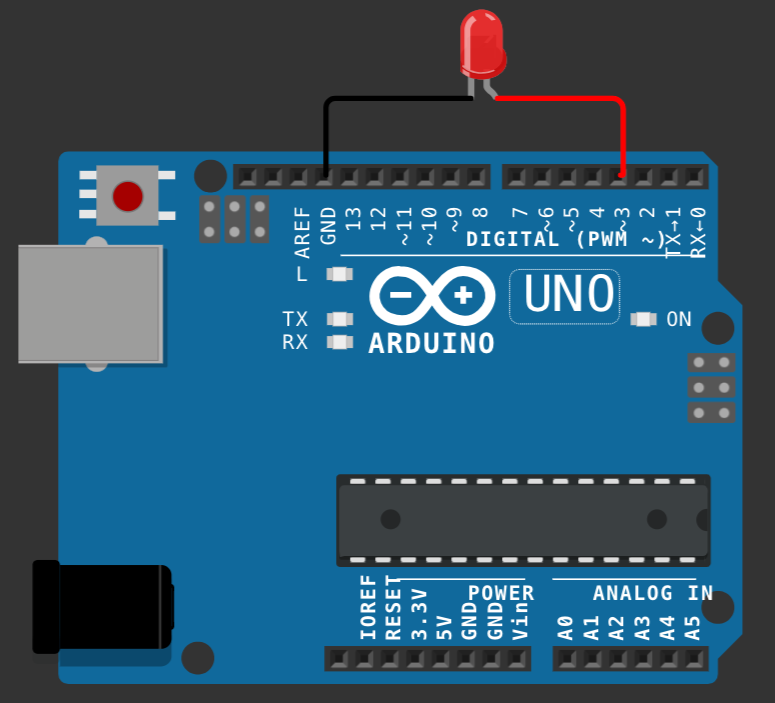

# Basics

## Arduino IDE

- Install Arduino IDE
- ESP8266/Node MCU
  - `Preferences` > Additional boards manager URLS
    - https://arduino.esp8266.com/stable/package_esp8266com_index.json
    
    - `Tools` > `Board` > `Boards Manager` > Search `ESP8266` > `Install`
    
    - Ensure `CH340g Driver` installed
- `Tools` > `Board` > Select Board
- `Tools` > `Board` > Connect to Port
- Compile & Upload

## Simulators

- Wokwi (Open-Source)
- TinkerCad

## Code

### Skeleton

```c
void setup(){
  // initialization code
}
void loop(){
  // infinitely-looping code
}
```

### Input/Outputs

|             |                                                              | Function                               |                                                              |
| ----------- | ------------------------------------------------------------ | -------------------------------------- | ------------------------------------------------------------ |
| Configuring | A GPIO pin **cannot** be used for both input and output. You need to specify one. | `pinMode(<pin_number>, <i/o>);`        | `pinMode(3, INPUT);`<br />`pinMode(3, OUTPUT);`              |
| Outputs     | Digital                                                      | `digitalWrite(<pin_number>, <state>);` | `digitalWrite(3, HIGH); // or digitalWrite(3, 1);`<br />`digitalWrite(3, LOW); // or digitalWrite(3, 0);` |
|             | Analog                                                       | `analogWrite(<pin_number>, value);`    | `analogWrite(3, 25);`                                        |

```cpp
// Code for blinking LED

void setup(){
  pinMode(3, OUTPUT);
}
void loop(){
  digitalWrite(3, HIGH);
  delay(1000); // 1000ms
  
  digitalWrite(3, LOW);
  delay(1000); // 1000ms
}
```

```cpp
// Code for changing LED brightness

void setup(){
  pinMode(3, OUTPUT);
}
void loop(){
  for (int i=0; i<=1023; i++) {
    analogWrite(3, i);
    delay(1000); // 1000ms
  }
}
```



## Unique ID for Arduino

### Method 1: Automatic (using external library)


```c
#include <ArduinoUniqueID.h> // in the same folder of this note

for(size_t i = 0; i < UniqueIDsize; i++)
  Serial.println(UniqueID[i], HEX);
```

### Method 2: Automatic

```c
#include <stdio.h>
#include <stdlib.h>
#include <unistd.h>
#include <sys/fcntl.h>
int main(int ac, char **av) {
    int fd, i;
    unsigned char eui[8];
    fd = open("/dev/random", O_RDONLY);
    if (fd < 0) {
        perror("can't open /dev/random");
        exit(1);
    }
    if (read(fd, eui, sizeof(eui)) != sizeof(eui)) {
        fprintf(stderr, "couldn't read %zu bytes\n", sizeof(eui));
        exit(1);
    }
    eui[0] = (eui[0] & ~1) | 2;
    for (i = 0; i < sizeof(eui); ++i) {
        printf("%02X%c", eui[i], i == sizeof(eui)-1 ? '\n' : '-');
    }
    return 0;
}
```

### Method 3: Manual/Custom ID

Get the code from `TOOLS > Get Board Info` or put a custom one

`write_id_to_eeprom.ino`

```c
char sID[7] = "AE0001";

// do this only once on an Arduino, 
// write the Serial of the Arduino in the first 6 bytes of the EEPROM

#include <EEPROM.h>

void setup()
{
  Serial.begin(9600);
  for (int i=0; i<6; i++) {
    EEPROM.write(i,sID[i]);
  }
}

void loop() {
  // 
}
```
`read_id_from_eeprom.ino`

```c
// reads the Serial of the Arduino from the 
// first 6 bytes of the EEPROM

#include <EEPROM.h>
char sID[7];

void setup()
{
  Serial.begin(9600);
  for (int i=0; i<6; i++) {
    sID[i] = EEPROM.read(i);
  }
  Serial.println(sID);
}

void loop() {
  // 
}
```

## Interrupts

| Trigger | Meaning in Bits |
| ------- | --------------- |
| High    | 1               |
| Low     | 0               |
| Rising  | 0-1             |
| Falling | 1-0             |
| Change  | 0-1 or 1-0      |

```c
void my_func() {
  delay_seconds = 1;
  delayMicroseconds(delay_seconds * 1000 * 1000);
  
  if (digitalRead(buttonPin) == LOW)
  {
    return ;
  }
  
  led_state = !led_state;
  digitalWrite(ledPin, ledState);
}

void setup(){
  pinMode(buttonPin, INPUT);
  pinMode(ledPin, OUTPUT);
  
  attachInterrupt(buttonPin, my_func, RISING);
}

void loop() {
  while(WiFi.connected()){
    
  }
}
```

